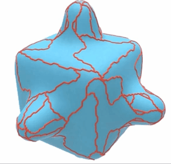

# Lecture 1: Overview

There are few application of Discrete Differential Geometry:

1. Geometry Processing
2. Shape Analysis
3. Machine Learning
4. Numerical Simulation
5. Architecture&Design
6. Discrete Models of Nature

In a nutshell, **GEOMETRY IS EVERYWHERE**!

### What is Differential Geometry?

___

1. considering ***local properties of shape***
2. considering ***global properties of shape***
3. considering ***local-global relationship***
4. profound impact in 20th century

### What is *Discrete* Differential Geometry?

___

1. No infinity in DDG.
2. modern language in geometric processing
3. increasing:arrow_up: impact in 21st century

### Why *Discrete* Differential Geometry is important?

___

In a nutshell, DDG translate differential geometry into language suitable for **computation**.

### What is discrete setting and smooth setting?

___

(*infml*.): 

**Discrete** setting can be conceived of as ***polyline/mesh*** in Rhino.

**Smooth** setting can be conceived of as ***NURBS-curve/surface*** in Rhino.

### How to convert smooth setting to discrete setting?

___

:bangbang: ***No free lunch*** rule: from smooth setting to discrete setting, there is always something missing!!

We therefore need to determine which properties should be captured.

#### Smooth->Discrete || curves in plane(ok)

___

In the ***smooth*** setting, a *parameterized curve* is a ***map*** taking each point in an *interval* $[0,L]$ of the real line to some point in the plane $\mathbb{R}^2$. For example, the interval is $[0,2\pi]$, the *parameterized curve* $\gamma$ is a circle.

In the ***discrete*** setting, a *parameterized curve* is ***piecewise linear***, i.e., it is a sequence of vertices connected by straight line segments. For example, this is a curve broken down into 2 curves. For architects, the discrete setting is merely polyline.

#### Smooth->Discrete || Tangent of a curve(not easy)

___

(infml) Curvature = "how much a curve bends" If the curve is a function, then curvature is second derivative. (indicate how the curve will bend along the tangent direction)

:x:Convert curvature from smoot setting directly to discrete is hard/impossible.

#### :question: So what is the equivalent definition of curvature in discrete setting?

___

There are 4:

(:bangbang: Most natural discrete quantities are often ***integrated*** rather than *pointwise* values.)  在discrete世界里面大部分的计算都是物与物之间的运算，而不是个体自己的运算。

### Turning Angle

___

How to measure? the ***turning angle*** at the vertex:

P.S. The angle of  $\phi$  is measured with the angle the tangent makes with the horizontal. 

### Length Variation

___

#### smooth setting

How to measure?  First let's take a look on the smooth setting:

The fastest way to decrease the length of a curve is to move it in the normal direction, with speed proportional to curvature.

For the straight line on the left, there is nothing change.

For the circle(most curvy) in the middle, the length varies a lot.

*fml*. why the motion that most quickly decreases length is $\eta=\kappa N$:

#### discrete setting

Suppose we have a single line segment:

$$
l := \lvert b-a\rvert
$$

Which motion of  $b$  most quickly increases this length?

Apparently, the direction along the segment. The variation can be denoted as: 

$$
\triangledown_{b}l = (b-a)/l
$$

Now think about the ***integration*** among segments. To find the motion that most quickly *increases the **total length*** $L$,
we now just sum the contributions of each segment:

Mathematically speaking:
$$
\triangledown_{\gamma_i}L = 2sin(\theta_i/2)N_i
$$

#### sum up

in smooth setting, gradient length = curvature × normal($-\kappa N$)

in discrete setting, length variation = *discrete* curvature × *discrete* normal($-\kappa^B_i N_i := 2sin(\theta_i/2)N_i$)

*Note: the negative sign here just indicate there might be 2 direction.

### Steiner Formula

___

It says that if we move at a constant speed in the normal direction, then the change in length is proportional to curvature. 

length$(\gamma+\varepsilon N)$=length$(\gamma) - \varepsilon\int_{0}^{L} \kappa(s) ds$

In a nutshell, there is not too much difference from the last one but **3** formula. What's more, there are **2** already seen from last two.

Similar from before, for a *constant-distance normal offset*, length will change in ***curved*** regions but not ***flat*** regions

(*infml*) the Steiner Formula defines the "***connectivity***" of the offset curves which later become the definition of curvature. You can easily understand if you are Rhino user.

Therefore, there are ***3*** kinds of "connectivity":

(A) along a circular arc of radius $\varepsilon$
(B) along a straight line
(C) extend edges until they intersect

the total length of A,B, and C are:

length$_A$ = length$(\gamma) - \varepsilon\sum_i\theta_i$		a.k.a Turning Angle

length$_B$ = length$(\gamma) - \varepsilon\sum_i2sin(\theta_i/2)$		a.k.a Length Variation

length$_C$ = length$(\gamma) - \varepsilon\sum_i2tan(\theta_i/2)$		

The corresponding component in Grasshopper is the "***Corners***" option of *Offset Curve*:

Steiner’s formula says **change in length** is *proportional* to **curvature**, hence, the curvature can be denoted as followed:

### Osculating Circle

#### smooth setting

The curvature is the reciprocal of the radius:
$$
\kappa(p) = \frac{1}{r(p)}
$$

#### discrete setting

Similarly, what we do in discrete is that:

consider the ***circumcircle***（外接圆） passing through three ***consecutive*** vertices of a discrete curve.

The curvature is also the reciprocal of the circle:
$$
\kappa^{D}_{i} = \frac{1}{r_i} = 2sin(\theta_i)/\omega_i
$$

### Which curvature should we use in application?

___

Just pick the right one for your job!

### Curvature Flow

___

There are many application using curvature.

### Apply 4 Formula in Curvature Flow

___

#### smooth setting

A simple version of this topic is ***curve shortening flow***, where a *closed curve* moves in the **normal** direction with **speed**
*proportional* to **curvature**.
$$
\frac{d}{dt}\gamma(s,t) = \kappa(s,t)N(s,t)
$$

**3** key properties in **curve shortening flow**:

• (**TOTAL**) Total curvature **remains** constant throughout the flow.
• (**DRIFT**) The **center of mass** does not drift from the origin.
• (**ROUND**) Up to rescaling, the flow is **stationary** for circular curves.

#### discrete setting

*No Free Lunch!!

(iterative process)We can approximate curvature flow by ***repeatedly*** moving each vertex a little bit in the **direction** of the **discrete curvature normal**:
$$
\gamma^{t+1} = \gamma^{t} + \tau\kappa_i N_i
$$

So which one should we choose? They have their own benefit:

Turning Angle(A),  $\kappa^{A}_{i} = \theta_i$

Length Variation(B),  $\kappa^{B}_{i} = 2sin(\theta_i/2)$

Osculating circle(D),  $\kappa^{D}_{i} = \frac{1}{r_i} = 2sin(\theta_i)/\omega_i$

A: It is good at containing the total curvature.

B: It does not drift the mass from center.

D: It has a round shape.