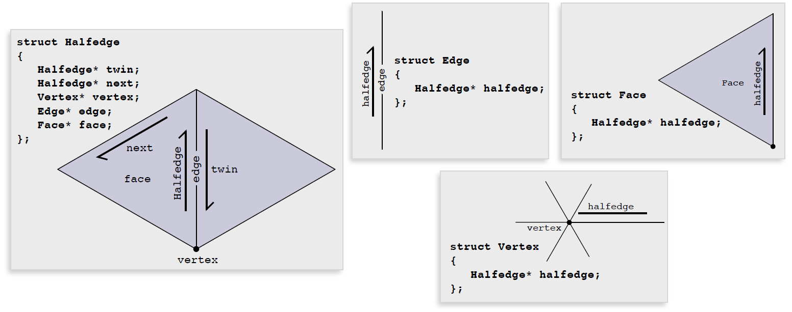
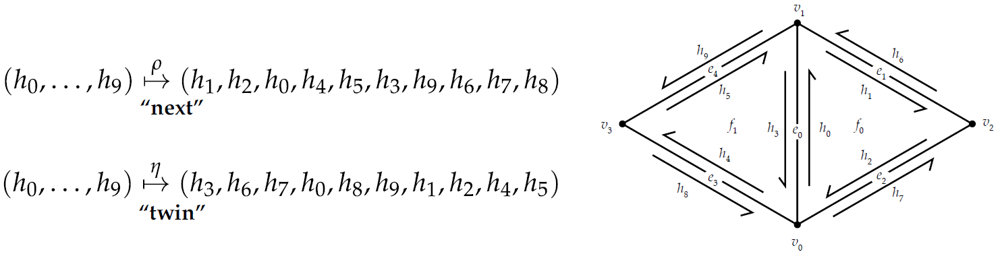

# 2Chapter 02 Combinatorial Surfaces


### Convex Set

___

Definition: A subset $S\sub\mathbb{R}^n$ is convex if for  every pair of points $p,q\in S$ the line segment between $p$ and $q$ is contained in $S$.


Now you can tell which are convex set:


### Convex Hull

___

Definition: For any subset $S\sub\mathbb{R}^n$, its convex hull $conv(S)$ is the smallest convex set containing $S$, or equivalently, the intersection of all convex set containing $S$.


### Convex Hull - Example

___

**Q:** What is the convex hull of the set $S := \{(\pm1,\pm1,\pm1)\}\sub\mathbb{R}^3$ ?

**A:** A Cube.


## 2.1. Abstract Simplicial Complex


### Linear Independence(for vector)

___

This is a topic in Linear Algebra.


### Affine Independence(for points)

___

Introduce concept of linear independence to geometry: A collection of points $p_0,...,p_k$ are affine independent if the vectors $v_i:=p_i-p_0$ are linearly independent.


### Simplex

___

(intuitive) From left to right, a *k-simplex* is a point, line segment, triangle, a tetrahedron...  *Most of the time, we study  <= $k=3$ .


(geometric definition) A ***k-simplex*** is the convex hull of *k+1* affinely-independent points, which also named ***vertices***.


| k-simplex | How many vertices? | Image                                                        |
| --------- | :----------------: | ------------------------------------------------------------ |
| 0-simplex |     1 = 0 + 1      |  |
| 1-simplex |     2 = 1 + 1      |  |
| 2-simplex |     3 = 2 + 1      |  |
| 3-simplex |     4 = 3 + 1      |  |


#### Barycentric Coordinates

___

A **barycentric coordinate system** is a coordinate system in which **the location of a point** is **specified** by **reference** to a **simplex** (a triangle for points in a plane, a tetrahedron四面体 for points in three-dimensional space, etc.). The barycentric coordinates of a point can be interpreted as **masses** placed at the vertices of the simplex, such that the point is the center of mass (or **barycenter**) of these masses. 


#### Barycentric Coordinates Example:  *1-simplex*

___

*1-simplex* is comprised of all **weighted** combinations of the two points where the weights sum to **1**：
$$
p(t) = (1-t)a + tb, t\in[0,1]
$$


Why $a\times(1-t)$ rather than $t$ ? Easy to comprehend, e.g. $t=\frac{3}{4}, p$ inclines to the right, hence the **weight** of $a$ (left) should be small, vice versa.


#### Barycentric Coordinates Example:  *k-simplex*

___

Any point $p$ in a $k$-simplex $\sigma$ can be expressed as a (**non-negative**) weighted combination of the vertices, where the weights sum to **1**. The weights $t_i$ are called *barycentric coordinates*.
$$
\sigma = \Bigg\{\sum_{i=0}^kt_ip_i\Bigg|\sum_{i=0}^kt_i=1,t_i\geq0\forall i\Bigg\}
$$


This is also known as **Convex Combination** which defined as a linear combination of points (which can be vectors, scalars, or more generally **points in an affine space**) where all coefficients are **non-negative** and sum to **1**.


#### Probability Simplex

___

The *standard n-simplex* is the collection of points which is also known as ***probability simplex***.
$$
\sigma := \Bigg\{(x_o,...,x_n)\in\mathbb{R}^{n+1}\Bigg|\sum^{n}_{i=1}x_i=1, x_i\geq0 \forall\Bigg\}
$$


The above diagram is a *2-simplex* which lies in $\mathbb{R}^3$. Imagine all the possibilities of this simplex... No matter how, they all lie in the triangle $\sigma$ above. Therefore, it is called **probability simplex**.


### Simplicial Complex

___

(*infml*) **Simplicial Complex** = a bunch of **simplices**.

| Singular单数 | Plural复数 |
| ------------ | ---------- |
| Vertex       | Vertices   |
| Simplex      | Simplicies |

**Q:** What are all the simplices?

**A:** {6,7,9} {7,10,8} {2,3} {3,4} {4,5} {0} {1}
{6,7} {7,9} {9,6} {7,8} {8,10} {10,7} {2} {3} {4} {5}
{6} {7} {8} {9} {10} - simply write down all the **vertices**, **edges** and **faces**.


#### (Abstract) Simplicial Complex  ||  (Geometric) Simplicial Complex

___

Definition: A (***geometric***) simplicial complex is a *collection* of simplices where (a) the *intersection* of any two simplices is a simplex, and every face of (b) every simplex in the complex is also in the complex.

Definition: Let $S$ be a collection of sets. If for each set $\sigma\in S$ all subsets of $\sigma$ are contained in $S$, then $S$ is an *abstract simplicial complex*. A set $\sigma\in S$ of size $k+1$ is an (***abstract***) simplicial complex.


(infml.) You can see these two as <u>torch_geometric.data.Data</u> while the left is *with coordinates and the right is *without coordinates*. You can also see the left as "**fabrication**" which requires everything lines up while the right as "**connectivity**" only.


#### Abstract Simplicial Complex—Graphs

___

Any *(undirected) graph* $G = (V,E)$ is an abstract simplicial (1-)complex


0-simplices are vertices

1-simplices are edges


#### Abstract Simplicial Complex—Example

___

Example: Consider the set

$S:=$ {{1,2,:black_heart:}, {2,:black_heart:,:slightly_smiling_face:},{1,2},{2,:black_heart:},{:black_heart:,1},{2,:slightly_smiling_face:},{:black_heart:,:slightly_smiling_face:},{1},{2},{:black_heart:},{:slightly_smiling_face:}}

**Q**: Is this set an abstract simplicial complex? If so, what does it look like?
**A**: Yes—it’s a pair of 2-simplices (triangles) sharing a single edge:


#### Application of Simplicial Complex

___

There are many applications of simplicial complex, one of which is persistent homology.


The idea is that

1. increase the radius of vertices

2. if overlapped, then connect
3. track "birth" and "death" of features like connected components, holes, etc
4. features that persist for a long time are likely "real"


As the radius increasing(axis of birth), the "D", "O", "G" are created(**birth**) and **exist for a certain amount of time** until they are connected(**dead**) with excessive radius.


### Comparison Chart of Noun

___

| Discrete Differential Geometry | Rhino/Grasshopper Software | PyTorch Geometric                                            |
| ------------------------------ | -------------------------- | ------------------------------------------------------------ |
| 0-simplex                      | A point                    | ```x = torch.tensor([0,0,0], dtype=torch.float)```           |
| 1-simplex                      | An edge                    | ```edge_index = torch.tensor([[0, 1], [1, 0]], dtype=torch.long)``` |
| 2-simplex                      | A triangle                 | /                                                            |
| Abstract Simplicial Complex    | NA.                        | ```torch_geometric.data.Data```                              |
| Geometric Simplicial Complex   | `Rhino.Geometry.Mesh`      | `read_ply` or `read_obj`                                     |

可以把0-simplex, 1-simplex和2-simplex理解为构建几何世界的基本元素，(只有一个点才是0-simplex，2个点是simplicial complex)。而把基本元素拼凑起来才是Mesh。


## 2.2. Anatomy of a Simplicial Complex: Star, Closure, and Link 

$S$ is a given set of simplices.

***Closure*** $Cl(S)$ is the smallest (i.e., fewest elements) subcomplex of $K$ that contains $S$. In the following diagram, $S$ is a set of 1×triangle and an 1×edge.


***Star*** $St(S)$ is the collection of all simplices in $K$ that contain any simplex in $S$. In the following diagram, $S$ is a vertex.


***Link*** $Lk(S)$ is equal to $Cl(St(S)) \backslash St(Cl(S))$ which means taking out the $star\space St(s)$ from $closure\space Cl(S)$. In the following diagram, $S$ is a vertex.


### Vertices, Edges, and Faces

___

Most of the time, **1-complexes** and **2-complexes** are 2 entities been researched the most. The former is called **graphs** which relates to Graph Machine Learning, Graph Theory, Space Syntax, etc. The later is called **triangle mesh**(trimesh) which relates to Architecture, design, manufacturing, everything!

| simplicial k-complexes | alias         | notation      | Image                                                        |
| ---------------------- | ------------- | ------------- | ------------------------------------------------------------ |
| simplicial 1-complexes | graph         | $G = (V,E)$   |  |
| simplicial 2-complexes | triangle mesh | $K = (V,E,F)$ |  |

- V = vertices
- E = edges
- F = faces
- *K = komplex(in German)


### 2.2.1. Oriented Simplicial Complex

___

#### Orientation of a 1-Simplex

___

$\{a,b\}$   is ***unordered set***.(NO direction)

$(a,b)$ or $(b,a)$    is ***ordered tuples*** which can be illustrated as followed.


Why *orientation* matters? **Integral**.
$$
\int^b_a f(x)dx = -\int^a_b f(x)dx
$$


#### Orientation of a 2-Simplex

___

For a 2-simplex, orientation given by "winding order" of vertices. An ***oriented 2-simplex*** can be specified by a 3-tuple.


#### Oriented *k-Simplex*

___

How do we define orientation in general?


Definition: An ***oriented k-simplex*** is an *ordered tuple*, up to **even** permutation. 

Why permutation is even? Because there are always **2** orientation **positive-negative** and **clockwise-counterclockwise**. Conventionally, we called the **even-index** permutation as "**positive**" while **odd-index** permutation as "**negative**".


#### Oriented 0-Simplex

___

What’s the orientation of a single vertex?


Only one permutation of vertices(the zero-index), so only one orientation - $(a)$! (Positive).


#### Oriented 3-Simplex

___

How to determine this...


We can use python for permutation.

```python
>>> import itertools
>>> list(itertools.permutations([1,2,3,4]))
[(1, 2, 3, 4), (1, 2, 4, 3), (1, 3, 2, 4), (1, 3, 4, 2), (1, 4, 2, 3), (1, 4, 3, 2), (2, 1, 3, 4), (2, 1, 4, 3), (2, 3, 1, 4), (2, 3, 4, 1), (2, 4, 1, 3), (2, 4, 3, 1), (3, 1, 2, 4), (3, 1, 4, 2), (3, 2, 1, 4), (3, 2, 4, 1), (3, 4, 1, 2), (3, 4, 2, 1), (4, 1, 2, 3), (4, 1, 3, 2), (4, 2, 1, 3), (4, 2, 3, 1), (4, 3, 1, 2), (4, 3, 2, 1)]
```

Therefore you got this:


#### Oriented Simplicial Complex

___

An ***oriented simplicial complex*** is a simplicial complex where each simplex is assigned an orientation. The *orientation* of a simplex is an ordering of its vertices up to even permutation. One can specify an oriented simplex via one of its representative **ordered tuples**. 


#### Relative Orientation

___

Two distinct oriented simplices have the same ***relative orientation*** if the two (maximal) faces in their intersection have **opposite** orientation.


共面的边方向相冲，则为relative orientation.


## 2.3. Simplicial Manifold

 Intuitively, which one is manifold?


Apparently, the left is manifold for it can be sampled any point with a cartesian x-y plane while the right can't. The "funky" and "chaotic" shape is not manifold.


(fml.) **Definition**:  A simplicial ***k-complex*** is ***manifold*** if the *link* of every vertex looks like a *(k-1)*-dimensional sphere.


How hard is it to check if a given simplicial complex is manifold?

•(k=1) trivial—is it a loop?
•(k=2) trivial—is each link a loop?
•(k=3) is each link a 2-sphere? Just check if $V-E+F = 2$ (Euler’s formula)
•(k=4) is each link a 3-sphere? …Well, it’s known to be in NP! [S. Schleimer 2004]


### :star:Manifold Triangle Mesh (*k=2*)

___

Manifold triangle mesh is of enormous importance in geometric processing and modeling.

(fml.)Requirements for a triangle mesh is manifold:

| simplex            | requirement                                                  | Image                                                        |
| ------------------ | ------------------------------------------------------------ | ------------------------------------------------------------ |
| edges              | every edge is contained in **exactly** **2** triangles       |  |
| edges(boundary)    | just **1** along the **boundary**                            |  |
| vertices           | every vertex is contained in **a single “loop”** of triangles |  |
| vertices(boundary) | **a single “fan”** along the **boundary**                    |  |


Non-manifold :


#### Why Manifold Meshes would be preferable?

___

In a nutshell, it is neat ingredient for **datastructure** which is easy to process and comfortable to access its "neighbor".


## 2.4. Topological Data Structures


### 2.4.1. Adjacency List

___

Adjacency List only stores top-dimensional simplices. For example, it only stores information of faces from a tetrahedron..


Pros: simple, small storage cost

Cons: hard to iterate over, e.g. expensive to access its neighbors


### 2.4.2. Incidence Matrix

___

(fml.) Definition: Let $K$ be a simplicial complex, let $n_k$ denote the number of $k$-simplices in $K$, and suppose that for each $k$ we give the $k$-simplices a canonical ordering so that they can be specified via indices $1,...,n_k$. The $k$th *incidence matrix* is then a $n_{k+1}\times n_k$ matrix $E^k$ with entries $E^{k}_{ij}=1$ if the $j$th $k$-simplex is contained in the $i$th $(k+1)$-simplex, and $E^k_{ij}=0$ otherwise.


(infml.) Explanation: 

- the matrix from *left to right* is getting **higher dimension**, e.g. vertices->edges->faces.
- the column of each matrix is the ingredient to construct row which is the upper dimension, e.g. columns of $E^0$ is vertices, row is edges
- seeing from the column picture, if the ingredient is used, then it is positive(**1**), otherwise negative(**0**)


### 2.4.3. Sparse Matrix

___

Incidence Matrix is not appropriate for a very large complex with a relatively small number of connections—**most** of the entries are going to be **zero**. In practice, it’s therefore essential to use a **sparse matrix**, i.e., a data structure that efficiently stores only the location and value of nonzero entries.

Taking the following matrix as an example:


#### Associative Array

(row, col) to value

:heavy_check_mark: easy to find and set entries (e.g. hash table)

:x: harder to do matrix operation (e.g. multiply)


#### Array of linked lists

:heavy_check_mark: conceptually simple

:x: slow access time; incoherent memory access


#### Compress column format

:heavy_check_mark: fast for actual matrix operation (e.g. multiply)

:x: hard to add/remove entries


In practice, build "raw" list of entries first, then convert to final (e.g., compressed) data structure.


### 2.4.4. Signed Incidence Matrix

___

(fml.)Definition: A *signed incidence matrix* is an incidence matrix where the sign of each nonzero entry is determined by the relative orientation of the two simplices corresponding to that row/column.


(infml.) Explanation: 

- in the dimension of vertices-edges, `-1 = start point` 	`1 = end point`
- in the dimension of edges-faces, `-1 = reverse orientation`   `1 = the orientation`


### 2.4.5. Half Edge Mesh

___

(infml.) Each edge gets split into two *oppositely-oriented* **half edges**.




(fml.) Definition: Let $H$ be any set with an even number of elements, let $\rho:H\rightarrow H$ be any permutation of $H$, and let $\eta:H\rightarrow H$ be an involution without any fixed points, i.e., $\eta\circ\eta=$identity and $\eta(h)\neq h$ for any $h\in H$. Then $(H,\rho,\eta)$ is a ***half edge mesh***, the elements of $H$ are called ***half edges***, the orbits of $\eta$ are ***edges***, the orbits of $\rho$ are ***faces***, and the orbits of $\eta\circ\rho$ are ***vertices***.



(infml.) Explanation: 

$\rho$ = "next" , along the orientation, the "next halfedge" of current halfedge

$\eta$ = "twin" , the "twin halfedge" sticking in the same edge with opposite orientation


the orbits of $\eta$ are ***edges***:


the orbits of $\rho$ are ***faces***:


the orbits of $\eta\circ\rho$ are ***vertices***:


