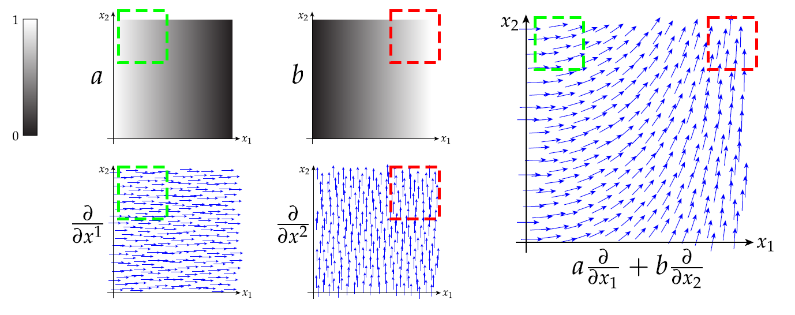
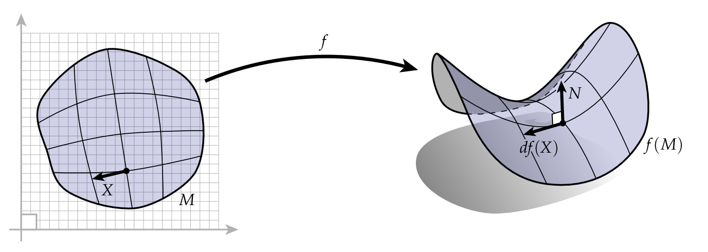

# Chapter 04 Intro to Exterior Calculus

Reason to study Exterior Calculus:

- Language: used to interact with *signed volume*
- Geometry: algebraic geometry, geometric algebra
- Physics: velocity, acceleration, momentum, force
- Computer Science: geometric computation on meshes

To 100% understand ***Discrete Exterior Calculus***, the pipeline is organized as followed:

- Linear Algebra: "little arrows" (vectors)
- Vector Calculus: how do vectors change?
- Exterior Algebra: "little volumes" ($k$-vectors)
- Exterior Calculus: how do $k$-vectors change?
- ***Discrete Exterior Calculus***: How do we do all of this on meshes?

In a nutshell, similar to Discrete Differential Geometry is to replace Differential Geometry, ***Discrete Exterior Calculus*** also is to replace vector calculus with computation on meshes.

Built on ***DEC***, the computational tools are:

Built on ***DEC***, the applications are:

## Vector Spaces - (review)

(fml.) A vector space is a set $V$ together with the operations

Addition:  $+: V\times V\to V$

Scalar multiplication:  $\cdot: \mathbb{R}\times V\to V$

Must satisfy the following properties for all vectors $x,y,z$ and scalars $a,b$:

$x+y=y+x$

$(x+y)+z=x+(y+z)$

$\exist 0\in V$ s.t. $x+0=0+x=x$  , $\exist$ means "exist",  "s.t." means "such that"

$\forall x,\exist \tilde{x}\in V$ s.t. $x+\tilde{x}=0$ , it means there is always a vector with reversed(negative) direction.

$(ab)x = a(bx)$

$1x=x$

$a(x+y)=ax+ay$

$(a+b)x=ax+bx$

## Inner Product - (review)

$\langle\cdot,\cdot\rangle:V\times V\to\mathbb{R}$ , this quantity tells how well two vector "line up" in $V$

***symmetry*** : $\langle x,y\rangle=\langle y,x\rangle$

***linearity*** : $\langle ax,y\rangle=a\langle x,y\rangle$   $\langle x,y+z\rangle=\langle x,y\rangle+\langle x,z\rangle$

***positivity*** : $\langle x,x\rangle > 0, x\neq0$        $\langle x,x\rangle = 0,x=0$

***Euclidean inner product*** : $\langle x,y\rangle = \sum_{k=1}^{n}x_iy_i $ 

## 4.1. Exterior Algebra

Definition: **exterior algebra** is the natural language of “little volumes” which we will call **$k$-vectors**.   REMEMBER!!:bangbang:  $k$-vectors also encode **orientation** and **magnitude**. For simplicity, this notes stick to the plane $\mathbb{R}^2$, three-dimensional space $\mathbb{R}^3$, or more generally, $n$-dimensional space $\mathbb{R}^n$.

### 4.1.1. $k$-Vectors in Exterior Algebra

___

#### direction vs orientation in English

$l$ : A line encodes a **direction**.(infinity)

$v$ : A vector encodes a **direction** AND a definite **orientation**. (finite)

#### 0-vector

​	It is a **scalar/scalar value**.  (*magnitude*, no direction) 

#### 1-vector

​	1-vector is just an ordinary vector.

#### 2-vector

​	A pretty good visualization of a 2-vector is to associate any two vectors $u, v$ in three-dimensional space $\mathbb{R}^3$ with the volume spanned by a little parallelogram.

#### $k$-vector

:bangbang: The **wedge** of $k$ vectors is called a “$k$-vector” a.k.a a **volume**!!

### 4.1.2. Wedge Product

___

$\land$ : pronounced "**wedge**"

In $\mathbb{R}^2$, $u\land v$ is the volume spanned by the 2 vectors, called **parallelogram**.

In $\mathbb{R}^3$, $u\land v\land w$ is the volume spanned by the 3 vectors, called **parallelepiped**.

#### Wedge product - orientation

In $\mathbb{R}$, there are 2 opposite orientations$(-x,x)$ which can be described as "**forward**" and "**backward**"

In $\mathbb{R}^2$, there are 2 opposite orientations corresponding to "**up**" and "**down**".

$+N : u\land v$  , $-N : v\land u$

$u\land v = -v\land u$

In $\mathbb{R}^3$, there are 2 opposite orientations corresponding to "**inward**" and "**outward**".

####  :bangbang: RULES OF ORIENTATION SWITCHES

Any **even permutation** of vectors **preserves** orientation!!!

Any **odd permutation** of vectors **reverses** orientation!!!

In CHN, we said"负负得正"

For example:

$u\land v\land w = v\land w \land u = w\land u \land v$ , 可以看成把$v,w$两个都挪到$u$前面

$w\land v\land u = v\land u\land w = u\land w\land v$

#### Wedge product - degeneracy

$u\land u=0$ , geometrically, spans a region of *zero area*.

#### Wedge product - scaling

Scaling just one of the vectors by a factor $a\in\mathbb{R}$ will scale the area of our parallelogram by the same amount:

$(au)\land v=a(u\land v) = u\land (av)=a(u\land v)$

#### Wedge product - associativity

$u\land v\land w=(u\land v)\land w=u\land (v\land w)$

#### Wedge product - distributivity

$u\land v_1 + u\land v_2 = u\land(v_1+v_2)$

#### Rules of Wedge Product

For any collection of vectors $u, v, w \in \mathbb{R}^n$ and scalars $a, b \in\mathbb{R}$ we have

- (Antisymmetry) $u ∧ v = −v ∧ u $
- (Associativity) $(u ∧ v) ∧ w = u ∧ (v ∧ w) $
- (Distributivity over addition) $u ∧ (v +w) = u ∧ v + u ∧ w $
- (Distributivity of scalar multiplication) $(au) ∧ (bv) = ab(u ∧ v)$

Except the first one which illustrates the orientation, others can all be interpret as multiplication乘法.

### 4.1.3. The Hodge Star

___

Why use "Hodge Star"? The ideology of "**complement**".

- Question - “*what foods do you like?*”
- Answer - (*positive* **all**) "*I like pizza, and apples, and hamburgers, and sushi, and fesenjan, and chicken & waffles, and . . .*"
- Answer - (*negative* **complement**) "*I like everything except for natto and doogh*"

#### Orthogonal Complement - "complement" in Linear Algebra

Definition: Let $U\subseteq V$ be a linear subspace of a vector space $V$ with an inner product $\langle\cdot,\cdot\rangle$. The *orthogonal complement* of $U$ is the collection of vectors denoted as $U^\bot$.

$$
U^{\bot}:=\{v\in V | \langle u,v\rangle=0, \forall u\in U\}
$$

#### Hodge Star - "complement" in Exterior Algebra

In exterior algebra, the ***Hodge star***$\star$(pronounced “star”) provides a sort of *orthogonal complement* for $k$-vectors. If we have a $k$-vector $v$ in $\mathbb{R}^n$, then $\star v$ will be an $(n−k)$-vector that is in some sense “complementary.” 

The analogy can be summarized:

|                          | Linear Algebra                                               | Exterior Algebra                                             |
| ------------------------ | ------------------------------------------------------------ | ------------------------------------------------------------ |
| image                    |  |  |
| ideology of "complement" | Orthogonal Complement                                        | Hodge Star                                                   |
| orientation & magnitude  | :x:                                                          | :heavy_check_mark:                                           |

#### Hodge Star - orientation & magnitude

Then the question shifts to how to determine these two?

orientation: 

- right hand rule, we asked: det$(u,v,\star(u\land v))>0$ , 
- i.e. the determinant of the two vectors comprising u ∧ v and the third vector given by its Hodge star should be positive
- :bangbang::warning:when heard the word "**determinant**", you should instead think "**volume**" !!

magnitude: 

- suppose there are 2 orthonormal vectors $u_1,u_2$ , 
- we asked: det$(u_1.u_2,\star(u_1\land u_2))=1$

General rules:

- orthonormal basis for $\mathbb{R}^n$ : $e_1,...,e_n$ 
- $k$ orthonormal vectors : $u_1,...,u_k$ 
- Relationship is that: $(u_1\land \cdot\cdot\cdot\land u_k)\land\star(u_1\land \cdot\cdot\cdot\land u_k)=e_1\land \cdot\cdot\cdot\land e_n$
- Conclusion of this relationship: their wedge and their hodge star must be the base of the whole space.

#### Hodge Star - 2D

Since  we are talking in $\mathbb{R}^2$, then we have 1-vector $u$. Hodge star $\star u$ will be $(n-k)=2-1=1$-vector. Therefore, it merely is 90 degree rotation.

### 4.1.4. Examples of Wedge and Star in $\mathbb{R}^n$ 

___

Example 1. Let $u:=e_1+2e_2$ and $v:=e_1+e_2-e_3$ be 1-vectors in $\mathbb{R}^3$. Then their wedge product is given by
$$
\begin{align}
u\land v &= (e_1+2e_2)\land(e_1+e_2-e_3)\\
&= e_1\land(e_1+e_2-e_3) + 2e_2\land(e_1+e_2-e_3)\\
&= \cancelto{0}{e_1\land e_1} + e_1\land e_2-e_1\land e_3+2e_2\land e_1+\cancelto{0}{2e_2\land e_2}-2e_2\land e_3\\
&=e_1\land e_2-2e_1\land e_2-e_1\land e_3-2e_2\land e_3\\
&=-e_1\land e_2-e_1\land e_3-2e_2\land e_3
\end{align}
$$
*key notes: $e_1\land e_1=0, \space 2e_2\land e_1=-2e_1\land e_2$

Example 2. Let $w:=-e_1\land e_2-e_1\land e_3-2e_2\land e_3$ be the 2-vector from the previous example. Its Hodge star is given by:
$$
\begin{align}
\star w &= \star(-e_1\land e_2-e_1\land e_3-2e_2\land e_3)\\
&=-\star(e_1\land e_2)-\star(e_1\land e_3)-2\star(e_2\land e_3)\\
&=-e_3-(-e_2)-2e_1\\
&=-2e_1+e_2-e_3
\end{align}
$$
*key notes: right hand rule, $\star(e_1\land e_3)=-e_2$

Example 3. Let $u:=e_1+e_2+e_3, v:=e_1+2e_2+3e_3, w:=e_1-e_3$ be 1-vectors in $\mathbb{R}^3$, compute $u\land v\land w$ . Due to the associativity, the process can be divided into $u\land(v\land w)$:

$$
\begin{align}
v\land w &= (e_1+2e_2+3e_3)\land(e_1-e_3)\\
&=\cancelto{0}{e_1\land e_1}-e_1\land e_3+2e_2\land e_1-2e_2\land e_3+3e_3\land e_1 -3\cancelto{0}{e_3\land e_3}\\
&=-2e_1\land e_2-4e_1\land e_3 -2e_2\land e_3\\
\\
u\land(v\land w)&=(e_1+e_2+e_3)\land (-2e_1\land e_2-4e_1\land e_3 -2e_2\land e_3)\\
&=0
\end{align}
$$

*key notes: any term involving multiple copies of the same basis 1-vector (e.g., $e_1\land e_1\land e_2$) would have zero volume

### 4.1.5. Coordinate Representation

___

#### Basis

Definition: Let $V$ be a vector space. A collection of vectors is *linearly independent* if no vector in the collection can be expressed as a linear combination of the others. A linearly independent collection of vectors $\{e_1,...,e_n\}$ is a ***basis*** for $V$ if every vector $v\in V$ can be expressed as:
$$
v=v_1e_1+\cdot\cdot\cdot+v_ne_n
$$
for some collection of coefficients $v_1,...,v_n\in\mathbb{R}$ , i.e., if every vector can be uniquely expressed as a linear combination of the *basis vector* $e_i$. In this case, we say that $V$ is **finite dimensional**, with dimension *n*.

#### Basic $k$-Vectors - visualized

Reminds once again: $k$-Vectors is a **volume**!! Therefore, **basis $k$-vector** is also a **volume**!!

#### Basic $k$-Vectors - amounts

Consider $V=\mathbb{R}^4$ with basis $\{e_1,e_2,e_3,e_4\}$

**How many basis 2-vectors?

​	$e_1\land e_2, e_1\land e_3,e_2\land e_3, e_1\land e_4, e_2\land e_4, e_3\land e_4$

**How many basis 3-vectors?

​	$e_1\land e_2\land e_3, e_1\land e_2\land e_4, e_1\land e_3\land e_4,e_2\land e_3\land e_4$

**How many basis 4-vectors?

​	$e_1\land e_2\land e_3\land e_4$

The **pattern** is this:

#### Basic $k$-Vectors - Hodge Star

Consider $V=\mathbb{R}^3$ with orthogonal basis $\{e_1,e_2,e_3\}$

Given $\alpha:=e_2$, find $\star\alpha$ such that det$(e_2\land\star e_2)=1$

Must have $\star\alpha=e_3\land e_1$, 

therefore $e_2\land\star e_2=e_2\land e_3\land e_1$,  which is the even permutation of $e_1,e_2,e_3$ , :bangbang: determinant是1

## 4.2. $k$-Vectors and $k$-Forms

:bangbang:  In a nutshell, $k$-Forms are to **measure** $k$-Vectors.

wedging together vectors yields  =>  $k$-vectors

wedging together covectors yields  =>  $k$-forms

### 4.2.1. Vector-Covector Duality

___

***Duality*** is a pervasive idea in mathematics - two sets of objects that are in ***one-to-one correspondence***, but play complementary roles. Very much similar to Ancient Chinese philosophy - Yin-Yang阴阳。

#### Duality in differential geometry and exterior calculus

vectors $u$ - vector of any magnitude, objects that get **measured** , 

covectors $\alpha$ - covector with unit magnitude, objects that **measure**

The notation $\alpha(u)$ here is meant to emphasize the idea that $\alpha$ is a **function**: in particular, it’s **a linear function** that *eats a vector and produces a scalar*. Any such function is called a **1-form** (also known as a **covector**).

#### Dual Space & Covectors

Definition: Let $V$ be any real vector space. Its **dual space** $V^*$ is the collection of all **linear functions** $\alpha:V\to\mathbb{R}$ together with the operations of ***addition*** and ***scalar multiplication***:
$$
(\alpha+\beta)(u):=\alpha(u)+\beta(u)\\
(c\alpha)(u):=c(\alpha(u))
$$
for all $\alpha,\beta\in V^*, u\in V,$ and $c\in\mathbb{R}$

Definition: An element of a dual vector space is called a ***dual vector*** or ***covector***.

#### Covectors - Example in $\mathbb{R}^3$

linear map $f$ , vectors $u,v$ , scalars $a$ . Then we have:

$f(u+v)=f(u)+f(v)$	and	$f(au)=af(u)$

**Q**: What’s an example of a linear map from $\mathbb{R}^3$ to $\mathbb{R}$?

​	A: One good example is to express vectors in coordinates $u = (x,y,z)$. One of many example could be $f (x,y,z) = x + 2y + 3z$

**Q**: What are all the possibilities?

​	A: It can be summarized as: $f(x,y,z) = ax + by + cz$  for constants $a,b,c$

**Conclusion**: In Euclidean $\mathbb{R}^3$, a covector looks like just another 3-vector!

#### Covectors - Example in Functions

Let $V$ be the set of integrable functions $f:[0,1]\to\mathbb{R}$ a.k.a. the blue,red, and green curve.

We say **covector** eats a vector and **produce** a **scalar**. So what is the covector of above 3 curves??:thinking:

The integral!!
$$
\phi:V\to\mathbb{R}; f\mapsto \smallint_0^1f(x)dx\\
\delta:V\to\mathbb{R}; f\mapsto f(0)
$$
How to interpret above equation?

一个函数叫$\phi$，它将$V$变成$\mathbb{R}$, 本质是将函数$f$ 影射到函数$f$ 的0-1区间的积分

一个函数叫$\delta$， 它将$V$变成$\mathbb{R}$, 本质是将函数$f$ 影射到函数$f(0)$

#### Sharp and Flat

***sharp*** ($\sharp$) : convert a 1-form into a vector

***flat*** ($\flat$) : convert a vector into a 1-form

How to memorize?

Keep it in mind: ***sharp*** ($\sharp$) and ***flat*** ($\flat$) are both *musical isomorphisms*. 

***sharp*** ($\sharp$) : tune going up $\uparrow$

***flat*** ($\flat$) : tune going down $\downarrow$

$k$-form is underneath, so "sharp" will bring it up to $k$-vector $\uparrow$

$k$-vector is above, so "flat" will bring it down to $k$-form $\downarrow$

Therefore, for 1-vector $v$ and 1-form $\alpha$, we can write like this:

$v^\flat(v)$ , which is equivalent to $\alpha(v)$

$\alpha(\alpha^\sharp)$ , which is equivalent to $\alpha(v)$

#### Sharp and Flat w/ Inner Product

$\begin{bmatrix}u_1&u_2&u_3\end{bmatrix}\begin{bmatrix}M_{11}&M_{12}&M_{13}\\M_{12}&M_{22}&M_{23}\\M_{13}&M_{23}&M_{33}\end{bmatrix}$$\begin{bmatrix}v_1\\v_2\\v_3\end{bmatrix}$

#### Sharp and Flat - Example

In *curved* space, suppose we want to measure the length of a vector $v$ along the direction of another vector $u$.

$f:\mathbb{R}^2\supset M\to\mathbb{R}^3$  , the map $f$ stretch out the tangent vector, take us from the plane to some surface in $\mathbb{R}^3$, then we have:
$$
u^\flat(v)=g(u,v)
$$
$g$  , is the metric. In a nutshell, a *distance function*. 因为$u^\flat()$是变成1-form，喂$v$进去，得出**scalar**，而这个scalar就是distance function $g$得出的。

### 4.2.2. $k$-Forms

___

Just a sum-up and warm-up:

$k$-form will measure $k$-vectors

Since we think of $u$ as the vector “**getting measured**” and $\alpha$ as the vector “**doing the measurement**”, we’ll write this as a function $\alpha(u)$:
$$
\alpha(u)=\sum^n_{i=1}\alpha_iu^i
$$

#### 0-form

0-form must take 0-vector and produce a scalar. 0-form is a scalar!

*Has ***magnitude***, while it has only one possible "direction".

#### 1-form

We can of course apply this same expression when $\alpha$ does not have unit length:
$$
\alpha(u) := \sum_ia_iu^i
$$
How to interpret? 

- Projected length gets scaled by magnitude of $\alpha$.

#### :page_with_curl:SOME NOTES

___

**(review) Determinants & Signed Volume**

:star:Don't memorize the equation and matrix of determinants. Just remember **determinant = signed volume**

Determinant of 2-vectors = 2D signed area 

Determinant of 3-vectors = 3D signed volume

___

#### 2-form : measurement of 2-vectors

(*Intuition*) a multilinear measurement of a 2-vector is a size of “shadow” of one parallelogram on another.

How to **compute** the "**shadow**"?

- (1) pick orthonormal basis $\alpha,\beta$ for the plane
- (2) project vector to the plane
- (3) apply cross product formula

*Projection*:
$$
u\mapsto(\alpha(u),\beta(u))\\
v\mapsto(\alpha(v),\beta(v))
$$
*Area*:
$$
(\alpha(u),\beta(v))-(\alpha(v),\beta(u))
$$

Definition of 2-form (even when $\alpha,\beta$ are not orthonormal):
$$
(\alpha\land \beta)(u,v):=\alpha(u)\beta(v)-\alpha(v)\beta(u)
$$

Intuitively interpret 2-form: Projected area of $u,v$ gets **scaled** by area of **parallelogram** with edges $\alpha,\beta$.

:star:**Antisymmetry of 2-Forms**

exchanging the arguments of a 2-form:
$$
\begin{align}
(\alpha\land\beta)(v,u)&=\alpha(v)\beta(u)-\alpha(u)\beta(v)\\
&=-(\alpha(u)\beta(v)-\alpha(v)\beta(u))\\
&=-(\alpha\land\beta)(u,v)
\end{align}
$$

exchanging the argument to a wedge product:
$$
\begin{align}
(\beta\land\alpha)(u,v)&=\beta(u)\alpha(v)-\beta(v)\alpha(u)\\
&=-(\alpha(u)\beta(v)-\alpha(v)\beta(u))\\
&=-(\alpha\land\beta)(u,v)
\end{align}
$$

#### 3-form : measurement of 3-vectors

(*Intuition*) a multilinear measurement of a 3-vector is in $\mathbb{R}^3$, all 3-vectors have same “direction”, a.k.a. is to measure "magnitude" 

How to **compute** the "**volume**"?

- (1) suppose $(\alpha,\beta,\gamma)$ is any orthonormal basis
- (2) project vector $u,v,w$ onto this basis
- (3) apply standard formula for volume

Definition of 3-form (even when $\alpha,\beta,\gamma$ are not orthonormal):

Intuitively interpret 3-form: Projected volume of $u,v,w$ gets **scaled** by volume of **parallelepiped** with edges $\alpha,\beta,\gamma$.

### $k$-form

Definition: $k$-form is a *fully antisymmetric*, *multilinear* measurement of a $k$-vector. Typically think of this as a **map** $\alpha$ from **$k$-vectors** to a **scalar**:
$$
\alpha:\underbrace{V\times\dotsm V}_{\text{$k$ times}}\to\mathbb{R}
$$
:one:**Multilinear** means "linear in each argument", e.g. for a 2-form:
$$
\begin{align}
\alpha(au+bv,w)&=a\alpha(u,w)+b\alpha(v,w)\\
\alpha(u,av+bw)&=a\alpha(u,v)+b\alpha(u,w)\\
\forall u,v,w\in V,a,b,\in\mathbb{R}
\end{align}
$$
:two:Fully **antisymmetric** means exchanging two arguments reverse sign(一负为负，负负得正):
$$
\begin{align}
&\alpha(u,v,w) = \\
-&\alpha(u,w,v)
\end{align}
$$
:three: $k$-form as a determinant: "project" onto $k$-dimensional space and measure volume there:
$$
(\alpha_1\land\dotsm\land\alpha_k)(u_1\land\dotsm\land u_k):=\begin{vmatrix}\alpha_1(u_1)&\cdots&\alpha_1(u_k)\\\vdots&\ddots&\vdots\\\alpha_k(u_1)&\cdots&\alpha_k(u_k)\end{vmatrix}
$$
For example, **k=1**:

For example, **k=2**:

#### :page_with_curl:SOME NOTES

___

**A Note on Notation**

Convention dictates that the argument $u,v$ should be written as $(u,v)$

___

### 4.2.3. $k$-Forms in Coordinates

___

The vector can be represented as followed once we have a coordinate system.

- (1) measure along each coordinate axis
- (2) use such measurements to take a weighted linear combination of bases

#### Dual Basis: vector basis and covector basis

**Vector**:

In an $n$-dimensional vector space $V$, can express vectors $v$ in a basis $e_1, …, e_n$:
$
v=v^1e_1+\dotsm+v^ne_n
$

$v^i$ , scalar value of the **coordinate** of $v$

**Covector**:

We can also write covectors $\alpha$ in a so-called **dual basis** $e_1,..., e_n$:

$\alpha=\alpha_1e^1+\dotsm+\alpha_ne^n$

**Notes**:

These bases have a special **relationship**, namely:
$$
e^i(e_j)=\begin{cases}
1, \space i=j\\
0,\space\text{otherwise}
\end{cases}
$$
:star:How to interpret? Take a look on:

:one:$e_1$ of vector basis and $e^1$ of covector basis, they are with **same** $n=1$, therefore, they are **lined up**, same amount equivalence.

:two: $e_1$ of vector basis and $e^2$ of covector basis, they are with **different** $n$, therefore, they are **not lined up**, in this case orthogonal! Therefore it is 0.

#### 1-form : Example in coordinates

Considering we have:
$$
\begin{align}
\textcolor{blue}{v}&=2\textcolor{blue}{e_1}+2\textcolor{blue}{e_2}\\
\textcolor{red}{\alpha}&=-2\textcolor{red}{e^1}+3\textcolor{red}{e^2}
\end{align}
$$

$$
\begin{align}
\textcolor{red}{\alpha}(\textcolor{blue}{v})
&=(-2\textcolor{red}{e^1}+3\textcolor{red}{e^2})(2\textcolor{blue}{e_1}+2\textcolor{blue}{e_2})\\
&=-4\textcolor{red}{e^1}\textcolor{blue}{e_1}-4\textcolor{red}{e^1}\textcolor{blue}{e_2}+6\textcolor{red}{e^2}\textcolor{blue}{e_1}+6\textcolor{red}{e^2}\textcolor{blue}{e_2}\\
&=-4\cancelto{1}{\textcolor{red}{e^1}\textcolor{blue}{e_1}}-4
\cancelto{0}{\textcolor{red}{e^1}\textcolor{blue}{e_2}}+6
\cancelto{0}{\textcolor{red}{e^2}\textcolor{blue}{e_1}}+6
\cancelto{1}{\textcolor{red}{e^2}\textcolor{blue}{e_2}}\\
&=-4+6\space\ \ \ \ \ \ \ \text{just like dot product}\\
&=2
\end{align}
$$

#### 2-form : Example in coordinates

Considering we have:
$$
\begin{align}
\textcolor{blue}{u}&=2\textcolor{blue}{e_1}+2\textcolor{blue}{e_2}\\
\textcolor{blue}{v}&=-2\textcolor{blue}{e_1}+2\textcolor{blue}{e_2}\\
\textcolor{red}{\alpha}&=\textcolor{red}{e^1}+3\textcolor{red}{e^2}\\
\textcolor{red}{\beta}&=2\textcolor{red}{e^1}+\textcolor{red}{e^2}\\
\end{align}
$$

We then have:
$$
\begin{align}
(\textcolor{red}{\alpha\land\beta})(\textcolor{blue}{u,v})&=\textcolor{red}{\alpha}(\textcolor{blue}{u})\textcolor{red}{\beta}(\textcolor{blue}{v})-\textcolor{red}{\alpha}(\textcolor{blue}{v})\textcolor{red}{\beta}(\textcolor{blue}{u})\\
\textcolor{red}{\alpha}(\textcolor{blue}{u})&=2+6=8\\
\textcolor{red}{\alpha}(\textcolor{blue}{v})&=-2+6=4\\
\textcolor{red}{\beta}(\textcolor{blue}{u})&=4+2=6\\
\textcolor{red}{\beta}(\textcolor{blue}{v})&=-4+2=-2\\
&=8\cdot(-2)-4\cdot6\\
&=-40
\end{align}
$$
**Q**: What does this value mean, **geometrically**? Why is it ***negative***?

- **A**: 40 is the **shadow area** $u\land v$ casting on $\alpha\land\beta$. They have **different orientation** so it is negative.

#### :page_with_curl:SOME NOTES

___

**Einstein Summation Notation**
$$
x^iy_i:=\sum^n_{i=1}x^iy_i
$$

This convention is by Einstein. However, for clarity, we will stick to use sum symbol. But keep it in mind the convention here since many math books assume you already know.

**Musical Isomorphisms**

We mentioned the sharp$\sharp$ and flat$\flat$ in above. It **also affect the coefficient of vector and covecto**r!!

Suppose we have $\alpha(v)=\langle u,v\rangle$ for all $v\in V$. Then:
$$
\alpha=\alpha_1e^1+\dotsm+\alpha_ne^n \qquad \begin{matrix}\overset{\sharp}{\Longrightarrow}\\\overset{\flat}{\Longleftarrow}\end{matrix} \qquad u=u^1e_1+\dotsm+u^ne_n
$$
:arrow_forward: From	 left(covector, underneath) 		raise pitch(sharp)		to 		right(vector, above),      **coefficient from down to up**

:arrow_backward: From	 right(vector, above)	lower pitch(flat)		to 		left(covector, underneath), 	**coefficient from up to down** 

**Alphabet Notation**

Roman alphabet for vector and vector fields, e.g. $u,v,w,X,Y,Z$

Greek alphabet for covector and $k$-form, e.g. $\alpha,\beta,\gamma$

___

## 4.3. Differential Forms in $\mathbb{R}^n$ 

A quick review:

- vector: \
- vector field: an assignment of a vector to **each point of space**

Likewise, we can have similar analogy on $k$-form

- $k$-form: \
- differential $k$-form: an assignment of a $k$-form to **each point**

*sometime some guy will simplify differential $k$-form to $k$-form.

### 4.3.1. Differential $k$-Form

___

#### *Differential* 0-Form

Definition: Assigns **a scalar** to each point. (no direction, **only magnitude**)

E.g., in 2D we have a value at each point $(x_1,x_2)$:

:star:Differential 0-form is the same as *scalar function*!

#### *Differential* 1-Form

Definition: Assigns a **1-form** to each point. 

E.g., in 2D we have a 1-form at each point $(x_1,x_2)$:

:bangbang::star:Differential 1-form is **NOT** the same as *vector field* !!!

:thinking:Why? Although vector fields and differential 1-forms look the same(in $\mathbb{R}^n$), **differential 1-form can produce scalar** while vector field can't!!

In a nutshell, differential 1-form $\alpha()$ can eat vector field $X$!! and produce scalar! 

Zone A: the 1-vector in the vector field is **orthogonal** to the 1-form in the differential 1-form, therefore it produce a **50%** intensity.

Zone B: the 1-vector in the vector field is **parallel** to the 1-form in the differential 1-form, therefore it produce a **100%** intensity.

Zone C: the 1-vector in the vector field is **opposite** to the 1-form in the differential 1-form, therefore it produce a **0%** intensity.

#### Differential 2-Form

Definition: A differential 2-form is an **area measurement** at each point$(x_1,x_2,x_3)$: 

Resulting function says how much a 2-vector field “**lines up**” with a given 2-form.

#### *Differential* $k$-Forms :  Pointwise Operations

Most operations on differential $k$-forms simply **apply that operation at each point**. Followings are the demo of 3 operation:

:one: Hodge Star

:two: Wedge

:three: $k$-form

Consider two differential forms $α, β$ on $\mathbb{R}^n$. At each point $p := (x_1,…,x_n)$, the

:one:	apply the Hodge star to the individual $k$ forms at each point $p$
$$
\begin{align}
(\star\alpha)_p&:=\star(\alpha_p)\\
\end{align}
$$
:two:	wedge their values at each point
$$
\begin{align}
(\alpha\land\beta)_p&:=(\alpha_p)\land(\beta_p)
\end{align}
$$
if $X_1, …, X_k$ are vector fields on all of $\mathbb{R}^n$, then:

:three:	vector field can also computed point-wise
$$
\alpha(X_1,...,X_k)_p:=(\alpha_p)((X_1)_p,...,(X_k)_p)
$$

### 4.3.2. *Differential* $k$-Forms in Coordinates

___

#### Basis Vector Fields

Left: basis for *vectors*

Right: *basis for vector fields* on $\mathbb{R}^n$ - **constant** vector fields of **unit magnitude** pointing along each of the coordinate axes:

[:bangbang::star:!!! the names of the basis vector fields look like partial derivatives, but **please temporally forget anything with derivatives** when you saw the name.]

#### Basis Vector Fields 👉 other Vector Fields

:star::star:$\frac{\partial}{\partial x^1},\frac{\partial}{\partial x^2}$ are the ingredients used to construct!! 

**Any other** vector field is then **a linear combination** of the basis vector fields! The **coefficients** of linear combination **can vary** across the domain.

$a,b$ are the coefficients and $\frac{\partial}{\partial x^1},\frac{\partial}{\partial x^2}$ are the ingredients of linear combination of $a\frac{\partial}{\partial x^1}+b\frac{\partial}{\partial x^2}$.

:green_heart:  GREEN ZONE The coefficient $a$ is with **high intensity**(1) while the coefficient $b$ is with **low intensity**(0). Hence, the output on the right is 100% $\frac{\partial}{\partial x^1}$, 0% $\frac{\partial}{\partial x^2}$, pointing :arrow_down:
:heart:  RED ZONE The coefficient $a$ is with **low intensity**(0) while the coefficient $b$ is with **high intensity**(1). Hence, the output on the right is 0% $\frac{\partial}{\partial x^1}$, 100% $\frac{\partial}{\partial x^2}$ , pointing up :arrow_up:

#### Bases for Vector Fields and Differential 1-forms

The analogy is nearly identical here:

1-vector $\iff$ 1-form

vector fields $\iff$  Differential 1-form

The two bases $dx^i$ and $\frac{\partial}{\partial x^i}$ are referred to as ***dual bases***, meaning they satisfy the **relationship**:
$$
dx^i\bigg(\frac{\partial}{\partial x^j}\bigg)
=\delta^i_j:=
\begin{cases}
1, \space i=j\\
0,\space\text{otherwise}
\end{cases}
$$

#### Example: Hodge Star of Differential 1-form

Consider the differential 1-form:

$$
\alpha:=(1-x)dx+xdy
$$

:page_facing_up: Note: the $(1-x)$ ad $x$ can be conceived of as the **coefficients** of bases differential 1-form $dx$ and $dy$.

:question: Q: Why does this differential 1-form look like this?

​	A: Remember $dx$ is basis pointing right, $dy$ is basis pointing up. As $x$ becoming bigger, $(1-x)$ becoming smaller, therefore when $x=0$, 100% $dx$ pointing right, 0% $dy$ pointing up. So as when $x=1$

:question: Q: What is its Hodge star?

​	A: Hodge star in 2D plane is counter-clockwise 90 degree rotation. Therefore:
$$
\begin{align}
\star\alpha&=\star((1-x)dx)+\star(xdy)\\
&=(1-x)(\star dx)+x(\star dy)\\
&=(1-x)dy + x(-dx)\\
&=-xdx+(1-x)dy
\end{align}
$$

:question: Q: What does it look like with both overlaid?

#### Example: Wedge of Differential 1-Forms

Consider the differential 1-forms:
$$
\alpha:=xdx, \qquad \beta:=(1-x)dx+(1-y)dy
$$

:question: Q: Why does it look like this?

$\alpha$ :

- :green_heart: $x=0\to$ , from nothing to basis $dx$. (there is no $dy$ in $\alpha$  !!)

- :large_orange_diamond: $x=\to1$ , basis $dx$

$\beta$ :

- :purple_heart: $x=0,y=0\space\to\space(1-x)=1,(1-y)=1$, therefore $dx+dy$ is pointing upper right

- :large_blue_diamond: $x=1,y=1\space\to\space(1-x)=0,(1-y)=0$, therefore $dx+dy$ is nothing

:question: Q: What is their wedge product?
$$
\begin{align}
\alpha\land\beta &= xdx\land[(1-x)dx+(1-y)dy]\\
&=x(1-x)dx\land dx+x(1-y)dx\land dy\\
&=x(1-x)\cancelto{0}{dx\land dx}+x(1-y)dx\land dy\\
&=(x-xy)dx\land dy
\end{align}
$$
:question: Q: What does it look like?

​	:star::star:A: Since $dx\land dy$ is wedge product between two bases! You can **imagine each points are placed 1*1 parallelogram**(unit area), and then **multiply magnitude** $(x-xy)$ which can be saw as scalar function.

- :green_heart: $x=0\space\to\space x-xy=0$ , no wedge product 

- :yellow_heart: $y=1\space\to\space x-xy=x-x=0$ , no wedge product

- :blue_heart: $x=1\space\to\space x-xy=1-y$, therefore as $y$ is going down(decrease), it is approaching parallelogram. 

- :purple_heart: $x=1,y=0\space\to\space x-xy=x$, therefore as $x$ is going right(increase), it is approaching parallelogram.

We can easily imagine its Hodge star which just flip over the intensity.

In $n$-dimensions, any  positive multiple of  $dx^1\land dx^2\land\dotsm\land dx^n$ is called a **volume form**.

#### Differential 1-form EATS vector field

After digesting lots of knowledge, we finally reached the goal is that **using differential 1-form to measure vector fields**.

Suppose we have differential 1-form $\alpha$ and vector fields $X$:
$$
\begin{align}
\alpha&:=xdx\\
X&:=(1-x)\frac{\partial}{\partial x}+(1-y)\frac{\partial}{\partial y}
\end{align}
$$
Then we can compute:
$$
\begin{align}
\alpha(X)&=xdx\bigg((1-x)\frac{\partial}{\partial x}+(1-y)\frac{\partial}{\partial y}\bigg)\\
&=x(1-x)dx\frac{\partial}{\partial x}+x(1-y)dx\frac{\partial}{\partial y}\\
&=x(1-x)\cancelto{1}{dx\frac{\partial}{\partial x}}+x(1-y)\cancelto{0}{dx\frac{\partial}{\partial y}}\\
&=x-x^2
\end{align}
$$

:mag: What do you notice from the intensity map?

1. There is no $y$ , the variation of $y$ does not affect the intensity. Therefore, it is mirrored up and down.
2. $x=0,x=1\Rightarrow x-x^2=0$, therefore the left and right are 0% intensity.

#### :star:Differential Forms in $\mathbb{R}^n$ - Summary

Started with a vector space $V (e.g.,\mathbb{R}^n)$
•(1-forms) Dual space $V$* of covectors, i.e., linear measurements of vectors
•($k$-forms) Wedge together $k$ covectors to get a measurement of $k$-dimensional volumes
•(differential $k$-forms) Put a $k$-form at each point of space

|                       | primal (阴)       | dual (阳)              |
| --------------------- | ----------------- | ---------------------- |
| **vector space**      | vectors           | covector               |
| **exterior algebra**  | $k$-vectors       | $k$-forms              |
| **spatially-varying** | $k$-vector fields | differential $k$-forms |

## 4.3. Exterior Calculus - Differentiation

:star: Big picture, from exterior algebra to exterior calculus, it aims to solve 2 things:

1. how quantities change? - **differentiation**微分 (typically differentiation of $k$-form, exterior derivative)
2. how to measure the change? - **integration**积分 (typically integration of $k$-form, measure volume)

The *differential df* of a surface $f:M\to\mathbb{R}^3$, which tells how the tangent vector "stretched out" from $M$ to $\mathbb{R}^3$.

*d* : is called the *exterior derivative*, which tells how quickly a $k$-form changes along *every possible direction*.

In this section, we will take a deep insight of it.

### Curl and Divergence - (review)

The following content is a review of calculus.

#### What is vector field?

All the points in the space are associated with a vector.

#### What is fluid field?

Vector field is a static and steady case while fluid field is dynamic.

#### What is divergence?

The divergence of a vector field at a particular point in a plane tell you how much this fluid tends to flow **OUT OF** or **INTO** the small region.

#### What is Curl?

How much the fluid at the point tends to rotate.

Positive: counter-clockwise

Negative: Clockwise

One of the application of "curl" is phase flow. Somehow it looks like a dynamic balance.

#### The Equation of Divergence and Curl

Divergence: $\text{div F} = \triangledown \cdot \text{F}$ 

Curl: $\text{curl F} = \triangledown \times \text{F}$

Why dot product for divergence? Why cross product for curl?
The **dot product** is expected to **measure** how these **two vectors line up**. If 100% match, then flows out, $\text{div F}  > 0$
The **cross product** is expected to **measure** how these **two vectors spin around**. If =1, then tends to rotate 90°.

#### What is partial derivative?

Partial derivative: a partial derivative of a function of **several variables** is its derivative with respect to one of those variables, with the **others held constant**.

Total derivative: (opposite to above) all variables are allowed to vary.

## 4.4. Hodge Duality

## 4.5. Differential Operators

## 4.6. Integration and Stokes’ Theorem 

## 4.7. Discrete Exterior Calculus