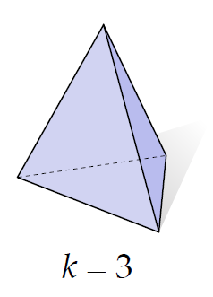
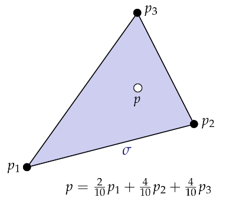
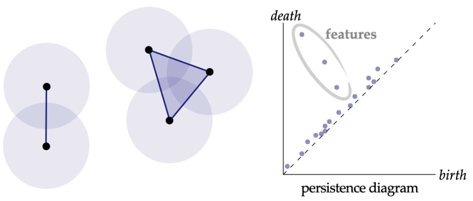
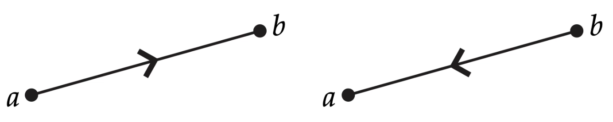
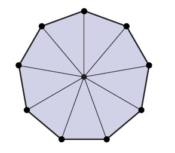
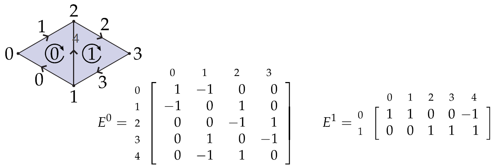
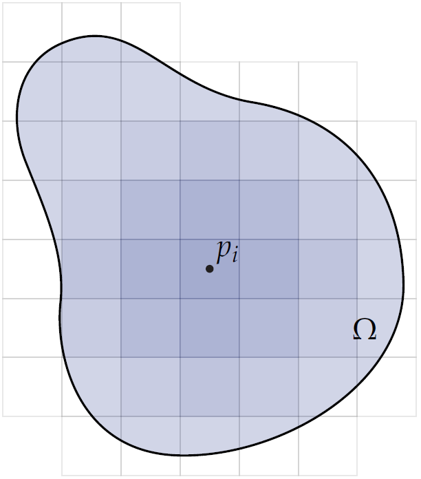
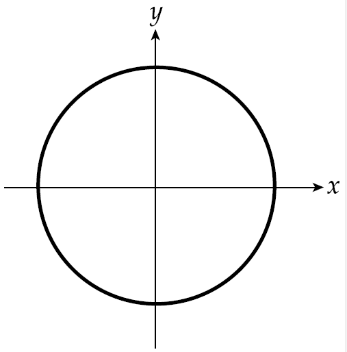
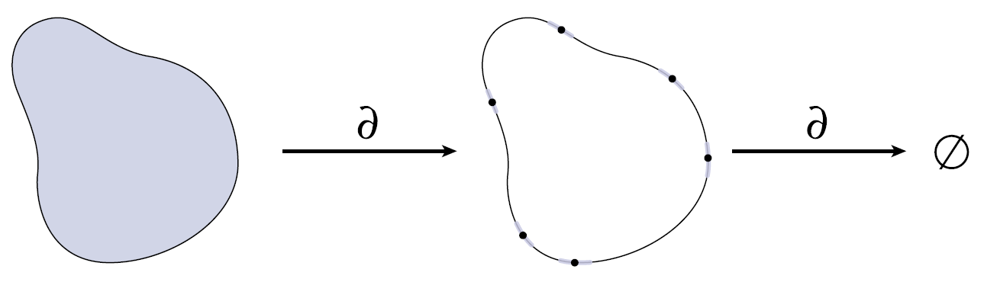
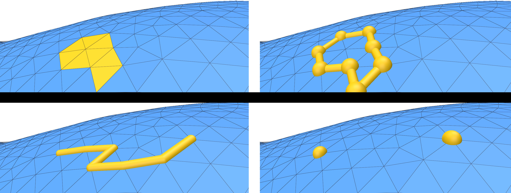

# Table of Content

:notebook_with_decorative_cover:[    **Lecture Notes**    ]:notebook_with_decorative_cover:

- [1. Overview](#chapter-01-overview)
- [2. Combinatorial Surfaces](#chapter-02-combinatorial-surfaces)
  - [2.1. Abstract Simplicial Complex](#21-abstract-simplicial-complex)
  - [2.2. Anatomy of a Simplicial Complex: Star, Closure, and Link ](#22-anatomy-of-a-simplicial-complex-star-closure-and-link)
  - [2.3. Simplicial Manifold](#23-simplicial-manifold)

:book:[    **Reading Assignment**    ]:book:


:keyboard:[    **Coding Assignment**    ]:keyboard:

- [1. Simplicial Operator](#1-simplicial-operator)


# Chapter 01: Overview


## 1.1. What and Why DDG?

:pushpin:**What is Differential Geometry?**

___

1. considering ***local properties of shape***
2. considering ***global properties of shape***
3. considering ***local-global relationship***
4. profound impact in 20th century


:pushpin:**What is *Discrete* Differential Geometry?**

___

1. No infinity in DDG.
2. modern language in geometric processing
3. increasing:arrow_up: impact in 21st century


## 1.2. :star::star::star:Study Roadmap of DDG

- :one: Combinatorial Surfaces
- :two: Exterior Calculus
  - Exterior Algebra
  - Differential Forms (3D calculus)
  - Discrete Exterior Calculus
- :three: Curves (2D&3D)
  - Smooth
  - Discrete
- :four: Surfaces
  - Smooth
  - Discrete
- :five: Curvature
- :six: Laplace-Beltrami
- :seven: Geodesics
- :eight: Conformal Geometry
- :nine: Homology & Cohomology


## 1.3. Discrete setting & Smooth setting

:pushpin:**What is discrete setting and smooth setting?**

___

(*infml*.): 

**Discrete** setting can be conceived of as ***polyline/mesh*** in Rhino.

**Smooth** setting can be conceived of as ***NURBS-curve/surface*** in Rhino.


:pushpin:**How to convert smooth setting to discrete setting?**

___

:bangbang: ***No free lunch*** rule: from smooth setting to discrete setting, there is always something missing!!

We therefore need to determine which properties should be captured.


:pushpin:**Case 1 - curves in plane: Smooth->Discrete = (ok:smile:)**

___

In the ***smooth*** setting, a *parameterized curve* is a ***map*** taking each point in an *interval* $[0,L]$ of the real line to some point in the plane $\mathbb{R}^2$. For example, the interval is $[0,2\pi]$, the *parameterized curve* $\gamma$ is a circle.


In the ***discrete*** setting, a *parameterized curve* is ***piecewise linear***, i.e., it is a sequence of vertices connected by straight line segments. For example, this is a curve broken down into 2 curves. For architects, the discrete setting is merely polyline.


:pushpin: **Case 2 - Tangent of a curve: Smooth->Discrete = (not easy:no_mouth: )**

___

(infml) Curvature = "how much a curve bends" If the curve is a function, then curvature is second derivative. (indicate how the curve will bend along the tangent direction)


:x:Convert curvature from smoot setting directly to discrete is hard/impossible.


## 1.4. A Case Study of Smooth to Discrete

___

To well explain the **distinction** between **smooth** setting and **discrete** setting, here introduce a case study of such transition on curvature.

There are 4:


(:bangbang: Most natural discrete quantities are often ***integrated*** rather than *pointwise* values.)  在discrete世界里面大部分的计算都是物与物之间的运算，而不是个体自己的运算。


### 1.4.1. Turning Angle

___

How to measure? the ***turning angle*** at the vertex:


P.S. The angle of  $\phi$  is measured with the angle the tangent makes with the horizontal. 


### 1.4.2. Length Variation

___

:pushpin:**smooth setting**

How to measure?  First let's take a look on the smooth setting:

The fastest way to decrease the length of a curve is to move it in the normal direction, with speed proportional to curvature.


For the straight line on the left, there is nothing change.

For the circle(most curvy) in the middle, the length varies a lot.


*fml*. why the motion that most quickly decreases length is $\eta=\kappa N$:


:pushpin:**discrete setting**

Suppose we have a single line segment:

$$
l := \lvert b-a\rvert
$$


Which motion of  $b$  most quickly increases this length?

Apparently, the direction along the segment. The variation can be denoted as: 

$$
\triangledown_{b}l = (b-a)/l
$$


Now think about the ***integration*** among segments. To find the motion that most quickly *increases the **total length*** $L$,
we now just sum the contributions of each segment:


Mathematically speaking:
$$
\triangledown_{\gamma_i}L = 2sin(\theta_i/2)N_i
$$

:pushpin: **sum up**

in smooth setting, gradient length = curvature × normal($-\kappa N$)


in discrete setting, length variation = *discrete* curvature × *discrete* normal($-\kappa^B_i N_i := 2sin(\theta_i/2)N_i$)


*Note: the negative sign here just indicate there might be 2 direction.


### 1.4.3. Steiner Formula

___

It says that if we move at a constant speed in the normal direction, then the change in length is proportional to curvature. 

length$(\gamma+\varepsilon N)$=length$(\gamma) - \varepsilon\int_{0}^{L} \kappa(s) ds$

In a nutshell, there is not too much difference from the last one but **3** formula. What's more, there are **2** already seen from last two.


Similar from before, for a *constant-distance normal offset*, length will change in ***curved*** regions but not ***flat*** regions


(*infml*) the Steiner Formula defines the "***connectivity***" of the offset curves which later become the definition of curvature. You can easily understand if you are Rhino user.


Therefore, there are ***3*** kinds of "connectivity":

(A) along a circular arc of radius $\varepsilon$
(B) along a straight line
(C) extend edges until they intersect


the total length of A,B, and C are:

length$_A$ = length$(\gamma) - \varepsilon\sum_i\theta_i$		a.k.a Turning Angle

length$_B$ = length$(\gamma) - \varepsilon\sum_i2sin(\theta_i/2)$		a.k.a Length Variation

length$_C$ = length$(\gamma) - \varepsilon\sum_i2tan(\theta_i/2)$		


The corresponding component in Grasshopper is the "***Corners***" option of *Offset Curve*:


Steiner’s formula says **change in length** is *proportional* to **curvature**, hence, the curvature can be denoted as followed:


### 1.4.4. Osculating Circle

:pushpin: **smooth setting**

The curvature is the reciprocal of the radius:
$$
\kappa(p) = \frac{1}{r(p)}
$$


:pushpin: **discrete setting**

Similarly, what we do in discrete is that:

consider the ***circumcircle***（外接圆） passing through three ***consecutive*** vertices of a discrete curve.


The curvature is also the reciprocal of the circle:
$$
\kappa^{D}_{i} = \frac{1}{r_i} = 2sin(\theta_i)/\omega_i
$$

### 1.4.5. Application of Curvature

___

:pushpin: **Which curvature should we use in application?**

Just pick the right one for your job!


:pushpin: **Application - Curvature Flow**

___

There are many applications using curvature and curvature flow is just one of them.


### 1.4.6. Apply 4 Theories in Curvature Flow

___

:pushpin: **smooth setting**

A simple version of this topic is ***curve shortening flow***, where a *closed curve* moves in the **normal** direction with **speed**
*proportional* to **curvature**.
$$
\frac{d}{dt}\gamma(s,t) = \kappa(s,t)N(s,t)
$$


**3** key properties in **curve shortening flow**:

• (**TOTAL**) Total curvature **remains** constant throughout the flow.
• (**DRIFT**) The **center of mass** does not drift from the origin.
• (**ROUND**) Up to rescaling, the flow is **stationary** for circular curves.


:pushpin: **discrete setting**

*No Free Lunch!!

(iterative process)We can approximate curvature flow by ***repeatedly*** moving each vertex a little bit in the **direction** of the **discrete curvature normal**:
$$
\gamma^{t+1} = \gamma^{t} + \tau\kappa_i N_i
$$


So which one should we choose? They have their own benefit:

Turning Angle(A),  $\kappa^{A}_{i} = \theta_i$

Length Variation(B),  $\kappa^{B}_{i} = 2sin(\theta_i/2)$

Osculating circle(D),  $\kappa^{D}_{i} = \frac{1}{r_i} = 2sin(\theta_i)/\omega_i$


A: It is good at containing the total curvature.

B: It does not drift the mass from center.

D: It has a round shape.


# Chapter 02 Combinatorial Surfaces

## 2.0. Prerequisite - Convex

### 2.0.1. Convex Set

___

Definition: A subset $S\sub\mathbb{R}^n$ is convex if for  every pair of points $p,q\in S$ the line segment between $p$ and $q$ is contained in $S$.


Now you can tell which are convex set:


### 2.0.2. Convex Hull

___

Definition: For any subset $S\sub\mathbb{R}^n$, its convex hull $conv(S)$ is the smallest convex set containing $S$, or equivalently, the intersection of all convex set containing $S$.


### 2.0.3. Convex Hull - Example

___

**Q:** What is the convex hull of the set $S := \{(\pm1,\pm1,\pm1)\}\sub\mathbb{R}^3$ ?

**A:** A Cube.


### 2.0.4. Topological Disk

___

A topological disk is **any shape** you can get **by deforming the unit disk** in the plane **without** *tearing* it, *puncturing* it, or *gluing* its edges together. Some examples of shapes that are disks include a flag, a leaf. Some examples of shapes that are not disks include a circle (i.e., *a disk without its interior*), a *hollow* sphere, a *donut*, a fidget *spinner*, and a *teapot*.

The objects in the first row **are** manifolds while the second row **aren't**.


## 2.1. Abstract Simplicial Complex

### 2.1.1. Basic Math

:pushpin: **Linear Independence(for vector)**

___

This is a topic in Linear Algebra.


:pushpin: **Affine Independence(for points)**

___

Introduce concept of linear independence to geometry: A collection of points $p_0,...,p_k$ are affine independent if the vectors $v_i:=p_i-p_0$ are linearly independent.


### 2.1.2. Simplex

___

(intuitive) From left to right, a *k-simplex* is a point, line segment, triangle, a tetrahedron...  *Most of the time, we study  <= $k=3$ .


(geometric definition) A ***k-simplex*** is the convex hull of *k+1* affinely-independent points, which also named ***vertices***.


| k-simplex | How many vertices? | Image                                                        |
| --------- | :----------------: | ------------------------------------------------------------ |
| 0-simplex |     1 = 0 + 1      |  |
| 1-simplex |     2 = 1 + 1      |  |
| 2-simplex |     3 = 2 + 1      |  |
| 3-simplex |     4 = 3 + 1      |  |


:pushpin: **Barycentric Coordinates**

___

A **barycentric coordinate system** is a coordinate system in which **the location of a point** is **specified** by **reference** to a **simplex** (a triangle for points in a plane, a tetrahedron四面体 for points in three-dimensional space, etc.). The barycentric coordinates of a point can be interpreted as **masses** placed at the vertices of the simplex, such that the point is the center of mass (or **barycenter**) of these masses. 


:pushpin: **Barycentric Coordinates Example:  *1-simplex***

___

*1-simplex* is comprised of all **weighted** combinations of the two points where the weights sum to **1**：
$$
p(t) = (1-t)a + tb, t\in[0,1]
$$


Why $a\times(1-t)$ rather than $t$ ? Easy to comprehend, e.g. $t=\frac{3}{4}, p$ inclines to the right, hence the **weight** of $a$ (left) should be small, vice versa.


:pushpin: **Barycentric Coordinates Example:  *k-simplex***

___

Any point $p$ in a $k$-simplex $\sigma$ can be expressed as a (**non-negative**) weighted combination of the vertices, where the weights sum to **1**. The weights $t_i$ are called *barycentric coordinates*.
$$
\sigma = \Bigg\{\sum_{i=0}^kt_ip_i\Bigg|\sum_{i=0}^kt_i=1,t_i\geq0\forall i\Bigg\}
$$


This is also known as **Convex Combination** which defined as a linear combination of points (which can be vectors, scalars, or more generally **points in an affine space**) where all coefficients are **non-negative** and sum to **1**.


:pushpin: **Probability Simplex**

___

The *standard n-simplex* is the collection of points which is also known as ***probability simplex***.
$$
\sigma := \Bigg\{(x_o,...,x_n)\in\mathbb{R}^{n+1}\Bigg|\sum^{n}_{i=1}x_i=1, x_i\geq0 \forall\Bigg\}
$$


The above diagram is a *2-simplex* which lies in $\mathbb{R}^3$. Imagine all the possibilities of this simplex... No matter how, they all lie in the triangle $\sigma$ above. Therefore, it is called **probability simplex**.


### 2.1.3. Simplicial Complex

___

(*infml*) **Simplicial Complex** = a bunch of **simplices**.

| Singular单数 | Plural复数 |
| ------------ | ---------- |
| Vertex       | Vertices   |
| Simplex      | Simplicies |

**Q:** What are all the simplices?

**A:** {6,7,9} {7,10,8} {2,3} {3,4} {4,5} {0} {1}
{6,7} {7,9} {9,6} {7,8} {8,10} {10,7} {2} {3} {4} {5}
{6} {7} {8} {9} {10} - simply write down all the **vertices**, **edges** and **faces**.


:pushpin: **(Abstract) Simplicial Complex  ||  (Geometric) Simplicial Complex**

___

Definition: A (***geometric***) simplicial complex is a *collection* of simplices where (a) the *intersection* of any two simplices is a simplex, and every face of (b) every simplex in the complex is also in the complex.

Definition: Let $S$ be a collection of sets. If for each set $\sigma\in S$ all subsets of $\sigma$ are contained in $S$, then $S$ is an *abstract simplicial complex*. A set $\sigma\in S$ of size $k+1$ is an (***abstract***) simplicial complex.


(infml.) You can see these two as <u>torch_geometric.data.Data</u> while the left is *with coordinates and the right is *without coordinates*. You can also see the left as "**fabrication**" which requires everything lines up while the right as "**connectivity**" only.


:pushpin: **Abstract Simplicial Complex—Graphs**

___

Any *(undirected) graph* $G = (V,E)$ is an abstract simplicial (1-)complex


0-simplices are vertices

1-simplices are edges


:pushpin: **Abstract Simplicial Complex—Example**

___

Example: Consider the set

$S:=$ {{1,2,:black_heart:}, {2,:black_heart:,:slightly_smiling_face:},{1,2},{2,:black_heart:},{:black_heart:,1},{2,:slightly_smiling_face:},{:black_heart:,:slightly_smiling_face:},{1},{2},{:black_heart:},{:slightly_smiling_face:}}

**Q**: Is this set an abstract simplicial complex? If so, what does it look like?
**A**: Yes—it’s a pair of 2-simplices (triangles) sharing a single edge:


### 2.1.4. Application of Simplicial Complex

___

There are many applications of simplicial complex, one of which is persistent homology.


The idea is that

1. increase the radius of vertices

2. if overlapped, then connect
3. track "birth" and "death" of features like connected components, holes, etc
4. features that persist for a long time are likely "real"



As the radius increasing(axis of birth), the "D", "O", "G" are created(**birth**) and **exist for a certain amount of time** until they are connected(**dead**) with excessive radius.


### 2.1.5. Simplex in Rhino and PyTorch (analogy)

___

| Discrete Differential Geometry | Rhino/Grasshopper Software | PyTorch Geometric                                            |
| ------------------------------ | -------------------------- | ------------------------------------------------------------ |
| 0-simplex                      | A point                    | ```x = torch.tensor([0,0,0], dtype=torch.float)```           |
| 1-simplex                      | An edge                    | ```edge_index = torch.tensor([[0, 1], [1, 0]], dtype=torch.long)``` |
| 2-simplex                      | A triangle                 | /                                                            |
| Abstract Simplicial Complex    | NA.                        | ```torch_geometric.data.Data```                              |
| Geometric Simplicial Complex   | `Rhino.Geometry.Mesh`      | `read_ply` or `read_obj`                                     |

可以把0-simplex, 1-simplex和2-simplex理解为构建几何世界的基本元素，(只有一个点才是0-simplex，2个点是simplicial complex)。而把基本元素拼凑起来才是Mesh。


## 2.2. Anatomy of a Simplicial Complex

### 2.2.1. $1$-Complexes & $2$-Complexes

___

Most of the time, **1-complexes** and **2-complexes** are 2 entities been researched the most. The former is called **graphs** which relates to Graph Machine Learning, Graph Theory, Space Syntax, etc. The later is called **triangle mesh**(trimesh) which relates to Architecture, design, manufacturing, everything!

| simplicial k-complexes | alias         | notation      | Image                                                        |
| ---------------------- | ------------- | ------------- | ------------------------------------------------------------ |
| simplicial 1-complexes | graph         | $G = (V,E)$   |  |
| simplicial 2-complexes | triangle mesh | $K = (V,E,F)$ |  |

- V = vertices
- E = edges
- F = faces
- *K = komplex(in German)


### 2.2.2. Star, Closure, Link, Boundary, and Interior

$S$ is a given set of simplices.

***Closure*** $Cl(S)$ is the smallest (i.e., fewest elements) subcomplex of $K$ that contains $S$. In the following diagram, $S$ is a set of 1×triangle and an 1×edge.


***Star*** $St(S)$ is the collection of all simplices in $K$ that contain any simplex in $S$. In the following diagram, $S$ is a vertex.


***Link*** $Lk(S)$ is equal to $Cl(St(S)) \backslash St(Cl(S))$ which means taking out the $star\space St(s)$ from $closure\space Cl(S)$. In the following diagram, $S$ is a vertex.


***Boundary*** $bd(K')$ is a pure $k$-subcomplex $K' \subseteq K$. The boundary is the closure of the set of all simplices $\sigma$ that are proper faces of exactly one simplex of $K'$.

***Interior*** $int(K') = K' \backslash  bd(K')$ is then everything but the boundary (as pictured above)


You may wonder what is the difference between ***Link*** and ***Boundary***, ***Closure*** and ***Interior***? Due to their similarity...

:warning: The difference is that ***Link*** and ***Closure*** are referring to **simplex** while ***Link*** and ***Interior*** are referring to **Complex/Subcomplex**.


### 2.2.3. Oriented Simplicial Complex

___

***Oriented simplicial complex*** is an abstract simplicial complex where we can assign a **consistent orientation** to every triangle.

***Unorientable simplicial complex*** is the opposite. The famous Möbius band is one of the cases:


In this section, the following definitions will be covered:

> ​	:one: Orientation of a 1-Simplex
>
> ​	:two: Orientation of a 2-Simplex
>
> ​	:three: Oriented $k$-Simplex
>
> ​	:four: Oriented 0-Simplex
>
> ​	:five: Oriented 3-Simplex
>
> ​	:six: Oriented Simplicial Complex :star:
>
> ​	:seven: Relative Orientation


:pushpin: **Orientation of a 1-Simplex**

___

$\{a,b\}$   is ***unordered set***.(NO direction)

$(a,b)$ or $(b,a)$    is ***ordered tuples*** which can be illustrated as followed.



Why *orientation* matters? **Integral**.
$$
\int^b_a f(x)dx = -\int^a_b f(x)dx
$$

:pushpin: **Orientation of a 2-Simplex**

___

For a 2-simplex, orientation given by "winding order" of vertices. An ***oriented 2-simplex*** can be specified by a 3-tuple.


:pushpin: **Oriented *k-Simplex***

___

How do we define orientation in general?


Definition: An ***oriented k-simplex*** is an *ordered tuple*, up to **even** permutation. 

Why permutation is even? Because there are always **2** orientation **positive-negative** and **clockwise-counterclockwise**. Conventionally, we called the **even-index** permutation as "**positive**" while **odd-index** permutation as "**negative**".


:pushpin: **Oriented 0-Simplex**

___

What’s the orientation of a single vertex?


Only one permutation of vertices(the zero-index), so only one orientation - $(a)$! (Positive).


:pushpin: **Oriented 3-Simplex**

___

How to determine this...


We can use python for permutation.

```python
>>> import itertools
>>> list(itertools.permutations([1,2,3,4]))
[(1, 2, 3, 4), (1, 2, 4, 3), (1, 3, 2, 4), (1, 3, 4, 2), (1, 4, 2, 3), (1, 4, 3, 2), (2, 1, 3, 4), (2, 1, 4, 3), (2, 3, 1, 4), (2, 3, 4, 1), (2, 4, 1, 3), (2, 4, 3, 1), (3, 1, 2, 4), (3, 1, 4, 2), (3, 2, 1, 4), (3, 2, 4, 1), (3, 4, 1, 2), (3, 4, 2, 1), (4, 1, 2, 3), (4, 1, 3, 2), (4, 2, 1, 3), (4, 2, 3, 1), (4, 3, 1, 2), (4, 3, 2, 1)]
```

Therefore you got this:


:pushpin: **Oriented Simplicial Complex**

___

An ***oriented simplicial complex*** is a simplicial complex where each simplex is assigned an orientation. The *orientation* of a simplex is an ordering of its vertices up to even permutation. One can specify an oriented simplex via one of its representative **ordered tuples**. 


:pushpin: **Relative Orientation**

___

Two distinct oriented simplices have the same ***relative orientation*** if the two (maximal) faces in their intersection have **opposite** orientation.


共面的边方向相冲，则为relative orientation.

:warning: The left is referred as **consistent orientation** while the right is referred as **inconsistent orientation**.


## 2.3. Simplicial Manifold

 Intuitively, which one is manifold?


Apparently, the left is manifold for it can be sampled any point with a cartesian x-y plane while the right can't. The "funky" and "chaotic" shape is not manifold.


(fml.) **Definition**:  A simplicial ***k-complex*** is ***manifold*** if the *link* of every vertex looks like a *(k-1)*-dimensional sphere.


How hard is it to check if a given simplicial complex is manifold?

•(k=1) trivial—is it a loop?
•(k=2) trivial—is each link a loop?
•(k=3) is each link a 2-sphere? Just check if $V-E+F = 2$ (Euler’s formula)
•(k=4) is each link a 3-sphere? …Well, it’s known to be in NP! [S. Schleimer 2004]


### 2.3.1. Manifold Triangle Mesh (*k=2*):star:

___

Manifold triangle mesh is of enormous importance in geometric processing and modeling.

(fml.)Requirements for a triangle mesh is manifold:

| simplex            | requirement                                                  | Image                                                        |
| ------------------ | ------------------------------------------------------------ | ------------------------------------------------------------ |
| edges              | every edge is contained in **exactly** **2** triangles       |  |
| edges(boundary)    | just **1** along the **boundary**                            |  |
| vertices           | every vertex is contained in **a single “loop”** of triangles |  |
| vertices(boundary) | **a single “fan”** along the **boundary**                    |  |


### 2.3.2. Nonmanifold

___

We will henceforth call such configurations **nonmanifold**: meeting at an edge, or multiple “cones” of vertices meeting at a vertex.


:pushpin: **Why Manifold Meshes would be preferable?**

___

In a nutshell, it is neat ingredient for **datastructure** which is easy to process and comfortable to access its "neighbor".


## 2.4. Topological Data Structures


### 2.4.1. Adjacency List

___

Adjacency List only stores top-dimensional simplices. For example, it only stores information of faces from a tetrahedron..


Pros: simple, small storage cost

Cons: hard to iterate over, e.g. expensive to access its neighbors


### 2.4.2. Incidence Matrix

___

(fml.) Definition: Let $K$ be a simplicial complex, let $n_k$ denote the number of $k$-simplices in $K$, and suppose that for each $k$ we give the $k$-simplices a canonical ordering so that they can be specified via indices $1,...,n_k$. The $k$-th *incidence matrix* is then a $n_{k+1}\times n_k$ matrix $E^k$ with entries $E^{k}_{ij}=1$ if the $j$th $k$-simplex is contained in the $i$-th $(k+1)$-simplex, and $E^k_{ij}=0$ otherwise.


(infml.) Explanation: 

- the matrix from *left to right* is getting **higher dimension**, e.g. vertices->edges->faces.
- the column of each matrix is the ingredient to construct row which is the upper dimension, e.g. columns of $E^0$ is vertices, row is edges
- seeing from the column picture, if the ingredient is used, then it is positive(**1**), otherwise negative(**0**)


### 2.4.3. Sparse Matrix

___

Incidence Matrix is not appropriate for a very large complex with a relatively small number of connections—**most** of the entries are going to be **zero**. In practice, it’s therefore essential to use a **sparse matrix**, i.e., a data structure that efficiently stores only the location and value of nonzero entries.

Taking the following matrix as an example:


The followings are 3 kinds of datastructure with the concept of "sparse".

#### 2.4.3.1. Associative Array

(row, col) to value

:heavy_check_mark: easy to find and set entries (e.g. hash table)

:x: harder to do matrix operation (e.g. multiply)


#### 2.4.3.2. Array of linked lists

:heavy_check_mark: conceptually simple

:x: slow access time; incoherent memory access


#### 2.4.3.3. Compress column format

:heavy_check_mark: fast for actual matrix operation (e.g. multiply)

:x: hard to add/remove entries


In practice, build "raw" list of entries first, then convert to final (e.g., compressed) data structure.


### 2.4.4. Signed Incidence Matrix

___

(fml.)Definition: A *signed incidence matrix* is an incidence matrix where the sign of each nonzero entry is determined by the relative orientation of the two simplices corresponding to that row/column.




(infml.) Explanation: 

- in the dimension of vertices-edges, `-1 = start point` 	`1 = end point`
- in the dimension of edges-faces, `-1 = reverse orientation`   `1 = the orientation`


### 2.4.5. Half Edge Mesh

___

(infml.) Each edge gets split into two *oppositely-oriented* **half edges**.


(fml.) Definition: Let $H$ be any set with an even number of elements, let $\rho:H\rightarrow H$ be any permutation of $H$, and let $\eta:H\rightarrow H$ be an involution without any fixed points, i.e., $\eta\circ\eta=$identity and $\eta(h)\neq h$ for any $h\in H$. Then $(H,\rho,\eta)$ is a ***half edge mesh***, the elements of $H$ are called ***half edges***, the orbits of $\eta$ are ***edges***, the orbits of $\rho$ are ***faces***, and the orbits of $\eta\circ\rho$ are ***vertices***.


(infml.) Explanation: 

$\rho$ = "next" , along the orientation, the "next halfedge" of current halfedge

$\eta$ = "twin" , the "twin halfedge" sticking in the same edge with opposite orientation


the orbits of $\eta$ are ***edges***:


the orbits of $\rho$ are ***faces***:


the orbits of $\eta\circ\rho$ are ***vertices***:


# Chapter 03 Intro to Differential Geometry


## 3.1 The Geometry of Surface

### 3.1.0. Math Review

:pushpin: **What is *differential* ?**

___
(*infml*) =How to *transform* vectors from one space to another. e.g.The $X$ in the left to $df(X)$ in the right by stretching or "pushing" forward.


The above transformation can be described via a map: 

$$
\begin{align}
f:M\rightarrow\mathbb{R}^3
\end{align}
$$

which map a region $M$ in the Euclidean plane $\mathbb{R}^2$ to a subset of $\mathbb{R}^3$ entitled $f(M)$.


Hence, we can say the **differential** of such map tells us how to map a vector $X$ in the plane to the corresponding vector $df(x)$ on the surface. The *differential* denoted as:
$$
\begin{align}
df
\end{align}
$$


:pushpin: **Different representation of *dot product***

___
In $\mathbb{R}^2$: use angle bracket, e.g.
$$
\begin{align}
\langle X,X\rangle
\end{align}
$$

In $\mathbb{R}^3$: use $\cdot$, e.g.
$$
\begin{align}
df(X)\cdot df(X)
\end{align}
$$


:pushpin: ***metric* of a surface**

___

*metric* $g$ is the inner product between any two tangent vectors $df(X)$ and $df(Y)$
$$
\begin{align}
g(X,Y) = df(X)\cdot df(Y)
\end{align}
$$


:pushpin: ***vector field***

___

A vector at every point of $M$.


:pushpin: ***tangent bundle***

___

The set of all tangent vectors of $M$. denoted as $TM$.


:pushpin: **normal vector**

___

a vector  $u\in \mathbb{R}^3$ is normal to the surface at a point $p$ if:
$$
\begin{align}
df(X)\cdot u = 0
\end{align}
$$


:pushpin: **orientable**

___

If the normal is consistent, then the manifold is *orientable*. e.g. :

The circular band on the left is ***orientable***.

The Mobius band on the right is ***NOT orientable***.


:pushpin: ***Gauss map and Weingarten map?***

___

For *orientable surfaces*, **Gauss map** (denoted as $N$) map the associates each point on the surface with its unit normal. 
$$
N: M \in S^2
$$
Because it must be `each point` and `unit normal`, the result can be illustrated as a sphere, $S^2$ as a subset of $\mathbb{R}^3$.包含所有从原点射出的单位向量 。


The Weingarten map is the differential of $N$ , denoted as $dN$, tell us the change in the normal direction as the point move from one to another. For example, we can look at the change in normal along a particular tangent direction $X$ by evaluating $dN(X)$. 从Strang的微积分Big Picture来看，分析曲面的法向变化就是在分析曲面的curvature.


### 3.1.1 Conformal Coordinates

:pushpin: **isometric parameterization?**

___

a.k.a *arc-length* or *unit speed* parameterization.

(*infml*) You can imagine you select the curve in Rhino to the real 3D world with :heavy_check_mark:***pick up/ bend*** but not :x:***stretched***.

(*fml*) Let $\overrightarrow{p}:\mathbb{R}^n\in S$ be a parameterization of $S$. The parameterization $\overrightarrow{p}$ is called an *isometric parameterization* if the speed of $\overrightarrow{p}$ with respect to each parameter is one and $\overrightarrow{p}$ preserves area.

(*fml*) Another definition is more intuitive:
$$
\lvert df(X)\rvert = \lvert X\rvert
$$
So after the transformation to $\mathbb{R}^3$, the norm of any vector $X$ preserved.

However, isometric parameterization does not always exist. Most of the time you need to stretch things out. e.g. The world map.


:pushpin: **conformal parameterization**

___

(*fml*) A map $f$ is ***conformal*** if it preserves the *angle* between any two vectors after the transformation to $\mathbb{R}^3$.
$$
f: \mathbb{R}^2\supset M \rightarrow \mathbb{R}^3
$$
The $f$ satisfies: 
$$
df(X)\cdot df(Y) = a \langle X,Y \rangle
$$
$a$ is a positive function. In practice, $a$ is often replaced with $\mathbb{e}^u$ for some real-valued function $u$. So you don't worry about whether the scaling is positive.

$\langle \cdot ,\cdot \rangle$ is the usual inner product on $\mathbb{R}^2$


Notice the surface can get :heavy_check_mark:***stretched out*** while the surface never gets :x:***sheared*** - for instance, orthogonal vectors$X, Y$ always stay orthogonal $df(X), df(Y)$.

conformal parameterization是永远存在的，背后的理论来自Riemann的uniformization theorem（单值化理论）。这是不是很像Grasshopper里面的某些操作，之前Dixon一直说要留意“曲面的结构”，我想他指的就是*conformal coordinate*吧。


## 3.2. Derivatives and Tangent Vectors


### 3.2.1. Derivatives on the Real Line

___

Suppose a good old fashioned real-valued function $\phi (x)$ on the real line. We typically visualize $\phi$ by plotting its value as a height over the $x$-axis.


Normally thinking: $\phi '$  is the slope of $\phi (x)$ , the dashed line in the graph. 


Geometrically thinking: $\phi$ stretches out the real line itself.  Imagine a curve of $y=x$ is evenly divided in Rhino, move the control point up and down. Then we will have the above graph. The change in node spacing is like this:


derivative$\uparrow$ nodes space apart$\uparrow$

derivative$\downarrow$ nodes close together$\downarrow$

这很好理解，越陡，变化越大，那两个点当然越远；反之亦然。

We can say the derivative of $\phi$ in terms of the push-forward $d\phi(X)$ of a unit tangent vector $X$ pointing along the positive $x$-axis:
$$
\phi' = d\phi(X)
$$
The real line also can be represented as a curve in $\mathbb{R}^2$:
$$
\gamma(x,\phi(x))
$$


### 3.2.2 Directional Derivatives

___

In last section, $\phi$ defines the $y$ value of $x$ in $\mathbb{R}$. So what about $\mathbb{R}^3$? Let's adopt the usual approach which is to draw a height function over the $\mathbb{R}^2$plane:


Normally, we pick one vector$X$ to travel along the direction and document how quickly we travel uphill/downhill. This is called ***directional derivative***.


## 3.3. The Geometry of Curves


The function map one-dimensional curve from interval:

$$
I = [0,T]\subset\mathbb{R}
$$
to 
$$
\mathbb{R}^3
$$
can be denoted as:
$$
\gamma: I \rightarrow \mathbb{R}^3
$$


$d\gamma$ = how tangent vectors get stretched out by $\gamma$:
$$
\lvert d\gamma(X)\rvert = \sqrt{d\gamma(X)\cdot d\gamma(X)}
$$

If it is unit speed/arc-length/isometric parameterization, then the $\gamma$ preserves *length* for every tangent vector $X$:
$$
\lvert d\gamma(X)\rvert = \lvert X\rvert
$$


### 3.3.1. The Curvature of a Curve

___


$\gamma$ : a unit-speed curve

$X$ : a positively-oriented vector

$I$ : interval

$T=d\gamma(X)$  : a unit vector in $\mathbb{R}^3$ tangent to the curve

Since $T$ may change at any rate in tangent direction as we move along $\gamma$. 

$N$ : unit vector, called as *principle normal* expresses the direction of change

$\kappa\in\mathbb{R}$ : called as curvature that expresses the magnitude of change

Hence, we have:
$$
dT(X)=-\kappa N
$$


:pushpin: **Why $T$ and $N$ are always orthogonal?**

___

:warning::question: Because if the change in $T$ were parallel to $T$ , then it would cease to have unit length! 

上面这个回答不够intuitive，用下面两个例子就懂了。以下公式不在DDG lecture notes里面，为网上搜集。

$\gamma$ : the curve

$t$ : the parameter of the curve, similar to the $t$ in Grasshopper

$T = \frac{d\gamma(t)}{t} = \gamma'$  : the first derivative of the curve $\gamma$ is the tangent vector, the **slope** of the curve. magenta arrow in the graph.

$N = \frac{dT(t)}{t}/\lvert\frac{dT(t)}{t} \rvert = \frac{T'}{\lvert T'\rvert} = \gamma''$ : the second derivative of the curve $\gamma$ is the acceleration, **how the slope change**! Conventionally, the $N$ is a quarter turn in the ***counter-clockwise*** direction from $T$. blue arrow in the graph. 为何要除以$T'$的norm，这是公式，因为它想要unit vector,所以才要除以它的norm。

$B = T \times N$ : this is *binormal*, the cyan arrow in the following graph

*Frenet frame* : the frame composed by $T$ and $N$.


$\therefore$ the $N$ of the following graph always points to the center of the circle because **it guides the tangent turn left... turn left... and turn left**.


Similarly:


:pushpin: **Frenet-Serret formula in details**

___

The formula is like this:
$$
\underbrace{\begin{bmatrix}T'\\N'\\B'\end{bmatrix}}_{Q'\in \mathbb{R}^{3\times3}}= \underbrace{\begin{bmatrix}0&-\kappa&0\\\kappa&0&-\tau\\0&\tau&0\end{bmatrix}}_{A\in \mathbb{R}^{3\times3}}\underbrace{\begin{bmatrix}T\\N\\B\end{bmatrix}}_{Q\in\mathbb{R}^{3\times3}}
$$

:pushpin: **Why $QQ^T = I$ ?**

We have:
$$
Q=\begin{bmatrix}T\\N\\B\end{bmatrix}, Q^{T}= \begin{bmatrix}T&N&B\end{bmatrix}
$$

Then:
$$
QQ^T = \begin{bmatrix}T\cdot T&T\cdot N&T\cdot B\\N\cdot T&N\cdot N&N\cdot B\\B\cdot T&B\cdot N&B\cdot B\end{bmatrix}
$$

$\because T,N,B$ are ***mutually orthogonal*** whose dot product is 0. $T\cdot T=1$, vice versa. So we have:
$$
QQ^T = \begin{bmatrix}1&0&0\\0&1&0\\0&0&1\end{bmatrix}
$$
:question:I only understand by far. Not fully understand Frenet-Serret formula.


### 3.3.2 Visualizing Curvature

___

:pushpin: **What is *Curvature*? (fml definition) **

The curvature of a circle is simply the reciprocal of its radius. 圆形的曲率是它半径的倒数。
$$
\kappa = \lvert\kappa N\rvert = \lvert dT(X)\rvert = 2\pi/2\pi r = 1/r
$$
:pushpin: **Curvature with Intuition**

There is an intuitive way perceiving this:
Curve flattening $\rightarrow$ curvature$(\kappa)\downarrow$ $\rightarrow$ circle grow bigger($r\uparrow$) $\rightarrow$ become straight line with **zero** curvature :
$$
\lim_{r\to \infty}\frac{1}{r}=0
$$
Curve bending $\rightarrow$ curvature$(\kappa)\uparrow$ $\rightarrow$ circle grow smaller($r\downarrow$) $\rightarrow$ become a dot with **infinite** curvature :
$$
\lim_{r\to0}\frac{1}{r}=\infty
$$


***osculating circle***: the circle in the middle with a radius of $r=\frac{1}{k}$


## 3.4. Curvature of Surfaces

The curvature of surface is quite interesting. Taking the beer as an example, the direction along vector $X_2$  is super flat while the direction along vector $X_1$ is curvy.


Construct a plane containing two vectors $df(X)$ and $N$. This plane intersects the surface in a curve:


$df(X)$ : a unit tangent direction at some distinguished point on the surface, e.g. the peak of this surface

$N$ : the normal vector of this surface in this point

$dN = \kappa T - \tau B$ : the change in the normal along a curve

$\kappa _n = \frac{df(X)\cdot dN(X)}{\lvert df(X)\rvert^2}$ : the normal curvature in the direction $df(X)$ . It is ***signed***, meaning the surface can be bend toward the normal or away from it. *signed* means the direction is fixed. 我理解这里为C++的signed，意思是它的正负值已经确定了，即方向已经定了。所以才会toward/away. 另外保持signed即可正可负，那么方向就可以由此判定了。前文提到Normal Vector是在Tangent Vector方向counter-clockwise方向90°，那么正负就能反应是左还是右了。

$\lvert df(X)\rvert^2$ : it normalizes any "stretching out" that occurs as we go from the domain $M$ into $\mathbb{R}^3$


### 3.4.1Principal, Mean, and Gaussian Curvature

___


$X_1,X_2$ : unit vectors which represent the *principle directions*

$\kappa_1,\kappa_2$ : *principle curvatures*

We can find the **maximum** and **minimum** normal curvatures( $\kappa_1,\kappa_2$ , a.k.a *principle curvatures*) along the *principle direction* represented by unit vector $X_1,X_2$.

e.g. Following picture, $\kappa_1$ has the maximum curvature and this direction is also kind of curvy, while $\kappa_2$ has the minimum curvature and this direction is flat.


*shape operator* $S：TM\to TM$ which satisfies the following:
$$
df(SX) = dN(X)
$$
$dN$ : the Weingarten map

The above equation tells that: ***how the normal changes*** as we travel along the direction $X$.


:pushpin: **Difference between $df(SX)$ and $dN(X)$?**

___

$S$ : specifies this change in terms of a tangent vector on $M$ ($\mathbb{R}^2$)

$dN$ : the changes as tangent vector in $\mathbb{R}^3$


:question:The principal directions and principal curvatures is that they correspond to **eigenvectors** and **eigenvalues** (respectively) of the shape operator:
$$
SX_i = \kappa_iX_i
$$


$\because X_1,X_2$ is *principal direction*, so we can express any tangent vector $\Upsilon$  as a linear combination of the principal directions $X_1,X_2$. If $\Upsilon$ is a unit vector offset from $X_1$ by an angle $\theta$, then the associated normal curvature is:
$$
\kappa_n(\Upsilon) = \kappa_1 \cos^2\theta + \kappa_2\sin^2\theta
$$


:pushpin: **mean curvature and Gaussian curvature**

___

These 2 curvature is more appropriate in discrete setting than principal curvatures.


mean curvature:
$$
H = \frac{\kappa_1+\kappa_2}{2}
$$
Gaussian curvature:
$$
K = \kappa_1\kappa_2
$$


(*infml*) You can think of:

***Gaussian curvature*** = logical "**and**" ((is there curvature along *both* directions?)
***mean curvature*** = logical "**or**" (is there curvature along *at least one* direction)


(*special cases*) : $\kappa_1 = -\kappa_2$   , which is zero *mean curvature*.


#### 3.4.1.1. Surface categorized via curvature

:pushpin: ***developable surface***

___

Definition: Surfaces with zero Gaussian curvature are called *developable surfaces* because they can be “***developed***” or flattened out into the plane without any stretching or tearing. e.g. 你可以把一张A4纸卷成一个圆柱体


:pushpin: ***minimal surfaces***

___

Definition: Surfaces with ***zero mean curvature*** are called *minimal surfaces* because they minimize surface area (with respect to certain constraints). 原来这就是“最小曲面”啊，百闻不如一见。


Minimal surfaces tend to be *saddle-like*(又称为马鞍面) since principal curvatures have equal magnitude but opposite sign.(at the *saddle point*, therefore *mean curvature* = 0. Also, the *Gaussian curvature* of *minimal surfaces* is negative because the direction is opposite.


:pushpin: ***hemisphere***

___

In this case: $\kappa_1=\kappa_2$ , and so principal directions are not uniquely defined—maximum (and minimum) curvature is achieved along any direction $X$. Any such point on a surface is called an *umbilic point*.（脐qí点，想象一下脐橙，上面是不是也有一个像下图的点）


#### 3.4.1.2. Points categorized via curvature

:pushpin: **Planar Point**

___

$K = \kappa_1\kappa_2 = 0$ , it is flat on any direction, therefore $\kappa_n=0$ , $K=0$


:pushpin: **Parabolic Point**

___

$K = \kappa_1\kappa_2 = 0$ , cyan direction is flat, therefore one of $\kappa=0, K=0$


:pushpin: **Hyperbolic Point**

___

$K = \kappa_1\kappa_2 < 0$ , they are with opposite curvature, therefore $K<0$


:pushpin: **Elliptic Point**

___

$K = \kappa_1\kappa_2 > 0$ , it is with max curvature on any direction, therefore $K>0$


### 3.4.2. The Fundamental Forms

___

*first fundamental form I* :
$$
I(X,Y):=g(X,Y)
$$
$I(X,Y)$ 只是待变form I而已，左边的I是罗马数字1


*second fundamental form II* :
$$
II(X,Y):=-g(SX,Y) = -dN(X)\cdot df(Y)
$$
$II(X,Y)$ 只是待变form II而已，左边的II是罗马数字2


I and II do not introduce any new geometric ideas—just another way of writing down things we’ve already seen.


## 3.5. Geometry in Coordinates


$M$ , you can see it as a set of infinite points(/a surface) in a 2D plane. $M\sub\mathbb{R}^2$

$f: M\to\mathbb{R}^3$ , a function which tell you the result of $M$ in $\mathbb{R}^3$

$df(X)$, this is the differential of $f$, so it tells how to stretch out tangent vector as we go from $M\sub\mathbb{R}^2$ to $f(M)\sub\mathbb{R}^3$

复述一遍，$M$可被看作一个二维曲面上的所有点或者描述改曲面的函数。$f$是一个把$M$从二维变成三维的函数。$df(X)$是描述$f$怎么把曲面$M$拉扯成三维的，即它的tangent vector怎么变化的。

Precise formula below:
$$
df_p(X)=\lim_{h\to0}\frac{f(p+hX)-f(p)}{h}
$$

:pushpin: ***Jacobian matrix?***

___

It is a more typical representation of $df$.
$$
J = \begin{bmatrix}\partial f^1/\partial x^1&\partial f^1/\partial x^2\\\partial f^2/\partial x^1&\partial f^2/\partial x^2\\\partial f^3/\partial x^1&\partial f^3/\partial x^2\end{bmatrix}
$$
The transformation can be written as:
$$
f(\underbrace{x^1,x^2}_{x,y\in M}) = (\underbrace{f^1(x^1,x^2)}_{x\in\mathbb{R}^3},\underbrace{f^2(x^1,x^2)}_{y\in\mathbb{R}^3},\underbrace{f^3(x^1,x^2)}_{z\in\mathbb{R}^3})
$$
The horizontal curly bracket is my interpretation on this formula.


### 3.5.1. Coordinate Representations Considered Harmful

___

:warning:There are many blablabla matrices and how should we memorize it? 矩阵名称太多，用时忘了出处，则也忘了该如何使用。

Crane's advice: Remember that ***matrices*** are not objects: they are merely ***representations of objects***! 


***linear operator***, mapping from one vector space to another:
$$
f : \mathbb{R}^2 \to \mathbb{R}^2; u\mapsto f(u)
$$
***bilinear form***, mapping from a pair of vectors to a scalar:
$$
g : \mathbb{R}^2\times\mathbb{R}^2 \to \mathbb{R}; (u,v)\mapsto g(u,v)
$$

$\to$ denotes a mapping between two sets.

$\mapsto$ denotes what it does to each element of the set

Above formula can be converted to matrices $A,B\in \mathbb{R}^{2\times2}$ and their arguments are represented by vector $u,v\in \mathbb{R}^2$
$$
\begin{align}
f(u) &= Au\\
g(u,v) &= u^{T}Bv
\end{align}
$$


Taking the following chart as an example:


vector $u$ which is composed by $u^1,u^2$ is in the coordinate system$(x^1,x^2)$

$P\in\mathbb{R}^{2\times2}$ : change the base of the coordinate system

$\tilde{u}$ : vector $u$ in the coordinate system $(\tilde{x}^1,\tilde{x}^2)$

Therefore we have:
$$
\begin{align}
&\tilde{u} = Pu\\
&\tilde{v} = Pv\\
&f(u) = PAu = PAP^{-1}\tilde{u}\\
&g(u,v) =u^TBv = (P^{-1}\tilde{u})^TB(P^{-1}\tilde{v}) =\tilde{u}^T(P^{-T}BP^{-1})\tilde{v}\\

&A\mapsto PAP^{-1}\\
&B\mapsto P^{-T}BP^{-1}
\end{align}
$$


### 3.5.2. Standard Matrices in the Geometry of Surfaces

___

:warning::question: This section I don't understand at all.


$g$, *induced metric* 

$J$, Jacobian matrix containing first-order derivatives of the immersion $f$

$I\in \mathbb{R}^{2\times2}$ , induced matrix $I$,
$$
u^TIv = (Ju)^T(Jv)\\
I = J^TJ\\
I = \begin{bmatrix}E&F\\F&G\end{bmatrix}\\
dN(X) = df(SX)\\
II(u,v) = g(Su,v)\\
u^TIIv =u^TISv\\
II = IS\\
II = \begin{bmatrix}e&f\\f&g\end{bmatrix}\\
e = N\cdot f_{xx}\\
f = N\cdot f_{yy}\\
g = N\cdot f_{z}\\
\kappa_n(u) = \frac{II(u,u)}{I(u,u)}\\
\frac{u^TIIu}{u^TIu} = \frac{u^TISu}{u^TIu} = \frac{(Ju)^T(JSu)}{(Ju)^T(Ju)} = \frac{df(u)\cdot dN(u)}{\lvert df(u) \rvert^2} = 
$$


# Chapter 04 Intro to Exterior Calculus

Reason to study Exterior Calculus:

- Language: used to interact with *signed volume*
- Geometry: algebraic geometry, geometric algebra
- Physics: velocity, acceleration, momentum, force
- Computer Science: geometric computation on meshes


To 100% understand ***Discrete Exterior Calculus***, the pipeline is organized as followed:

- Linear Algebra: "little arrows" (vectors)
- Vector Calculus: how do vectors change?
- Exterior Algebra: "little volumes" ($k$-vectors)
- Exterior Calculus: how do $k$-vectors change?
- ***Discrete Exterior Calculus***: How do we do all of this on meshes?


In a nutshell, similar to Discrete Differential Geometry is to replace Differential Geometry, ***Discrete Exterior Calculus*** also is to replace vector calculus with computation on meshes.


Built on ***DEC***, the computational tools are:


Built on ***DEC***, the applications are:


## 4.0. Math Review

:pushpin: **Vector Spaces - (review)**

(fml.) A vector space is a set $V$ together with the operations

Addition:  $+: V\times V\to V$

Scalar multiplication:  $\cdot: \mathbb{R}\times V\to V$


Must satisfy the following properties for all vectors $x,y,z$ and scalars $a,b$:

$x+y=y+x$

$(x+y)+z=x+(y+z)$

$\exist 0\in V$ s.t. $x+0=0+x=x$  , $\exist$ means "exist",  "s.t." means "such that"

$\forall x,\exist \tilde{x}\in V$ s.t. $x+\tilde{x}=0$ , it means there is always a vector with reversed(negative) direction.

$(ab)x = a(bx)$

$1x=x$

$a(x+y)=ax+ay$

$(a+b)x=ax+bx$


:pushpin: **Inner Product - (review)**

$\langle\cdot,\cdot\rangle:V\times V\to\mathbb{R}$ , this quantity tells how well two vector "line up" in $V$

***symmetry*** : $\langle x,y\rangle=\langle y,x\rangle$

***linearity*** : $\langle ax,y\rangle=a\langle x,y\rangle$   $\langle x,y+z\rangle=\langle x,y\rangle+\langle x,z\rangle$

***positivity*** : $\langle x,x\rangle > 0, x\neq0$        $\langle x,x\rangle = 0,x=0$

***Euclidean inner product*** : $\langle x,y\rangle = \sum_{k=1}^{n}x_iy_i $ 


## 4.1. Exterior Algebra

Definition: **exterior algebra** is the natural language of “little volumes” which we will call **$k$-vectors**.   REMEMBER!!:bangbang:  $k$-vectors also encode **orientation** and **magnitude**. For simplicity, this notes stick to the plane $\mathbb{R}^2$, three-dimensional space $\mathbb{R}^3$, or more generally, $n$-dimensional space $\mathbb{R}^n$.


### 4.1.1. $k$-Vectors in Exterior Algebra

___


:pushpin: **direction vs orientation in English**

$l$ : A line encodes a **direction**.(infinity)

$v$ : A vector encodes a **direction** AND a definite **orientation**. (finite)


:pushpin: **0-vector**

​	It is a **scalar/scalar value**.  (*magnitude*, no direction) 

:pushpin: **1-vector**

​	1-vector is just an ordinary vector.

:pushpin: **2-vector**

​	A pretty good visualization of a 2-vector is to associate any two vectors $u, v$ in three-dimensional space $\mathbb{R}^3$ with the volume spanned by a little parallelogram.


:pushpin: **$k$-vector**

:bangbang: The **wedge** of $k$ vectors is called a “$k$-vector” a.k.a a **volume**!!


### 4.1.2. Wedge Product

___

$\land$ : pronounced "**wedge**"

In $\mathbb{R}^2$, $u\land v$ is the volume spanned by the 2 vectors, called **parallelogram**.


In $\mathbb{R}^3$, $u\land v\land w$ is the volume spanned by the 3 vectors, called **parallelepiped**.


:pushpin: **Wedge product - orientation**

In $\mathbb{R}$, there are 2 opposite orientations$(-x,x)$ which can be described as "**forward**" and "**backward**"


In $\mathbb{R}^2$, there are 2 opposite orientations corresponding to "**up**" and "**down**".


$+N : u\land v$  , $-N : v\land u$

$u\land v = -v\land u$

In $\mathbb{R}^3$, there are 2 opposite orientations corresponding to "**inward**" and "**outward**".


:pushpin:   **:bangbang: RULES OF ORIENTATION SWITCHES**

Any **even permutation** of vectors **preserves** orientation!!!

Any **odd permutation** of vectors **reverses** orientation!!!

In CHN, we said"负负得正"

For example:

$u\land v\land w = v\land w \land u = w\land u \land v$ , 可以看成把$v,w$两个都挪到$u$前面

$w\land v\land u = v\land u\land w = u\land w\land v$


:pushpin: **Wedge product - degeneracy**

$u\land u=0$ , geometrically, spans a region of *zero area*.


:pushpin: **Wedge product - scaling**

Scaling just one of the vectors by a factor $a\in\mathbb{R}$ will scale the area of our parallelogram by the same amount:

$(au)\land v=a(u\land v) = u\land (av)=a(u\land v)$


:pushpin:  **Wedge product - associativity**

$u\land v\land w=(u\land v)\land w=u\land (v\land w)$


:pushpin: **Wedge product - distributivity**

$u\land v_1 + u\land v_2 = u\land(v_1+v_2)$


:pushpin: **Rules of Wedge Product**

For any collection of vectors $u, v, w \in \mathbb{R}^n$ and scalars $a, b \in\mathbb{R}$ we have

- (Antisymmetry) $u ∧ v = −v ∧ u $
- (Associativity) $(u ∧ v) ∧ w = u ∧ (v ∧ w) $
- (Distributivity over addition) $u ∧ (v +w) = u ∧ v + u ∧ w $
- (Distributivity of scalar multiplication) $(au) ∧ (bv) = ab(u ∧ v)$

Except the first one which illustrates the orientation, others can all be interpret as multiplication乘法.


### 4.1.3. The Hodge Star

___

Why use "Hodge Star"? The ideology of "**complement**".

- Question - “*what foods do you like?*”
- Answer - (*positive* **all**) "*I like pizza, and apples, and hamburgers, and sushi, and fesenjan, and chicken & waffles, and . . .*"
- Answer - (*negative* **complement**) "*I like everything except for natto and doogh*"


:pushpin: **Orthogonal Complement - "complement" in Linear Algebra**

Definition: Let $U\subseteq V$ be a linear subspace of a vector space $V$ with an inner product $\langle\cdot,\cdot\rangle$. The *orthogonal complement* of $U$ is the collection of vectors denoted as $U^\bot$.

$$
U^{\bot}:=\{v\in V | \langle u,v\rangle=0, \forall u\in U\}
$$


:pushpin: **Hodge Star - "complement" in Exterior Algebra**

In exterior algebra, the ***Hodge star***$\star$(pronounced “star”) provides a sort of *orthogonal complement* for $k$-vectors. If we have a $k$-vector $v$ in $\mathbb{R}^n$, then $\star v$ will be an $(n−k)$-vector that is in some sense “complementary.” 


The analogy can be summarized:

|                          | Linear Algebra                                               | Exterior Algebra                                             |
| ------------------------ | ------------------------------------------------------------ | ------------------------------------------------------------ |
| image                    |  |  |
| ideology of "complement" | Orthogonal Complement                                        | Hodge Star                                                   |
| orientation & magnitude  | :x:                                                          | :heavy_check_mark:                                           |


:pushpin: **Hodge Star - orientation & magnitude**

Then the question shifts to how to determine these two?

orientation: 

- right hand rule, we asked: det$(u,v,\star(u\land v))>0$ , 
- i.e. the determinant of the two vectors comprising u ∧ v and the third vector given by its Hodge star should be positive
- :bangbang::warning:when heard the word "**determinant**", you should instead think "**volume**" !!

magnitude: 

- suppose there are 2 orthonormal vectors $u_1,u_2$ , 
- we asked: det$(u_1.u_2,\star(u_1\land u_2))=1$

General rules:

- orthonormal basis for $\mathbb{R}^n$ : $e_1,...,e_n$ 
- $k$ orthonormal vectors : $u_1,...,u_k$ 
- Relationship is that: $(u_1\land \cdot\cdot\cdot\land u_k)\land\star(u_1\land \cdot\cdot\cdot\land u_k)=e_1\land \cdot\cdot\cdot\land e_n$
- Conclusion of this relationship: their wedge and their hodge star must be the base of the whole space.


:pushpin: **Hodge Star - 2D**

Since  we are talking in $\mathbb{R}^2$, then we have 1-vector $u$. Hodge star $\star u$ will be $(n-k)=2-1=1$-vector. Therefore, it merely is 90 degree rotation.


### 4.1.4. Examples of Wedge and Star in $\mathbb{R}^n$ 

___

Example 1. Let $u:=e_1+2e_2$ and $v:=e_1+e_2-e_3$ be 1-vectors in $\mathbb{R}^3$. Then their wedge product is given by
$$
\begin{align}
u\land v &= (e_1+2e_2)\land(e_1+e_2-e_3)\\
&= e_1\land(e_1+e_2-e_3) + 2e_2\land(e_1+e_2-e_3)\\
&= \cancelto{0}{e_1\land e_1} + e_1\land e_2-e_1\land e_3+2e_2\land e_1+\cancelto{0}{2e_2\land e_2}-2e_2\land e_3\\
&=e_1\land e_2-2e_1\land e_2-e_1\land e_3-2e_2\land e_3\\
&=-e_1\land e_2-e_1\land e_3-2e_2\land e_3
\end{align}
$$
*key notes: $e_1\land e_1=0, \space 2e_2\land e_1=-2e_1\land e_2$


Example 2. Let $w:=-e_1\land e_2-e_1\land e_3-2e_2\land e_3$ be the 2-vector from the previous example. Its Hodge star is given by:
$$
\begin{align}
\star w &= \star(-e_1\land e_2-e_1\land e_3-2e_2\land e_3)\\
&=-\star(e_1\land e_2)-\star(e_1\land e_3)-2\star(e_2\land e_3)\\
&=-e_3-(-e_2)-2e_1\\
&=-2e_1+e_2-e_3
\end{align}
$$
*key notes: right hand rule, $\star(e_1\land e_3)=-e_2$


Example 3. Let $u:=e_1+e_2+e_3, v:=e_1+2e_2+3e_3, w:=e_1-e_3$ be 1-vectors in $\mathbb{R}^3$, compute $u\land v\land w$ . Due to the associativity, the process can be divided into $u\land(v\land w)$:

$$
\begin{align}
v\land w &= (e_1+2e_2+3e_3)\land(e_1-e_3)\\
&=\cancelto{0}{e_1\land e_1}-e_1\land e_3+2e_2\land e_1-2e_2\land e_3+3e_3\land e_1 -3\cancelto{0}{e_3\land e_3}\\
&=-2e_1\land e_2-4e_1\land e_3 -2e_2\land e_3\\
\\
u\land(v\land w)&=(e_1+e_2+e_3)\land (-2e_1\land e_2-4e_1\land e_3 -2e_2\land e_3)\\
&=0
\end{align}
$$

*key notes: any term involving multiple copies of the same basis 1-vector (e.g., $e_1\land e_1\land e_2$) would have zero volume


### 4.1.5. Coordinate Representation

___

:pushpin: **Basis**

**Definition**: Let $V$ be a vector space. A collection of vectors is *linearly independent* if no vector in the collection can be expressed as a linear combination of the others. A linearly independent collection of vectors $\{e_1,...,e_n\}$ is a ***basis*** for $V$ if every vector $v\in V$ can be expressed as:
$$
v=v_1e_1+\cdot\cdot\cdot+v_ne_n
$$
for some collection of coefficients $v_1,...,v_n\in\mathbb{R}$ , i.e., if every vector can be uniquely expressed as a linear combination of the *basis vector* $e_i$. In this case, we say that $V$ is **finite dimensional**, with dimension *n*.


:pushpin: **Basic $k$-Vectors - visualized**

Reminds once again: $k$-Vectors is a **volume**!! Therefore, **basis $k$-vector** is also a **volume**!!


:pushpin: **Basic $k$-Vectors - amounts**

Consider $V=\mathbb{R}^4$ with basis $\{e_1,e_2,e_3,e_4\}$

:thinking: How many basis 2-vectors?

> ​		$e_1\land e_2, e_1\land e_3,e_2\land e_3, e_1\land e_4, e_2\land e_4, e_3\land e_4$

:thinking: How many basis 3-vectors?

> ​		$e_1\land e_2\land e_3, e_1\land e_2\land e_4, e_1\land e_3\land e_4,e_2\land e_3\land e_4$

:thinking: How many basis 4-vectors?

> ​		$e_1\land e_2\land e_3\land e_4$

The **pattern** is this:


:pushpin: **Basic $k$-Vectors - Hodge Star**

Consider $V=\mathbb{R}^3$ with orthogonal basis $\{e_1,e_2,e_3\}$

Given $\alpha:=e_2$, find $\star\alpha$ such that $\det(e_2\land\star e_2)=1$

Must have $\star\alpha=e_3\land e_1$, 

therefore $e_2\land\star e_2=e_2\land e_3\land e_1$,  which is the even permutation of $e_1,e_2,e_3$ , :bangbang: determinant是1


## 4.2. $k$-Vectors and $k$-Forms

:bangbang:  In a nutshell, $k$-Forms are to **measure** $k$-Vectors.

wedging together vectors yields  =>  $k$-vectors

wedging together covectors yields  =>  $k$-forms


### 4.2.1. Vector-Covector Duality

___

***Duality*** is a pervasive idea in mathematics - two sets of objects that are in ***one-to-one correspondence***, but play complementary roles. Very much similar to Ancient Chinese philosophy - Yin-Yang阴阳。


:pushpin: **Duality in differential geometry and exterior calculus**

<span style="color:blue">vectors</span> $u$ - vector of any magnitude, objects that get **measured** , 

<span style="color:red">covectors</span> $\alpha$ - covector with unit magnitude, objects that **measure**


The notation $\alpha(u)$ here is meant to emphasize the idea that $\alpha$ is a **function**: in particular, it’s **a linear function** that *eats a vector and produces a scalar*. Any such function is called a **1-form** (also known as a **covector**).


:pushpin: **Dual Space & Covectors**

Definition: Let $V$ be any real vector space. Its **dual space** $V^*$ is the collection of all **linear functions** $\alpha:V\to\mathbb{R}$ together with the operations of ***addition*** and ***scalar multiplication***:
$$
(\alpha+\beta)(u):=\alpha(u)+\beta(u)\\
(c\alpha)(u):=c(\alpha(u))
$$
for all $\alpha,\beta\in V^*, u\in V,$ and $c\in\mathbb{R}$


Definition: An element of a dual vector space is called a ***dual vector*** or ***covector***.


:pushpin: **Covectors - Example in $\mathbb{R}^3$**

linear map $f$ , vectors $u,v$ , scalars $a$ . Then we have:

$f(u+v)=f(u)+f(v)$	and	$f(au)=af(u)$

**Q**: What’s an example of a linear map from $\mathbb{R}^3$ to $\mathbb{R}$?

​	A: One good example is to express vectors in coordinates $u = (x,y,z)$. One of many example could be $f (x,y,z) = x + 2y + 3z$

**Q**: What are all the possibilities?

​	A: It can be summarized as: $f(x,y,z) = ax + by + cz$  for constants $a,b,c$

**Conclusion**: In Euclidean $\mathbb{R}^3$, a covector looks like just another 3-vector!


:pushpin: **Covectors - Example in Functions**

Let $V$ be the set of integrable functions $f:[0,1]\to\mathbb{R}$ a.k.a. the blue,red, and green curve.


We say **covector** eats a vector and **produce** a **scalar**. So what is the covector of above 3 curves??:thinking:

The integral!!
$$
\phi:V\to\mathbb{R}; f\mapsto \smallint_0^1f(x)dx\\
\delta:V\to\mathbb{R}; f\mapsto f(0)
$$
How to interpret above equation?

一个函数叫$\phi$，它将$V$变成$\mathbb{R}$, 本质是将函数$f$ 影射到函数$f$ 的0-1区间的积分

一个函数叫$\delta$， 它将$V$变成$\mathbb{R}$, 本质是将函数$f$ 影射到函数$f(0)$


:pushpin: **Sharp and Flat**

***sharp*** ($\sharp$) : convert a 1-form into a vector

***flat*** ($\flat$) : convert a vector into a 1-form

How to memorize?


Keep it in mind: ***sharp*** ($\sharp$) and ***flat*** ($\flat$) are both *musical isomorphisms*. 

***sharp*** ($\sharp$) : tune going up $\uparrow$

***flat*** ($\flat$) : tune going down $\downarrow$

$k$-form is underneath, so "sharp" will bring it up to $k$-vector $\uparrow$

$k$-vector is above, so "flat" will bring it down to $k$-form $\downarrow$


Therefore, for 1-vector $v$ and 1-form $\alpha$, we can write like this:

$v^\flat(v)$ , which is equivalent to $\alpha(v)$

$\alpha(\alpha^\sharp)$ , which is equivalent to $\alpha(v)$


:pushpin: **Sharp and Flat w/ Inner Product**

<span style="color:red">$\begin{bmatrix}u_1&u_2&u_3\end{bmatrix}\begin{bmatrix}M_{11}&M_{12}&M_{13}\\M_{12}&M_{22}&M_{23}\\M_{13}&M_{23}&M_{33}\end{bmatrix}$</span><span style="color:blue">$\begin{bmatrix}v_1\\v_2\\v_3\end{bmatrix}$</span>


:pushpin: **Sharp and Flat - Example**

In *curved* space, suppose we want to measure the length of a vector $v$ along the direction of another vector $u$.

$f:\mathbb{R}^2\supset M\to\mathbb{R}^3$  , the map $f$ stretch out the tangent vector, take us from the plane to some surface in $\mathbb{R}^3$, then we have:
$$
u^\flat(v)=g(u,v)
$$
$g$  , is the metric. In a nutshell, a *distance function*. 因为$u^\flat()$是变成1-form，喂$v$进去，得出**scalar**，而这个scalar就是distance function $g$得出的。


### 4.2.2. $k$-Forms

___

Just a sum-up and warm-up:


$k$-form will measure $k$-vectors


Since we think of $u$ as the vector “**getting measured**” and $\alpha$ as the vector “**doing the measurement**”, we’ll write this as a function $\alpha(u)$:
$$
\alpha(u)=\sum^n_{i=1}\alpha_iu^i
$$


:page_with_curl: **SOME NOTES**

___

**(review) Determinants & Signed Volume**

:star:Don't memorize the equation and matrix of determinants. Just remember **determinant = signed volume**

Determinant of $2$-vectors = 2D signed area 

Determinant of $3$-vectors = 3D signed volume


**A Note on Notation**

Convention dictates that the argument $u,v$ should be written as $(u,v)$


___


:pushpin: **0-form**

0-form must take 0-vector and produce a scalar. 0-form is a scalar!


Has ***magnitude***, while it has only one possible "direction".


:pushpin: **1-form**

We can of course apply this same expression when $\alpha$ does not have unit length:
$$
\alpha(u) := \sum_ia_iu^i
$$
How to interpret? 

- Projected length gets scaled by magnitude of $\alpha$.


:pushpin: **2-form : measurement of 2-vectors**

(*Intuition*) a multilinear measurement of a 2-vector is a size of “shadow” of one parallelogram on another.


How to **compute** the "**shadow**"?

- (1) pick orthonormal basis $\alpha,\beta$ for the plane
- (2) project vector to the plane
- (3) apply cross product formula

*Projection*:
$$
u\mapsto(\alpha(u),\beta(u))\\
v\mapsto(\alpha(v),\beta(v))
$$
*Area*:
$$
(\alpha(u),\beta(v))-(\alpha(v),\beta(u))
$$


Definition of 2-form (even when $\alpha,\beta$ are not orthonormal):
$$
(\alpha\land \beta)(u,v):=\alpha(u)\beta(v)-\alpha(v)\beta(u)
$$


Intuitively interpret 2-form: Projected area of $u,v$ gets **scaled** by area of **parallelogram** with edges $\alpha,\beta$.


:star:**Antisymmetry of 2-Forms**

exchanging the arguments of a 2-form:
$$
\begin{align}
(\alpha\land\beta)(v,u)&=\alpha(v)\beta(u)-\alpha(u)\beta(v)\\
&=-(\alpha(u)\beta(v)-\alpha(v)\beta(u))\\
&=-(\alpha\land\beta)(u,v)
\end{align}
$$


exchanging the argument to a wedge product:
$$
\begin{align}
(\beta\land\alpha)(u,v)&=\beta(u)\alpha(v)-\beta(v)\alpha(u)\\
&=-(\alpha(u)\beta(v)-\alpha(v)\beta(u))\\
&=-(\alpha\land\beta)(u,v)
\end{align}
$$


:pushpin: **3-form : measurement of 3-vectors**

(*Intuition*) a multilinear measurement of a 3-vector is in $\mathbb{R}^3$, all 3-vectors have same “direction”, a.k.a. is to measure "magnitude" 


How to **compute** the "**volume**"?

- (1) suppose $(\alpha,\beta,\gamma)$ is any orthonormal basis
- (2) project vector $u,v,w$ onto this basis
- (3) apply standard formula for volume


Definition of 3-form (even when $\alpha,\beta,\gamma$ are not orthonormal):


Intuitively interpret 3-form: Projected volume of $u,v,w$ gets **scaled** by volume of **parallelepiped** with edges $\alpha,\beta,\gamma$.


:pushpin: **$k$-form**

Definition: $k$-form is a *fully antisymmetric*, *multilinear* measurement of a $k$-vector. Typically think of this as a **map** $\alpha$ from **$k$-vectors** to a **scalar**:
$$
\alpha:\underbrace{V\times\dotsm V}_{\text{$k$ times}}\to\mathbb{R}
$$
:one:**Multilinear** means "linear in each argument", e.g. for a 2-form:
$$
\begin{align}
\alpha(au+bv,w)&=a\alpha(u,w)+b\alpha(v,w)\\
\alpha(u,av+bw)&=a\alpha(u,v)+b\alpha(u,w)\\
\forall u,v,w\in V,a,b,\in\mathbb{R}
\end{align}
$$
:two:Fully **antisymmetric** means exchanging two arguments reverse sign(一负为负，负负得正):
$$
\begin{align}
&\alpha(u,v,w) = \\
-&\alpha(u,w,v)
\end{align}
$$
:three: $k$-form as a determinant: "project" onto $k$-dimensional space and measure volume there:
$$
(\alpha_1\land\dotsm\land\alpha_k)(u_1\land\dotsm\land u_k):=\begin{vmatrix}\alpha_1(u_1)&\cdots&\alpha_1(u_k)\\\vdots&\ddots&\vdots\\\alpha_k(u_1)&\cdots&\alpha_k(u_k)\end{vmatrix}
$$
For example, **k=1**:


For example, **k=2**:


### 4.2.3. $k$-Forms in Coordinates

___

The vector can be represented as followed once we have a coordinate system.

- (1) measure along each coordinate axis
- (2) use such measurements to take a weighted linear combination of bases


:page_with_curl:**SOME NOTES**

___

**Einstein Summation Notation**
$$
x^iy_i:=\sum^n_{i=1}x^iy_i
$$

This convention is by Einstein. However, for clarity, we will stick to use sum symbol. But keep it in mind the convention here since many math books assume you already know.

**Musical Isomorphisms**

We mentioned the sharp$\sharp$ and flat$\flat$ in above. It **also affect the coefficient of vector and covecto**r!!


Suppose we have $\alpha(v)=\langle u,v\rangle$ for all $v\in V$. Then:
$$
\alpha=\alpha_1e^1+\dotsm+\alpha_ne^n \qquad \begin{matrix}\overset{\sharp}{\Longrightarrow}\\\overset{\flat}{\Longleftarrow}\end{matrix} \qquad u=u^1e_1+\dotsm+u^ne_n
$$
:arrow_forward: From	 left(covector, underneath) 		raise pitch(sharp)		to 		right(vector, above),      **coefficient from down to up**

:arrow_backward: From	 right(vector, above)	lower pitch(flat)		to 		left(covector, underneath), 	**coefficient from up to down** 

**Alphabet Notation**

Roman alphabet for vector and vector fields, e.g. $u,v,w,X,Y,Z$

Greek alphabet for covector and $k$-form, e.g. $\alpha,\beta,\gamma$

___


:pushpin: **Dual Basis: vector basis and covector basis**

**Vector**:

In an $n$-dimensional vector space $V$, can express vectors $v$ in a basis <span style="color:blue">$e_1, …, e_n$</span>:
<span style="color:blue">$
v=v^1e_1+\dotsm+v^ne_n
$
</span>

$v^i$ , scalar value of the **coordinate** of $v$


**Covector**:

We can also write covectors $\alpha$ in a so-called **dual basis** <span style="color:red">$e_1,..., e_n$</span>:

<span style="color:red">$\alpha=\alpha_1e^1+\dotsm+\alpha_ne^n$</span>


**Notes**:

These bases have a special **relationship**, namely:
$$
e^i(e_j)=\begin{cases}
1, \space i=j\\
0,\space\text{otherwise}
\end{cases}
$$
:star:How to interpret? Take a look on:

:one:$e_1$ of vector basis and $e^1$ of covector basis, they are with **same** $n=1$, therefore, they are **lined up**, same amount equivalence.

:two: $e_1$ of vector basis and $e^2$ of covector basis, they are with **different** $n$, therefore, they are **not lined up**, in this case orthogonal! Therefore it is 0.


:pushpin: **1-form : Example in coordinates**

Considering we have:
$$
\begin{align}
\textcolor{blue}{v}&=2\textcolor{blue}{e_1}+2\textcolor{blue}{e_2}\\
\textcolor{red}{\alpha}&=-2\textcolor{red}{e^1}+3\textcolor{red}{e^2}
\end{align}
$$


$$
\begin{align}
\textcolor{red}{\alpha}(\textcolor{blue}{v})
&=(-2\textcolor{red}{e^1}+3\textcolor{red}{e^2})(2\textcolor{blue}{e_1}+2\textcolor{blue}{e_2})\\
&=-4\textcolor{red}{e^1}\textcolor{blue}{e_1}-4\textcolor{red}{e^1}\textcolor{blue}{e_2}+6\textcolor{red}{e^2}\textcolor{blue}{e_1}+6\textcolor{red}{e^2}\textcolor{blue}{e_2}\\
&=-4\cancelto{1}{\textcolor{red}{e^1}\textcolor{blue}{e_1}}-4
\cancelto{0}{\textcolor{red}{e^1}\textcolor{blue}{e_2}}+6
\cancelto{0}{\textcolor{red}{e^2}\textcolor{blue}{e_1}}+6
\cancelto{1}{\textcolor{red}{e^2}\textcolor{blue}{e_2}}\\
&=-4+6\space\ \ \ \ \ \ \ \text{just like dot product}\\
&=2
\end{align}
$$

:pushpin: **2-form : Example in coordinates**

Considering we have:
$$
\begin{align}
\textcolor{blue}{u}&=2\textcolor{blue}{e_1}+2\textcolor{blue}{e_2}\\
\textcolor{blue}{v}&=-2\textcolor{blue}{e_1}+2\textcolor{blue}{e_2}\\
\textcolor{red}{\alpha}&=\textcolor{red}{e^1}+3\textcolor{red}{e^2}\\
\textcolor{red}{\beta}&=2\textcolor{red}{e^1}+\textcolor{red}{e^2}\\
\end{align}
$$


We then have:
$$
\begin{align}
(\textcolor{red}{\alpha\land\beta})(\textcolor{blue}{u,v})&=\textcolor{red}{\alpha}(\textcolor{blue}{u})\textcolor{red}{\beta}(\textcolor{blue}{v})-\textcolor{red}{\alpha}(\textcolor{blue}{v})\textcolor{red}{\beta}(\textcolor{blue}{u})\\
\textcolor{red}{\alpha}(\textcolor{blue}{u})&=2+6=8\\
\textcolor{red}{\alpha}(\textcolor{blue}{v})&=-2+6=4\\
\textcolor{red}{\beta}(\textcolor{blue}{u})&=4+2=6\\
\textcolor{red}{\beta}(\textcolor{blue}{v})&=-4+2=-2\\
&=8\cdot(-2)-4\cdot6\\
&=-40
\end{align}
$$
**Q**: What does this value mean, **geometrically**? Why is it ***negative***?

- **A**: 40 is the **shadow area** $u\land v$ casting on $\alpha\land\beta$. They have **different orientation** so it is negative.


## 4.3. Differential Forms in $\mathbb{R}^n$ 

A quick review:

- vector: \
- vector field: an assignment of a vector to **each point of space**


Likewise, we can have similar analogy on $k$-form

- $k$-form: \
- differential $k$-form: an assignment of a $k$-form to **each point**


*sometime some guy will simplify differential $k$-form to $k$-form.


### 4.3.1. Differential $k$-Form

___

:pushpin: ***Differential* 0-Form**

Definition: Assigns **a scalar** to each point. (no direction, **only magnitude**)

E.g., in 2D we have a value at each point $(x_1,x_2)$:


:star:Differential 0-form is the same as *scalar function*!


:pushpin: ***Differential* 1-Form**

Definition: Assigns a **1-form** to each point. 

E.g., in 2D we have a 1-form at each point $(x_1,x_2)$:


:bangbang::star:Differential 1-form is **NOT** the same as *vector field* !!!


:thinking:Why? Although vector fields and differential 1-forms look the same(in $\mathbb{R}^n$), **differential 1-form can produce scalar** while vector field can't!!

In a nutshell, differential 1-form $\alpha()$ can eat vector field $X$!! and produce scalar! 

Zone A: the 1-vector in the vector field is **orthogonal** to the 1-form in the differential 1-form, therefore it produce a **50%** intensity.

Zone B: the 1-vector in the vector field is **parallel** to the 1-form in the differential 1-form, therefore it produce a **100%** intensity.

Zone C: the 1-vector in the vector field is **opposite** to the 1-form in the differential 1-form, therefore it produce a **0%** intensity.


:pushpin: ***Differential* 2-Form**

Definition: A differential 2-form is an **area measurement** at each point$(x_1,x_2,x_3)$: 


Resulting function says how much a 2-vector field “**lines up**” with a given 2-form.


:pushpin: ***Differential* $k$-Forms :  Pointwise Operations**

Most operations on differential $k$-forms simply **apply that operation at each point**. Followings are the demo of 3 operation:

:one: Hodge Star

:two: Wedge

:three: $k$-form

Consider two differential forms $α, β$ on $\mathbb{R}^n$. At each point $p := (x_1,…,x_n)$, the

:one:	apply the Hodge star to the individual $k$ forms at each point $p$
$$
\begin{align}
(\star\alpha)_p&:=\star(\alpha_p)\\
\end{align}
$$
:two:	wedge their values at each point
$$
\begin{align}
(\alpha\land\beta)_p&:=(\alpha_p)\land(\beta_p)
\end{align}
$$
if $X_1, …, X_k$ are vector fields on all of $\mathbb{R}^n$, then:

:three:	vector field can also computed point-wise
$$
\alpha(X_1,...,X_k)_p:=(\alpha_p)((X_1)_p,...,(X_k)_p)
$$


### 4.3.2. *Differential* $k$-Forms in Coordinates

___

:pushpin: **Basis Vector Fields**

Left: basis for *vectors*

Right: *basis for vector fields* on $\mathbb{R}^n$ - **constant** vector fields of **unit magnitude** pointing along each of the coordinate axes:


[:bangbang::star:!!! the names of the basis vector fields look like partial derivatives, but **please temporally forget anything with derivatives** when you saw the name.]


:pushpin: **Basis Vector Fields -> to build :hammer: ->other Vector Fields**

:star::star:$\frac{\partial}{\partial x^1},\frac{\partial}{\partial x^2}$ are the ingredients used to construct!!  

**Any other** vector field is then **a linear combination** of the basis vector fields! The **coefficients** of linear combination **can vary** across the domain.

$a,b$ are the coefficients and $\frac{\partial}{\partial x^1},\frac{\partial}{\partial x^2}$ are the ingredients of linear combination of $a\frac{\partial}{\partial x^1}+b\frac{\partial}{\partial x^2}$.


:green_heart: <span style="color:green"> GREEN ZONE</span> The coefficient $a$ is with **high intensity**(1) while the coefficient $b$ is with **low intensity**(0). Hence, the output on the right is 100% $\frac{\partial}{\partial x^1}$, 0% $\frac{\partial}{\partial x^2}$, pointing :arrow_down:
:heart: <span style="color:red"> RED ZONE</span> The coefficient $a$ is with **low intensity**(0) while the coefficient $b$ is with **high intensity**(1). Hence, the output on the right is 0% $\frac{\partial}{\partial x^1}$, 100% $\frac{\partial}{\partial x^2}$ , pointing up :arrow_up:


:pushpin: **Bases for Vector Fields and Differential 1-forms**

The analogy is nearly identical here:

1-vector $\iff$ 1-form

vector fields $\iff$  Differential 1-form


The two bases $dx^i$ and $\frac{\partial}{\partial x^i}$ are referred to as ***dual bases***, meaning they satisfy the **relationship**:
$$
dx^i\bigg(\frac{\partial}{\partial x^j}\bigg)
=\delta^i_j:=
\begin{cases}
1, \space i=j\\
0,\space\text{otherwise}
\end{cases}
$$


### 4.3.3. Examples of *Differential* 1-form

:pushpin: **Example: Hodge Star of Differential 1-form**

Consider the differential 1-form:

$$
\alpha:=(1-x)dx+xdy
$$

:page_facing_up: Note: the $(1-x)$ ad $x$ can be conceived of as the **coefficients** of bases differential 1-form $dx$ and $dy$.


:question: Q: Why does this differential 1-form look like this?

​	A: Remember $dx$ is basis pointing right, $dy$ is basis pointing up. As $x$ becoming bigger, $(1-x)$ becoming smaller, therefore when $x=0$, 100% $dx$ pointing right, 0% $dy$ pointing up. So as when $x=1$


:question: Q: What is its Hodge star?

​	A: Hodge star in 2D plane is counter-clockwise 90 degree rotation. Therefore:
$$
\begin{align}
\star\alpha&=\star((1-x)dx)+\star(xdy)\\
&=(1-x)(\star dx)+x(\star dy)\\
&=(1-x)dy + x(-dx)\\
&=-xdx+(1-x)dy
\end{align}
$$


:question: Q: What does it look like with both overlaid?


:pushpin: **Example: Wedge of Differential 1-Forms**

Consider the differential 1-forms:
$$
\alpha:=xdx, \qquad \beta:=(1-x)dx+(1-y)dy
$$


:question: Q: Why does it look like this?

$\alpha$ :

- :green_heart: $x=0\to$ , from nothing to basis $dx$. (there is no $dy$ in $\alpha$  !!)

- :large_orange_diamond: $x=\to1$ , basis $dx$


$\beta$ :

- :purple_heart: $x=0,y=0\space\to\space(1-x)=1,(1-y)=1$, therefore $dx+dy$ is pointing upper right

- :large_blue_diamond: $x=1,y=1\space\to\space(1-x)=0,(1-y)=0$, therefore $dx+dy$ is nothing


:question: Q: What is their wedge product?
$$
\begin{align}
\alpha\land\beta &= xdx\land[(1-x)dx+(1-y)dy]\\
&=x(1-x)dx\land dx+x(1-y)dx\land dy\\
&=x(1-x)\cancelto{0}{dx\land dx}+x(1-y)dx\land dy\\
&=(x-xy)dx\land dy
\end{align}
$$
:question: Q: What does it look like?

​	:star::star:A: Since $dx\land dy$ is wedge product between two bases! You can **imagine each points are placed 1*1 parallelogram**(unit area), and then **multiply magnitude** $(x-xy)$ which can be saw as scalar function.

- :green_heart: $x=0\space\to\space x-xy=0$ , no wedge product 

- :yellow_heart: $y=1\space\to\space x-xy=x-x=0$ , no wedge product

- :blue_heart: $x=1\space\to\space x-xy=1-y$, therefore as $y$ is going down(decrease), it is approaching parallelogram. 

- :purple_heart: $x=1,y=0\space\to\space x-xy=x$, therefore as $x$ is going right(increase), it is approaching parallelogram.


We can easily imagine its Hodge star which just flip over the intensity.


In $n$-dimensions, any  positive multiple of  $dx^1\land dx^2\land\dotsm\land dx^n$ is called a **volume form**.


:pushpin: **Differential 1-form EATS(measure) vector field**

After digesting lots of knowledge, we finally reached the goal is that **using differential 1-form to measure vector fields**.

Suppose we have differential 1-form $\alpha$ and vector fields $X$:
$$
\begin{align}
\alpha&:=xdx\\
X&:=(1-x)\frac{\partial}{\partial x}+(1-y)\frac{\partial}{\partial y}
\end{align}
$$
Then we can compute:
$$
\begin{align}
\alpha(X)&=xdx\bigg((1-x)\frac{\partial}{\partial x}+(1-y)\frac{\partial}{\partial y}\bigg)\\
&=x(1-x)dx\frac{\partial}{\partial x}+x(1-y)dx\frac{\partial}{\partial y}\\
&=x(1-x)\cancelto{1}{dx\frac{\partial}{\partial x}}+x(1-y)\cancelto{0}{dx\frac{\partial}{\partial y}}\\
&=x-x^2
\end{align}
$$


:mag: What do you notice from the intensity map?

1. There is no $y$ , the variation of $y$ does not affect the intensity. Therefore, it is mirrored up and down.
2. $x=0,x=1\Rightarrow x-x^2=0$, therefore the left and right are 0% intensity.


### 4.3.4. Differential Forms in $\mathbb{R}^n$ - Summary:star:

Started with a vector space $V (e.g.,\mathbb{R}^n)$
•(1-forms) Dual space $V$* of covectors, i.e., linear measurements of vectors
•($k$-forms) Wedge together $k$ covectors to get a measurement of $k$-dimensional volumes
•(differential $k$-forms) Put a $k$-form at each point of space


|                       | primal (阴)       | dual (阳)              |
| --------------------- | ----------------- | ---------------------- |
| **vector space**      | vectors           | covector               |
| **exterior algebra**  | $k$-vectors       | $k$-forms              |
| **spatially-varying** | $k$-vector fields | differential $k$-forms |


## 4.4. Differentiation of $k$-forms

:star: Big picture, from exterior algebra to exterior calculus, it aims to solve 2 things:

1. how quantities change? - **differentiation**微分 (typically differentiation of $k$-form)
2. how to measure the change? - **integration**积分 (typically integration of $k$-form)


There is a nickname for Differentiation of $k$-form, a.k.a. ***Exterior Derivative***.


The *differential df* of a surface $f:M\to\mathbb{R}^3$, which tells how the tangent vector "stretched out" from $M$ to $\mathbb{R}^3$.

*d* : is called the *exterior derivative*, which tells how quickly a $k$-form changes along *every possible direction*.


In this section, we will take a deep insight of it.


### 4.4.1. Math Review


:pushpin: **Illustration of Gradient, Divergence, and Curl**


:pushpin: **What is vector field?**

All the points in the space are associated with a vector.


:pushpin: **What is fluid field?**

Vector field is a static and steady case while fluid field is dynamic.


:pushpin: **What is divergence?**


The divergence of a vector field at a particular point in a plane tell you how much this fluid tends to flow **OUT OF** or **INTO** the small region.


:pushpin: **What is Curl?**

How much the fluid at the point tends to rotate.

Positive: counter-clockwise

Negative: Clockwise


One of the application of "curl" is phase flow. Somehow it looks like a dynamic balance.


:pushpin: **The Equation of Divergence and Curl**

Divergence: $\text{div F} = \triangledown \cdot \text{F}$ 

Curl: $\text{curl F} = \triangledown \times \text{F}$

Why dot product for divergence? Why cross product for curl?
The **dot product** is expected to **measure** how these **two vectors line up**. If 100% match, then flows out, $\text{div F}  > 0$
The **cross product** is expected to **measure** how these **two vectors spin around**. If =1, then tends to rotate 90°.


:pushpin: **What is partial derivative?**

Partial derivative: a partial derivative of a function of **several variables** is its derivative with respect to one of those variables, with the **others held constant**.

Total derivative: (opposite to above) all variables are allowed to vary.


:pushpin: **Vector Derivatives in Coordinates**

Consider:

:one: a scalar function $\phi:\mathbb{R}^3\to\mathbb{R}$

:two: a vector field: $X = u\frac{\part}{\part x}+v\frac{\part}{\part y}+w\frac{\part}{\part z}$

where:

- $u$, coordinate function: $\mathbb{R}^n\to\mathbb{R}$
- $v$, coordinate function: $\mathbb{R}^n\to\mathbb{R}$
- $w$, coordinate function: $\mathbb{R}^n\to\mathbb{R}$
- $\frac{\part}{\part x}$, standard basis vector field
- $\frac{\part}{\part y}$, standard basis vector field
- $\frac{\part}{\part z}$, standard basis vector field

Then the 

$\underline{\text{grad}}$: 
$$
\grad\phi=
\frac{\part\phi}{\part x}\frac{\part}{\part x}+
\frac{\part\phi}{\part y}\frac{\part}{\part y}+
\frac{\part\phi}{\part z}\frac{\part}{\part z}
$$
$\underline{\text{div}}$: 
$$
\grad\cdot X=
\frac{\part u}{\part x}+
\frac{\part v}{\part y}+
\frac{\part w}{\part z}
$$


$\underline{\text{curl}}$:
$$
\grad\cross X=
(\frac{\part w}{\part y}-\frac{\part v}{\part z})\frac{\part}{\part x}+
(\frac{\part u}{\part z}-\frac{\part w}{\part x})\frac{\part}{\part y}+
(\frac{\part v}{\part x}-\frac{\part u}{\part y})\frac{\part}{\part z}
$$


### 4.4.2. Big Picture

:pushpin: **Definition**

The exterior derivative $d$ is a unique *linear* map:
$$
d: \Omega^k\to\Omega^{k+1}
$$
$\Omega^k$, the space of all differential $k$-forms

$\Omega^k\to\Omega^{k+1}$, means the $d$ increase the degree of differential form

:pushpin: **Properties**

The exterior derivative $d$ has following properties:

- **differential**

$$
\text{for }k=0,\space d\phi(X)=D_X\phi
$$

- **product rule**

$$
d(\alpha\wedge\beta)=d\alpha\wedge\beta+(-1)^k\alpha\wedge d\beta
$$

- **exactness**

$$
d\circ d=0
$$


### 4.4.3. Differential

:pushpin: **Prerequisite - Directional Derivative**

The **directional derivative** of a **scalar function** $\phi$ at a **point** $p$ with respect to a **vector** $X$ is the rate at which that function increases as we walk away from $p$ with velocity $X$.

$X$ is a **vector**:
$$
D_X\phi\bigg|_{p}:=\lim_{\epsilon\to0}\frac{\phi(p+\epsilon X)-\phi(p)}{\epsilon}
$$
If $X$ is a vector field,: then the equation can be simplified as:
$$
D_X\phi
$$
The result is a *scalar function* whose value at each point $p$ is the directional derivative along the vector $X(p)$

:bulb: **Intuition Understanding of Directional Derivative**

As we walk along a curve $\gamma$ tangent to $X$, how fast will an observed quantity $\phi$ change as we pass through $p$?


:pushpin: **Prerequisite - Gradient**

Let $\phi :\mathbb{R}^n\to\mathbb{R}$. The **gradient** of $\phi$ can be interpreted in the following:

- *Geometric Intuition*: the "**Uphill**" direction
- *Coordinate Approach*: in Euclidean $\mathbb{R}^n$, it is a list of partials:

(:warning:There is a risk of this approach which it is **hard to see the big picture**.)
$$
\grad\phi = 
\frac{\part\phi}{\part x^1}\frac{\part}{\part x^1}+
\cdots+
\frac{\part\phi}{\part x^n}\frac{\part}{\part x^n}=
\begin{bmatrix}
\frac{\part\phi}{\part x^1}\cdots\frac{\part\phi}{\part x^n}
\end{bmatrix}^{T}
$$

- *Coordinate-free Approach*: 

The gradient is the unique* vector field $\grad\phi$ whose inner product with any vector field $X$ yields the directional derivative $D_X\phi$ along $X$. 
$$
\lang\grad\phi, X\rang=D_X\phi\text{ ,for all }X
$$
`*` means assuming the function is differentiable.


:pushpin: **Definition: Differential of exterior derivative $d$**

Before we getting into the definition, we were known the following:

- differential $0$-forms are ordinary scalar functions
- change in a scalar function can be measured via *differential*

Therefore, we have following definition:


> ​	Definition:one:: As unique $1$-form such that applying to **any** vector field gives directional derivative along those directions

$$
d\phi(X)=D_X\phi
$$

> ​	Definition:two:: the differential property of exterior derivative can be defined as:

$$
d\phi:=\frac{\part\phi}{\part x^1}dx^1+\cdots+\frac{\part\phi}{\part x^n}dx^n
$$

(:warning: It looks very similar to Gradient)


:pushpin:**Comparison between Gradient and Differential**

| Distinction Label        | Gradient                                                     | Differential of Exterior Derivative                          |
| ------------------------ | ------------------------------------------------------------ | ------------------------------------------------------------ |
| Coordinate-free approach | $\lang\grad\phi, X\rang=D_X\phi$                             | $d\phi(X)=D_X\phi$                                           |
| Coordinate approach      | $\grad\phi =\frac{\part\phi}{\part x^1}\frac{\part}{\part x^1}+\cdots+\frac{\part\phi}{\part x^n}\frac{\part}{\part x^n}$ | $d\phi:=\frac{\part\phi}{\part x^1}dx^1+\cdots+\frac{\part\phi}{\part x^n}dx^n$ |
| Identity                 | it is *vector field*                                         | it is *differential 1-form*                                  |
| Dependency               | depends on *inner product*                                   | does NOT depend on *inner product*                           |


:pushpin:**Transformation between Gradient and Differential**

- Gradient: it is *vector field*, **get measured**
- Differential: it is *differential 1-form*, **to measure**

Using the sharp and pound:

- ***sharp*** ($\sharp$) : convert a 1-form into a vector

- ***flat*** ($\flat$) : convert a vector into a 1-form

We can have:

- ($\grad\phi$: Gradient-vector field) :arrow_forward: ($d\phi$: Differential-differential 1-form)

It goes down to the bases for taking the measurement = flat $\flat$ = $(\grad\phi)^{\flat}=d\phi$

- ($\grad\phi$: Gradient-vector field) :arrow_backward: ($d\phi$: Differential-differential 1-form)

It goes up to be measured = sharp $\sharp$ = $\grad\phi=(d\phi)^{\sharp}$


### 4.4.4. Product Rule

:pushpin:**Product Rule of Normal Derivative**

For any differentiable function
$$
f,g:\mathbb{R}\to\mathbb{R}
$$
 the product rule is:
$$
(fg)'=f'g+fg'
$$
Use the philosophy of infinity:
$$
(fg)'(x)=\lim_{h\to0}\frac{f(x+h)g(x+h)-f(x)g(x)}{h}
$$
Its geometrical interpretation is:


:pushpin:**Product Rule of Exterior Derivative $d$**

Let

-  $\alpha$,  $k$-form 

- $\beta$,   $l$-form

The product rule is:
$$
d(\alpha\wedge\beta)=d\alpha\wedge\beta+(-1)^k\alpha\wedge d\beta
$$
The geometric intuition is:


:pushpin:**"Recursive Evaluation" in product rule**

In short, "Recursive Evaluation" is to **eliminate** such *derivative* to *zero*.

Suppose we have following **differential $1$-forms** on $\mathbb{R}^n$:

- $\alpha:=udx$
- $\beta:=vdy$
- $\gamma=wdz$

and we have following **$0$-forms** that $\mathbb{R}^n\to\mathbb{R}$:

- $u$
- $v$
- $w$

and suppose

- $\omega:=\alpha\wedge\beta$

and we need to compute the following:
$$
\begin{align}
d(\omega\wedge\gamma)&=(d\omega)\wedge\gamma+(-1)^2\omega\wedge(d\gamma)\\
\text{we can eliminate them as followed:}\\
d\omega&=(d\alpha)\wedge\beta+(-1)^1\alpha\wedge(d\beta)\\
d\alpha&=d(udx)=(du)\wedge dx+(-1)^0u\cancelto{0}{(ddx)}\\
d\beta&=d(vdy)=(dv)\wedge dy+(-1)^0v\cancelto{0}{(ddy)}\\
d\beta&=d(wdz)=(dw)\wedge dz+(-1)^0w\cancelto{0}{(ddz)}\\
\end{align}
$$

:star: **Key Idea**: The "base case" is the 0-forms, i.e., computing the final result boils down to taking the differential of ordinary scalar functions.


### 4.4.5. Exactness

:star: **Big Picture**: There are always analogy between `vector calculus` and `exterior calculus`. In this section, we focus on 3 main analogy:

- Gradient
- Divergence
- Curl


:pushpin:**$d\circ d=0$**

Consider: 

a $1$-form $\alpha=udx+vdy+wdz$, 

the coefficient $u,v,w$ are each scalar functions $\mathbb{R}^3\to\mathbb{R}$. 

What is the exterior derivative $d\alpha$ in **coordinates** $x,y,z$?
$$
\begin{align}

d\alpha&=d(udx+vdy+wdz)\\
&=du\wedge dx+u\cancelto{0}{ddx}+dv\wedge dy+ v\cancelto{0}{ddy}+dw\wedge dz+w\cancelto{0}{ddz}\\
&=
\begin{matrix}
(\frac{\part u}{\part x}dx+\frac{\part u}{\part y}dy+\frac{\part u}{\part z}dz)\wedge dx+\\
(\frac{\part v}{\part x}dx+\frac{\part v}{\part y}dy+\frac{\part v}{\part z}dz)\wedge dy+\\
(\frac{\part w}{\part x}dx+\frac{\part w}{\part y}dy+\frac{\part w}{\part z}dz)\wedge dz\\
\end{matrix}\\\\
&=
\begin{matrix}
(\frac{\part u}{\part x}\cancelto{0}{dx\wedge dx}+\frac{\part u}{\part y}dy\wedge dx+\frac{\part u}{\part z}dz\wedge dx)\\
(\frac{\part v}{\part x}dx\wedge dy+\frac{\part v}{\part y}\cancelto{0}{dy\wedge dy}+\frac{\part v}{\part z}dz\wedge dy)\\
(\frac{\part w}{\part x}dx\wedge dz+\frac{\part w}{\part y}dy\wedge dz+\frac{\part w}{\part z}\cancelto{0}{dz\wedge dz})\\
\end{matrix}\\\\
&=
-\frac{\part u}{\part y}dx\wedge dy + \frac{\part u}{\part z}dz\wedge dx+\frac{\part v}{\part x}dx\wedge dy
-\frac{\part v}{\part z}dy\wedge dz - \frac{\part w}{\part x}dz\wedge dx+\frac{\part w}{\part y}dy\wedge dz\\
&=
(\frac{\part w}{\part y}-\frac{\part v}{\part z})dy\wedge dz + 
(\frac{\part u}{\part z}-\frac{\part w}{\part x})dz\wedge dx +
(\frac{\part v}{\part x}-\frac{\part u}{\part y})dx\wedge dy
\end{align}
$$


:pushpin:**Comparison between `Curl of Gradient` and $d\circ d$**

> ​	Curl of Gradient:


> ​	$d\circ d$:


___

:pushpin:**Comparison between `Curl` and $d$**

**Vector Calculus**:

> ​	Suppose we have a ***vector field***:

$$
X:=u\frac{\part}{\part x}+v\frac{\part}{\part y}+w\frac{\part}{\part z}
$$
> ​	Its **curl** in vector calculus:

$$
\grad\cross X=
\begin{matrix}
(\part w/\part y - \part v/\part z)\frac{\part}{\part x}+\\
(\part u/\part z - \part w/\part x)\frac{\part}{\part y}+\\
(\part v/\part x - \part u/\part y)\frac{\part}{\part z}
\end{matrix}
$$
**Exterior Calculus**:

> ​	Suppose we have a ***differential 1-form***:

$$
\alpha = udx+vdy+wdz
$$
> ​	Its **derivative** $d$ is:

$$
d\alpha=
\begin{matrix}
(\part w/\part y - \part v/\part z)dy\wedge dz+\\
(\part u/\part z - \part w/\part x)dz\wedge dx+\\
(\part v/\part x - \part u/\part y)dx\wedge dy
\end{matrix}
$$

**Transformation**:
$$
\grad\cross X=(\star dX^b)^{\sharp}
$$


___


:pushpin:**$d\star \alpha$**

Suppose $\alpha=udx+vdy+wdz$, compute $d\star \alpha$
$$
\begin{align}
d\star\alpha
&=d(\star(udx+vdy+wdz))\\
&=du\wedge dy\wedge dz+dv\wedge dz\wedge dx+dw\wedge dx\wedge dy\\
&=\frac{\part u}{\part x}dx\wedge dy\wedge dz+\frac{\part v}{\part y}dy\wedge dz\wedge dx+\frac{\part w}{\part z}dz\wedge dx\wedge dy\\
&=(\frac{\part u}{\part x}+\frac{\part v}{\part y}+\frac{\part w}{\part z})dx\wedge dy\wedge dz

\end{align}
$$


___

:pushpin:**Comparison between `Divergence` and $d\star \alpha $** 

**Vector Calculus**:

> ​	Suppose we have a ***vector field***:

$$
X:=u\frac{\part}{\part x}+v\frac{\part}{\part y}+w\frac{\part}{\part z}
$$

> ​	Its divergence is:

$$
\grad\cdot X=\frac{\part u}{\part x}+\frac{\part v}{\part y}+\frac{\part w}{\part z}
$$

**Exterior Calculus**:

> ​	Suppose we have a ***differential 1-form***:

$$
\alpha = udx+vdy+wdz
$$

> ​	The **derivative of its star** is:

$$
d\star\alpha=(\frac{\part u}{\part x}+\frac{\part v}{\part y}+\frac{\part w}{\part z})dx\wedge dy\wedge dz
$$

**Transformation**:
$$
\grad\cdot X=\star d\star X^b
$$
> ​	The $\star d\star$ also called **codifferential**

$$
\delta:=\star d\star
$$

___


:pushpin:**Summary - `Vector Derivative` VS `Exterior Derivative`**


### 4.4.6. Examples

:pushpin:**Example 1**

Let $\phi(x,y):=\frac{1}{2}e^{-(x^2+y^2)}$, compute $d\phi$:
$$
\begin{align}
d\phi&=\frac{\part\phi}{\part x}dx+\frac{\part\phi}{\part y}dy\\
&=-2\phi(xdx+ydy)
\end{align}
$$


:pushpin:**Example 2**

Let $\alpha(x,y)=xdx+ydy$, compute $d\alpha$:
$$
\begin{align}
d\alpha&=
(\frac{\part x}{\part x}dx+\frac{\part x}{\part y}dy)\wedge dx
+
(\frac{\part y}{\part x}dx+\frac{\part y}{\part y}dy)\wedge dy
\\
&=dx\wedge dx+dy\wedge dy\\
&=0+0\\
&=0
\end{align}
$$


:pushpin:**Example 3**

Let $\alpha(x,y)=xdx+ydy$, compute $d\star\alpha$:
$$
\begin{align}
d\star\alpha &= d(x\star dx + y\star dy)\\
&=d(dxy-ydx)\\
&=dx\wedge dy- dy\wedge dx\\
&=2dx\wedge dy
\end{align}
$$

### 4.4.7. Summary

:pushpin:**Transformation across differential $k$-forms**

We have following operators(算子):

- $d$, exterior derivative
- $\star$, star
- $\delta :=\star d\star$

Suppose $\Omega_k$ is differential $k$-form, we can have following transformation:


:pushpin:**Operators as Ingredient**

Imagine if operators $A_1,B_1,C_1$ can compose operator $D_1$ in ***vector calculus***,

its analogy operators $A^1,B^1,C^1$ in ***exterior calculus*** can compose such operator $D^1$.

:star:This is an extremely powerful mindset and reason why we are studying these analogy!!

For example:

> ​	*Laplacian* from *vector calculus*:

$$
\Delta:=\text{div}\circ\text{grad}
$$

> ​	*Laplacian* from *exterior calculus*:

$$
\Delta = \star d\star d
$$


## 4.5. Integration of $k$-forms

**:star: Big Picture**:

- Usage: the function of <u>integration of $k$-form</u> is to measure volume
- Relationship: it closely relates to Stoke's theorem
- Goal: the goal is to integrate differential forms over meshes to get ***discrete exterior calculus (DEC)***


### 4.5.1. Math Review

:pushpin:**Integration of Area**

Suppose you have a closed domain $\Omega$, and you want to compute its area.


You can first segment the area into pieces(small enough).


Then you sum all the small enough brackets.


We can conclude that:
$$
\sum_{i}A_i\Longrightarrow \int_{\Omega}dA
$$
<u>Key idea</u>: sums converge to integrals as we refine the $A_i$.:star:


:pushpin:**Integration of Scalar Functions**

Suppose you have a closed domain $\Omega$:


And you have a scalar function $\phi$ which produce a scalar value:
$$
\phi:\Omega\to\mathbb{R}
$$
It can be interpreted as the domain $\Omega$ with specific value generated by scalar function $\phi$:


To compute the integration of a scalar function, we could say the **integrals of functions are <u>weighted</u> sums of area**.:star:


$$
\sum_iA_i\phi(p_i)\Longrightarrow\int_{\Omega}\phi\space dA
$$


:pushpin:**Inner Product**

The basic inner product of 2 vectors in $\mathbb{R}^n$:
$$
\lang u,v\rang=u^Tv=u_1v_1+u_2v_2+\cdots+u_nv_n
$$
The inner product in a geometric way:
$$
\lang u,v\rang=\abs{u}\abs{v}\cos\theta
$$


:pushpin:**Example - Euclidean Inner Product**


$$
\begin{align}
&u=3e_1+2e_2\\
&v=2e_1+4e_2\\
&\lang u,v\rang=3\cdot2+2\cdot4=14
\end{align}
$$


### 4.5.2. Integration

:pushpin:**Integration of Differential $2$-form**

The differential $2$-form($\omega$) means producing an **area** by eating **2** vectors.
$$
\omega - \text{differential}\space \text{2-form on }\Omega
$$


Then the integration is:
$$
\sum_i\omega_{p_i}(u_i,v_i)\Longrightarrow\int_{\Omega}\omega
$$


:pushpin:**Integration of Differential $2$-forms - Example**

Consider a differential $2$-form($\omega$) on the unit square in the plane:
$$
\omega:=(x+xy)dx\wedge dy
$$


Then the integration is that:
$$
\begin{align}
\int_{\Omega}\omega&=\int_{\Omega}(x+xy)dx\wedge dy\\
&=\int_0^1\int_0^1(x+xy)dx\wedge dy\\
&=\cdots=\frac{3}{4}
\end{align}
$$


:pushpin:**Integration on Curve**

Suppose you have a curve $\gamma$:


And you have a differential $1$-form($\alpha$) on $\mathbb{R}^2$:


You can measure the **integration** in light of alignment between **the tangent vector of the curve**:
$$
	\int_{\gamma}\alpha\approx\sum_i\alpha_{p_i}(t_i)
$$


OK, what if I want to take the integral of $\star\alpha$ rather than $\alpha$.

Now, let me introduce a clever way:

- the  $\star\alpha$ of $\alpha$ is rotate the differential $2$-form counter-clockwise.
- how about maintaining the $\alpha$, but rotating the tangent vector $t_i$ to normal vector $n_i$ instead?

Therefore, we could have:
$$
\int_{\gamma}\star\alpha\approx\sum_i\star\alpha_{p_i}(t_i)=\sum_i\alpha_{p_i}(n_i)
$$


:pushpin:**Integration on Curves - Example**

Consider a constant differential $1$-form($\alpha$):
$$
\alpha=dy
$$


And a unit circle $S$:



Then you can also take the tangent vector as a reference:


The circle $S^1$ can be seen as:
$$
\gamma:[0,2\pi)\to\mathbb{R}^2; s\mapsto(\cos(s),\sin(s))
$$
You can compute the integration that:
$$
\begin{align}
\int_{S^1}\alpha&=\int_0^{2\pi}\alpha_{\gamma(s)}(T(s))ds\\
&=\int_0^{2\pi}\alpha_{\gamma(s)}(-\sin(s)\frac{\part}{\part x}+\cos(s)\frac{\part}{\part y})ds\\
&=dy(-\sin(s)\frac{\part}{\part x}+\cos(s)\frac{\part}{\part y})ds\\
&=\int_0^{2\pi}\cos(s)ds=0
\end{align}
$$

### 4.5.3. Stoke's Theorem

:pushpin:**What is Boundary?**

Let's denote the *boundary operator* as:
$$
\part
$$
Then it can be applied to computation of domain and curve:


:pushpin:**Basic Idea of Boundary**

At an interior point $p$ of a $k$-dimensional set the intersection of an open ball around $p$ with the set <u>looks like</u>[^1] an open $k$-ball; at a boundary point it doesn’t.


[^1]: …is homeomorphic to, in the subspace topology.


:pushpin:**Boundary of Boundary**

Boundary of a boundary is always **empty**.





:pushpin:**Fundamental Theorem of Calculus**

In short, the fundamental theorem of calculus can be illustrated as:
$$
\int_a^b=\frac{\part\phi}{\part x}dx=\phi(b)-\phi(a)
$$
That simply said, the integral from $a$ to $b$ is the volume changed.


:pushpin: **Stoke's Theorem**

In one sentence, the theorem is said:
$$
\int_{\Omega}d\alpha=\int_{\part\Omega}\alpha
$$


:pushpin:**Example - Divergence Theorem in the perspective of Stoke Theorem**


The notation is the following:

- $\Omega$ - the domain
- $\part\Omega$ - the boundary of the domain

> ​	In *Vector Calculus* perspective:

- $X$  -  the vector field over the domain(like water flow)
- $\nabla\cdot X$   -  the divergence
- $\int_{\Omega}\nabla\cdot XdA$  -  the integral over the whole domain $\Omega$ of the divergence of $X$
- $\int_{\part\Omega}n\cdot Xdl$ - the integral over the boundary of the domain of the normal component of the vector field

Then the divergence theorem in *Vector Calculus* said:

​	<u>the integral over the whole domain $\Omega$ of the divergence of $X$</u> 

​			is **EUQAL** to

​	<u>the integral over the boundary of the domain of the normal component of the vector field</u>
$$
\int_{\Omega}\nabla\cdot XdA = \int_{\part\Omega}n\cdot Xdl
$$

> ​	In *Exterior Calculus* perspective:

From the rule of [exactness](#445-exactness), we know that the analogy of divergence in Exterior Calculus:

- $\alpha$ - the differential $1$-form
- $d\star\alpha$ - the divergence in the differential form

- $\int_{\Omega}d\star\alpha$ - the integral of the divergence of the differential form over the domain

Then the Stoke theorem in *Exterior Calculus* said:

​	<u>the integral over the whole domain $\Omega$ of the divergence of $d\alpha$</u> 

​			is **EUQAL** to

​	<u>the integral over the boundary of the $\star\alpha$</u>

Therefore:
$$
\int_{\Omega}d\star\alpha=\int_{\part\Omega}\star\alpha
$$


> ​	An intuitive interpretation:

<div align="center">
    <h5>
        What goes in, must come out!
    </h5>
</div>


> ​	A ZEN interpretation:

<div align="center">
    <h5>
        The change we see on the outside is purely a function of the change within.
        事物外在的变化可以反映其内在变化。
    </h5>
</div>


:pushpin:**Example - Green Theorem in the perspective of Stoke Theorem**


The notation is the following:

- $\Omega$ - the domain
- $\part\Omega$ - the boundary of the domain

> ​	In *Vector Calculus* perspective:

- $X$  -  the vector field over the domain(like water flow)
- $\nabla\cross X$   -  the curl
- $\int_{\Omega}\nabla\cross XdA$  -  the integral over the whole domain $\Omega$ of the curl of $X$
- $\int_{\part\Omega}t\cdot Xdl$ - the integral over the boundary of the domain of the tangent component of the vector field

Then the Green theorem in *Vector Calculus* said:

​	<u>the integral over the whole domain $\Omega$ of the curl of $X$</u> 

​			is **EUQAL** to

​	<u>the integral over the boundary of the domain of the tangent component of the vector field</u>
$$
\int_{\Omega}\nabla\cdot XdA = \int_{\part\Omega}n\cdot Xdl
$$

> ​	In *Exterior Calculus* perspective:

From the rule of [exactness](#445-exactness), we know that the analogy of curl in Exterior Calculus:

- $\alpha$ - the differential $1$-form
- $d\alpha$ - the curl in the differential form

- $\int_{\Omega}d\alpha$ - the integral of the curl of the differential form over the domain

Then the Stoke theorem in *Exterior Calculus* said:

​	<u>the integral over the whole domain $\Omega$ of the curl of $d\alpha$</u> 

​			is **EUQAL** to

​	<u>the integral over the boundary of the $\alpha$</u>

Therefore:
$$
\int_{\Omega}d\alpha=\int_{\part\Omega}\alpha
$$


> ​	An intuitive interpretation:

<div align="center">
    <h5>
        What goes around, must come around!
    </h5>
</div>


:pushpin:**Example - Fundamental Theorem of Calculus in the perspective of Stoke Theorem**

We know that the fundamental theorem of calculus can be seen as:
$$
\int_a^b=\frac{\part\phi}{\part x}dx=\phi(b)-\phi(a)
$$


In the perspective of Stoke Theorem:
$$
\int_{[a,b]}d\phi=\int_{\part[a,b]}\phi
$$
That is said, the integral of from $a$ to $b$ is the boundary which is the **2** points.


:pushpin:**$d\circ d=0$ in the perspective of Stoke Theorem**

In [Exterior Derivative](#445-exactness), we know that:
$$
d\circ d=0
$$
We can see it in the perspective of Stoke's Theorem:
$$
\int_{\Omega}dd\phi=\int_{\part\Omega}d\phi=\int_{\underbrace{\part\part\Omega}_{\empty}}\phi=0
$$
Intuitively, the boundary of boundary is empty:


### 4.5.4. Inner Product

In this section, we will talk about the **<u>Inner Product</u>** on Differential $k$-Forms.

:pushpin:**Definition**

Let $\alpha,\beta\in\Omega^k$ be any two differential $k$-forms. Their $L^2$ inner product is defined as:
$$
\lang\lang\alpha,\beta\rang\rang:=\int_{\Omega}\star\alpha\wedge\beta
$$


:pushpin:**Example - Inner Product of Differential $1$-Forms**

Consider two differential $1$-form on the unit square $[0,1]\cross[0,1]$ given by:
$$
\begin{align}
\alpha&:=du,\\\beta&:=vdu-udv
\end{align}
$$
Then the inner product is:
$$
\begin{align}

\lang\lang\alpha,\beta\rang\rang&=\int_0^1\int_0^1(\star\alpha)\wedge\beta\\
&=\int_0^1\int_0^1dv\wedge(vdu-udv)\\
&=-\int_0^1\int_0^1vdu\wedge dv\\
&=-\frac{1}{2}

\end{align}
$$


### 4.5.5. Summary

:pushpin:**Integration & Stokes’ Theorem**

> ​	Integration

- break domain into small pieces
- measure each piece with $k$-form

> ​	Stokes’ theorem

- convert region integral to boundary integral:star:
- super useful—lets us “skip” a derivative
- special cases: divergence theorem, Green’s theorem, fundamental theorem of calculus, Cauchy’s integral theorem… and many more!


:pushpin:**Constraint of Exterior Calculus**

For simplicity, we introduced exterior calculus in **flat spaces** ($\mathbb{R}^n$).:warning:

We cannot directly apply these idea to curve spaces!


:pushpin:****


:pushpin:****


:pushpin:****


:pushpin:****


:pushpin:****


:pushpin:****


## 4.5. Differential Operators


## 4.6. Integration and Stokes’ Theorem 


## 4.7. Discrete Exterior Calculus


# Chapter 09 Geodesic


## Overview

What is **geodesic**?

We all know one fact from our elementary school that the closest distance between 2 points is connected by a line. The line is the:

> 1. straightest path - *no curvature/acceleration*
> 2. shortest path - *(locally) minimize length*

So **Geodesic** generalizes this idea to curved spaces. Although we very much care about discrete geodesic distance, it does start from curved space. 


However, there is something between curved space and plane. We call plane as Euclidean Geometry while curved space as Non-Euclidean Geometry. Looking at following example:

For any line 𝓁 and point $p$ not on 𝓁, there’s **a** unique line parallel to 𝓁 passing through $p$


But it is not true in following cases:


- Elliptic: **no** parallel lines through a point—all lines intersect

- Hyperbolic: **many** parallel line through point is not unique

So today we will see that shortest and straightest disagree in simplicial surfaces.


## Intrinsic & Extrinsic?


One image to illustrate the idea between intrinsic and extrinsic:

> An **intrinsic** property will **not change**, regardless of how we represent the object, an extrinsic property does not have the same immutability.

For example, the distance(intrinsic) between two hands below will not change. Just imagine there is an ant crawling from right hand to left hand. No matter how this guy performs, the ant always has to crawl a static distance.(You can also see it as topological structure)


Just like the map, if you fold the map, the length of the river doesn't change at all.


This is also called Isometry Invariance which preserves the **Riemannian metric** (which measures lengths & angles of tangent vectors).


## Shortest


# 1. Reading Assignment


##### What is the solution of the research field of *Architectural Geometry* ?

___

Discrete Differential Geometry and Numerical Optimization. Also, it is the interdisciplinary research filed between mathematics and computer science.


##### What is *rationalization* and What is *panelization* ??

___

rationalization: The approximation of an ideal design surface by a surface which is suitable for fabrication.

panelization: Replace the design surface by a surface which has a simple generation like a ruled surface

Both are very similar.


##### What is fabrication-aware design?

___

A digital modeling tool which automatically generates only buildable structures of a certain type. 上述的rationalization是设计->工程转换的问题，是解决设计落地的问题。后者fabrication-aware design是直接输出落地的工程解决方案，没有转换过程。


##### What kind of topic includes?

___

Flat panels, Developable panels, Smooth double-curved skins, paneling, support structures, repetition, patterns, statics, shading and other functional aspects, design exploration


## 1.1 Polyhedral surfaces – structures from flat panels

建筑行业一般习惯把free-form的曲面拆分成很多小的板块，这些板块被称为*panel*， 那么将曲面拆分成panel的这种曲面被定义为polyhedral surfaces / polyhedral meshes


### 1.1.1 History of polyhedral surfaces in architecture

___


1928, engineers of Carl Zeiss, planetarium in Jena, Germany

Construction method: project the vertices of a platonic solid with regularly triangulated faces to a sphere


1940s, R. Buckminster Fuller, geodesic dome

Construction method: increase the stability of triangular elements


### 1.1.2 Triangle meshes from the architectural perspective

___

(1) Edges, mesh has different uses in Computer Graphics and Architecture. 

Graphics: 模糊的，用来rendering比较多，所以一般不会露出edges

Architecture: mesh edges is important for design

(2) Normal vector, this is kind of important for the gaussian image of the surface.


Hybrid triangle-quad mesh in the roof of Islamic art exhibition in the Louvre, Paris, by Mario Bellini Architects and Rudy Ricciott. 这种是最基础最基本的建筑结构，每一块面折成三角面，所以这种结构最能看出三角形的edges。


### 1.1.3 Planar quad meshes

___

Planar quad mesh = PQ Mesh


PQ Mesh in the roof of Hippo house. 它是平的，可以想象成是一根线sweep过它的曲面顶部。


##### What is conjugate?

___

$s(u,v)$ = parameterization of a surface

$n = (s_u\times s_v)/\lVert s_u\times s_v\rVert$ , unit normal field

$\begin{bmatrix}L&M\\M&N\end{bmatrix} = \begin{bmatrix}s_{uu}\cdot n&s_{uv}\cdot n\\s_{uv}\cdot n&s_{vv}\cdot n\end{bmatrix}$, coefficient matrix

$t_1 = u_1s_u+v_1s_v$ , $t_2 = u_2s_u+v_2s_v$

If second fundamental form:
$$
(t_1, t_2) = Lu_1v_1 + M(u_1v_2 + u_2v_1) + Nu_2v_2 = 0
$$

Then we say $t_1,t_2$ are the conjugate. (principle curvature directions = conjugate direction when orthogonal)


So what if conjugate all about?

You can see it as the surface can be panelized once the surface is divided by conjugate curve.


The blue curves are generated by manually drawn guide-curve. The area of intersection between red curve and blue curve is nearly flat!! (a.k.a it is ok to fabricate)


But in most of the cases, **PQ Mesh** is mostly forced to use principal curvature line to remesh. You can easily sense the principal curvature direction along the roof in the following image


:warning:PQ Mesh is hard and easily failed to remesh surface like minimal surface马鞍面(which $t_1=-t_2$)!!


### 1.1.4 Nearly rectangular panels, support structures and offsets

Nearly rectangular panels are sustainable and preferable in fabrication since it saves lots of materials and energy. There are 2 types of these: ***Circular meshes*** and ***Conical meshes***.


# Coding Assignment


## 1. Simplicial Operator


### 1.1. Build Adjacency Matrix

:keyboard: **Task 1 - Build Vertex-Edge Adjacency Matrix**

```c++
SparseMatrix<size_t> SimplicialComplexOperators::buildVertexEdgeAdjacencyMatrix() const {

    // TODO
    return identityMatrix<size_t>(1); // placeholder
}
```

:keyboard: **Task 2 - Build Face-Edge Adjacency Matrix**

```c++
SparseMatrix<size_t> SimplicialComplexOperators::buildFaceEdgeAdjacencyMatrix() const {

    // TODO
    return identityMatrix<size_t>(1); // placeholder
}
```


:pushpin: **What is `size_t`?**

It is a data structure define by the architect. Just remember it is related to the architecture of your device like `x32` or `x64`.

```c++
// Definitions of common types
#ifdef _WIN64
    typedef unsigned __int64 size_t;
    typedef __int64          ptrdiff_t;
    typedef __int64          intptr_t;
```


:pushpin: **Recap of Adjacency Matrix**

You can review [topological data structure](#24-topological-data-structures).


:pushpin: **A0 and A1 Matrix**

In the framework of `ddg-exercise`, they are:

- `A0` matrix : **edges-vertices matrix** which is the $E_0$ [matrix](#242-incidence-matrix).
- `A1` matrix : **faces-edges matrix** which is the $E_1$ [matrix](#242-incidence-matrix).


:pushpin: **How to remember what is A0 and A1?**

I would like to interpret this way.

- $k$ of $E^k/A^k$ indicates the $k$-simplex of the column!
- the row is $k+1$-simplex

e.g. 

- $E^0/A^0$ , $k=0$, column = **0**-simplex = vertices, row = **0+1**-simplex = edges
- $E^1/A^1$ , $k=1$, column = **1**-simplex = edges, row = **1+1**-simplex = faces


:pushpin: **$E^0$/$A^0$ and $E^1$/$A^1$ matrix**

$E^0$/$A^0$ in short:

> ​	So the column is $0$-simplex which is vertex, the row is $1$-simplex which is edge.

// TODO - A nice matrix representation here rather than an image.


$E^1$/$A^1$ in short:

> ​	So the column is $1$-simplex which is vertex, the row is $2$-simplex which is edge.


$$
E^0 = \begin{bmatrix}\end{bmatrix}
$$
How to do it?

> ​	Loop over all the edges and their vertices, set the column as **1** if these vertices construct current row of edge.


:pushpin: **Algorithm**

```
get the amount of vertices as nVertices
get the amount of edges as nEdges
declare the dimension of sparse matrix with row=nEdges, column=nVertices
⭐build the sparse matrix from Triplet
for Edge in Edges:
	get index of this edge (row index)
	get the vertices of this edge (column index)
	assign Triplet
build Sparse Matrix from triplets
compress it
```

The data structure of Triplet is [here](https://eigen.tuxfamily.org/dox/classEigen_1_1Triplet.html).


:pushpin: **Task 1 Solution**

```c++
SparseMatrix<size_t> SimplicialComplexOperators::buildVertexEdgeAdjacencyMatrix() const {
    size_t nVertices = mesh->nVertices();
    size_t nEdges = mesh ->nEdges();
    Eigen::SparseMatrix<size_t> M(nEdges, nVertices);
    std::vector<Eigen::Triplet<size_t>> T;
    for (Edge e : mesh->edges())
    {
        size_t eIndex = e.getIndex();
        T.emplace_back(eIndex, e.firstVertex().getIndex(), 1);
        T.emplace_back(eIndex, e.secondVertex().getIndex(), 1);
    }

    M.setFromTriplets(T.begin(), T.end());
    M.makeCompressed();
    
    return M;
}
```


:pushpin: **Task 2 Solution**

It is similar to `Build Vertex-Edge Adjacency Matrix`, except you have to loop the edges of a face.

```c++
SparseMatrix<size_t> SimplicialComplexOperators::buildFaceEdgeAdjacencyMatrix() const {

    size_t nFaces = mesh->nFaces();
    size_t nEdges = mesh->nEdges();
    Eigen::SparseMatrix<size_t> M(nFaces, nEdges);
    std::vector<Eigen::Triplet<size_t>> T;
    for (Face f : mesh->faces())
    {
        size_t fIndex = f.getIndex();
        for (Edge e : f.adjacentEdges())
        {
            T.emplace_back(fIndex, e.getIndex(), 1);
        }
    }

    M.setFromTriplets(T.begin(), T.end());
    M.makeCompressed();

    return M;
}
```


### 1.2. Build Vertex, Edge, Face Vector

The following 3 tasks are almost the same. Build the corresponding vectors of the simplices.

:keyboard: **Task 3 - Build Vertex Vector**

```c++
Vector<size_t> SimplicialComplexOperators::buildVertexVector(const MeshSubset& subset) const {

    // TODO
    return Vector<size_t>::Zero(1);
}
```


:keyboard: **Task 4 - Build Edge Vector**

```c++
Vector<size_t> SimplicialComplexOperators::buildEdgeVector(const MeshSubset& subset) const {

    // TODO
    return Vector<size_t>::Zero(1);
}
```


:keyboard: **Task 5 - Build Face Vector**

```c++
Vector<size_t> SimplicialComplexOperators::buildFaceVector(const MeshSubset& subset) const {

    // TODO
    return Vector<size_t>::Zero(1);
}
```


:pushpin: **What is the input? Recap of simplex**

Input is `MeshSubset& subset` which are **selected subset of simplices**.

For example, a manifold mesh is a simplicial COMPLEX. Its elements are simplices. You can refer to [simplex section](#simplex).


:pushpin: **What is XXX Vector exactly?**

It is a SPARSE vector whose dimension corresponds to the elements of simplicial complex.

For example, a face vector's dimension is $n\cross1$ where $n$ is the amount of faces in a mesh. The subset of a simplicial complex is called simplices.
$$
\begin{bmatrix}1\\0\\1\\0\\1\end{bmatrix}
$$


Suppose it is a vertex vector above and it means the simplices are the **1st**, **3th** and **5th** vertex from the complex which composes the current `MeshSubset`.


:pushpin:**Solution**

```c++
Vector<size_t> SimplicialComplexOperators::buildVertexVector(const MeshSubset& subset) const {
    
    size_t nVertices = mesh->nVertices();
    Vector<size_t> VertexVector(nVertices);

    for (size_t iVertex : subset.vertices)
    {
        VertexVector(iVertex, 0) = 1;
    }
    
    return VertexVector;
}
```

1. use `nVertices()` to acquire the amount of vertices of the mesh
2. Build a vector with a full dimension of the amount of vertices `Vector<size_t>`. (now they are all $0$)
3. Loop over the vector, if $i$-th vertex is in the `subset`, then assign $1$ to $i$-th row of the vector


The others are similar

```c++
Vector<size_t> SimplicialComplexOperators::buildEdgeVector(const MeshSubset& subset) const {

    size_t nEdges = mesh->nEdges();
    Vector<size_t> EdgeVector(nEdges);

    for (size_t iEdge : subset.edges)
    {
        EdgeVector(iEdge, 0) = 1;
    }

    return EdgeVector;
}

Vector<size_t> SimplicialComplexOperators::buildFaceVector(const MeshSubset& subset) const {

    size_t nFaces = mesh->nFaces();
    Vector<size_t> FaceVector(nFaces);

    for (size_t iFace : subset.faces)
    {
        FaceVector(iFace, 0) = 1;
    }

    return FaceVector;
}
```


:book:**Review**

To review the concept of `star`, `closure`, `link`, and `boundary`. Please click [here](#22-anatomy-of-a-simplicial-complex-star-closure-and-link).


### 1.3 Star

***Star*** $St(S)$ is the collection of all simplices in $K$ that contain any simplex in $S$. In the following diagram, $S$ is a vertex.


:pushpin:**Overview of `Star`**

In short, the star of an object is what enclose it. For example, an edge encloses a point, a face encloses an edge. Therefore, the star of a subset is what encloses it.


:pushpin:**Initial attempt**

```c++
MeshSubset SimplicialComplexOperators::star(const MeshSubset& subset) const {
    MeshSubset star = subset.deepCopy();

    for (size_t iVertex : star.vertices)
    {
        for (Edge e : mesh->vertex(iVertex).adjacentEdges())
        {
            star.addEdge(e.getIndex());
        }
        for (Face f : mesh->vertex(iVertex).adjacentFaces())
        {
            star.addFace(f.getIndex());
        }
    }

    for (size_t iEdge : star.edges)
    {
        for (Face f : mesh->edge(iEdge).adjacentFaces())
        {
            star.addFace(f.getIndex());
        }
    }

    return star;
}
```


:pushpin:**Evaluation of 1st attempt**

There are **TWO** big shortages in my code.

- They are `for` loops in my code which cannot be parallelized:x:.
- If a face includes a vertex, it must include the adjacent edge of such vertex. Therefore, there are redundancy:turtle: in my code.


:pushpin:**Implementation**

- The following `for` loop can be deleted since the second `for` loop will add faces from edges

```c++
for (Face f : mesh->vertex(iVertex).adjacentFaces())
{
    star.addFace(f.getIndex());
}
```

- To speed up computing, we can take advantage of Matrix-computing in Eigen library.

  - :one: First, what encloses vertex, it is edge. Therefore, we can use `vertex-edge` adjacent matrix to have the edge vector

  - :two: Second, after adding edges, we can use `edge-face` adjacent matrix to have face vector.


:pushpin:**Final Solution**

```c++
MeshSubset SimplicialComplexOperators::star(const MeshSubset& subset) const {

    //1.Deep copy a subset as a star
    MeshSubset star = subset.deepCopy();

    //2.Use vertex-edge matrix to find all the edges
    Vector<size_t> edgeVector = this->A0 * this->buildVertexVector(star);
    size_t edgeLength = edgeVector.size();
    for (size_t i = 0; i < edgeLength; i++)
    {
        if (edgeVector[i] != 0)
        {
            star.addEdge(i);
        }
    }

    //3.Use edge-face matrix to find all the faces
    Vector<size_t> faceVector = this->A1 * this->buildEdgeVector(star);
    size_t faceLength = faceVector.size();
    for (size_t i = 0; i < faceLength; i++)
    {
        if (faceVector[i] != 0)
        {
            star.addFace(i);
        }
    }

    //4.Return the star
    return star;
}
```


### 1.4 Closure

***Closure*** $Cl(S)$ is the smallest (i.e., fewest elements) subcomplex of $K$ that contains $S$. In the following diagram, $S$ is a set of 1×triangle and an 1×edge.


:pushpin:**Overview of `closure`**

In short, the `closure` of a mesh subset is its downward level. For instance, the `closure` of a face is its edges and vertices. The `closure` of an edge is its vertices. There is no `closure` of a vertex since it has no downward level.


:pushpin:**Initial Attempt**

```c++
MeshSubset SimplicialComplexOperators::closure(const MeshSubset& subset) const {

    //Make a deepcopy of the input simplices
    MeshSubset closure = subset.deepCopy();

    // For closure, we only need to 
    // (1) add the adjacent edges from faces
    // (2) add the adjacent vertices from faces
    // (3) add the adjacent vertices from edges
    for (size_t iFace : subset.faces)
    {
        for (Edge e : mesh->face(iFace).adjacentEdges())
        {
            closure.addEdge(e.getIndex());
        }
        for (Vertex v : mesh->face(iFace).adjacentVertices())
        {
            closure.addVertex(v.getIndex());
        }
    }

    for (size_t iEdge : subset.edges)
    {
        for (Vertex v : mesh->edge(iEdge).adjacentVertices())
        {
            closure.addVertex(v.getIndex());
        }
    }

    return closure;
}
```


:pushpin:**Evaluation of 1st attempt**

Same with the solution of `Star` , there are **TWO** big shortages in my code.

- They are `for` loops in my code which cannot be parallelized:x:.
- There are redundancy:turtle: in adding vertices since it operates twice.


:pushpin:**Implementation**

- The following `for` loop can be deleted since the second `for` loop will add faces from edges

```c++
for (Vertex v : mesh->face(iFace).adjacentVertices())
{
    closure.addVertex(v.getIndex());
}
```

- To speed up computing, we can take advantage of Matrix-computing in Eigen library as we did in `Star`.

  - :one: Use `face-edge` matrix and `edge-vertex` matrix, a downward solution
  - :two: Use matrix operation to speed up


:pushpin:**Final Solution**

```c++
MeshSubset SimplicialComplexOperators::closure(const MeshSubset& subset) const {

    //1. Make a deepcopy of the input simplices
    MeshSubset closure = subset.deepCopy();

    //2. Use transpose of edge-face matrix, to have all the edges
    Vector<size_t> edgeVector = this->A1.transpose() * this->buildFaceVector(closure);
    size_t edgeLength = edgeVector.size();
    for (size_t i = 0; i < edgeLength; i++)
    {
        if (edgeVector[i] != 0)
        {
            closure.addEdge(i);
        }
    }

    //3. Use the transpose of vertex-edge matrix, to have all the vertices
    Vector<size_t> vertexVector = this->A0.transpose() * this->buildEdgeVector(closure);
    size_t vertexLength = vertexVector.size();
    for (size_t i = 0; i < vertexLength; i++)
    {
        if (vertexVector[i] != 0)
        {
            closure.addVertex(i);
        }
    }
    
    //4. Return the closure
    return closure;
}
```


### 1.5 Link

***Link*** $Lk(S)$ is equal to $Cl(St(S)) \backslash St(Cl(S))$ which means taking out the $star\space St(s)$ from $closure\space Cl(S)$. In the following diagram, $S$ is a vertex.

:pushpin:**Solution**

With development of `Star` and `Closure`, the `Link` can be computed via $Cl(St(S)) \backslash St(Cl(S))$.

```c++
MeshSubset SimplicialComplexOperators::link(const MeshSubset& subset) const {

    MeshSubset closureStar = SimplicialComplexOperators::closure(SimplicialComplexOperators::star(subset));
    MeshSubset starClosure = SimplicialComplexOperators::star(SimplicialComplexOperators::closure(subset));

    closureStar.deleteSubset(starClosure);

    return closureStar;
}
```


### 1.6 isComplex

:pushpin: **Definition**

A MeshSubset is a `complex` **if and only** if its `closure` is itself.

:pushpin:**Assignment**

The method is expected to return a `bool` to see if this is a `complex`.

```c++
bool SimplicialComplexOperators::isComplex(const MeshSubset& subset) const {

    // TODO
    return false; // placeholder
}
```


:pushpin:**Solution**

```c++
bool SimplicialComplexOperators::isComplex(const MeshSubset& subset) const {

    MeshSubset closure = SimplicialComplexOperators::closure(subset);
    bool flag = subset.equals(closure);
    return flag;
}
```


### 1.7 isPureComplex

:pushpin:**Definition**

A complex $K$ is a pure $k$-*simplicial complex* if every simplex $\sigma'\in K $ is contained in some simplex of degree $k$ (possibly itself).

:pushpin: **Category**

The following is the category of $k$ degree.

| $k$-simplex | Geometry   |
| ----------- | ---------- |
| 0-simplex   | A point    |
| 1-simplex   | An edge    |
| 2-simplex   | A triangle |

:pushpin:**Assignment**

The method is expected to compute the degree of this meshsubset in `int`.

```c++
int SimplicialComplexOperators::isPureComplex(const MeshSubset& subset) const {

    // TODO
    return -1; // placeholder
}
```

:pushpin: **Illustration**

The diagram illustrates the degree of $k$ of a pure complex.


The diagram illustrates those NOT a complex. For example, the vertex of an edge is not shown.


:pushpin:**Solution**

It can be sliced into following steps:

1. Check if it is a `complex`, if NOT, return `-1`
2. From $k=2$ to $k=0$ check if it is qualified, if NOT, return `-1`

```c++
int SimplicialComplexOperators::isPureComplex(const MeshSubset& subset) const {

    //1. Check if it is a complex
    if (!SimplicialComplexOperators::isComplex(subset))
    {
        return -1;
    }

    //2. Prepare the ingredients for computing
    Vector<size_t> vertexVector = this->buildVertexVector(subset);
    Vector<size_t> edgeVector = this->buildEdgeVector(subset);
    Vector<size_t> faceVector = this->buildFaceVector(subset);
    size_t nVertices = mesh->nVertices();

    //3. See if it is a 2-complex
    if (subset.faces.size() > 0)
    {
        Vector<size_t> faceVertices = this->A0.transpose().operator*(this->A1.transpose().operator*(faceVector));

        for (size_t i = 0; i < nVertices; i++)
        {
            if (faceVertices(i, 0) == 0 && vertexVector(i, 0) != 0)
            {
                return -1;
            }
        }
        return 2;
    }

    //4. See if it is a 1-complex
    else if (subset.edges.size() > 0)
    {
        Vector<size_t> edgeVertices = this->A0.transpose().operator*(edgeVector);

        for (size_t i = 0; i < nVertices; i++)
        {
            if (edgeVertices(i, 0) == 0 && vertexVector(i, 0) != 0)
            {
                return -1;
            }
        }
        return 1;
    }

    //5. See if it is a 0-complex
    else if (subset.vertices.size() > 0)
    {
        return 0;
    }
    else
    {
        return 0;
    }
}
```


### 1.8 Boundary



:pushpin:**Definition**

***Boundary*** $bd(K')$ is a pure $k$-subcomplex $K' \subseteq K$. The boundary is the closure of the set of all simplices $\sigma$ that are proper faces of exactly one simplex of $K'$.

:pushpin:**Assignment**

Return a meshsubset representing the boundary.

```c++
MeshSubset SimplicialComplexOperators::boundary(const MeshSubset& subset) const {

    // TODO
    return subset; // placeholder
}
```

:pushpin:**Solution**

```c++
MeshSubset SimplicialComplexOperators::boundary(const MeshSubset& subset) const {

    //1. Made a brandnew empty meshsubset
    MeshSubset boundary;

    //2.1. If it has faces
    if (subset.faces.size() > 0) {
        Vector<size_t> faceEdges = this->A1.transpose().operator*(this->buildFaceVector(subset));
        size_t nEdges = mesh->nEdges();
        for (size_t i = 0; i < nEdges; i++) {
            if (faceEdges(i, 0) == 1) {
                boundary.addEdge(i);
            }
        }
    }
    //2.2. If it has edges
    else if (subset.edges.size() > 0) {
        Vector<size_t> edgeVertices = this->A0.transpose().operator*(this->buildEdgeVector(subset));
        size_t nVertices = mesh->nVertices();
        for (size_t i = 0; i < nVertices; i++) {
            if (edgeVertices(i, 0) == 1) {
                boundary.addVertex(i);
            }
        }
    }

    //3. Return
    return this->closure(boundary);
}
```

1. Make a brand new meshsubset to store the lower level elements
2. To make a subset
   1. if it has faces
   2. if it has edges
3. To return the `closure`. 


//TODO Please explain why `faceEdges` is the outer most edges not including the inner edges???


[#445-exactness]: 
