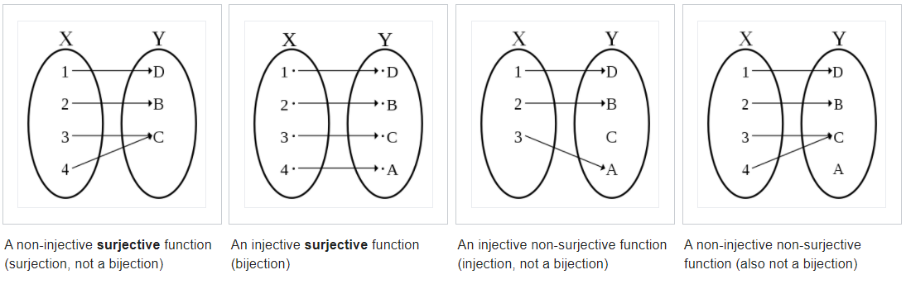
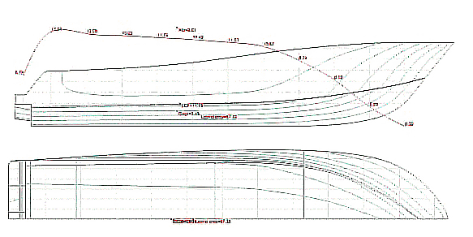
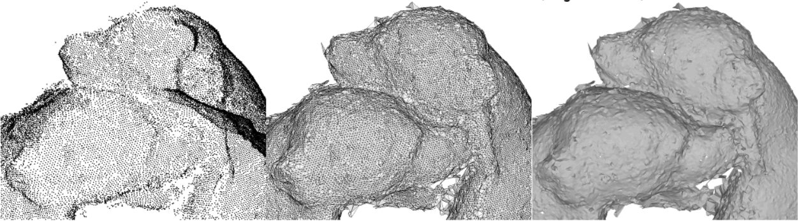
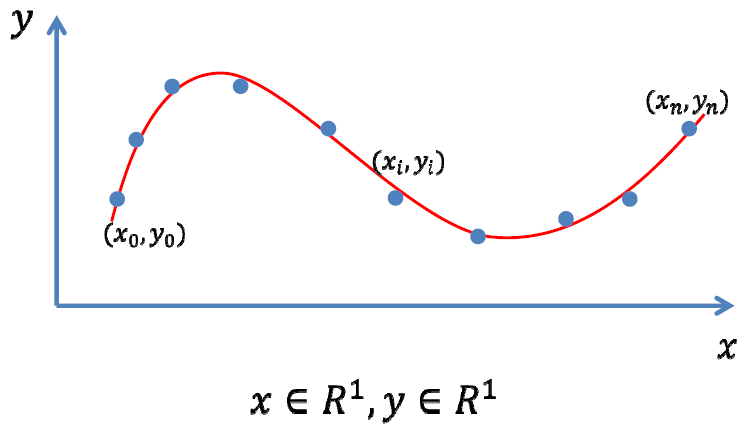
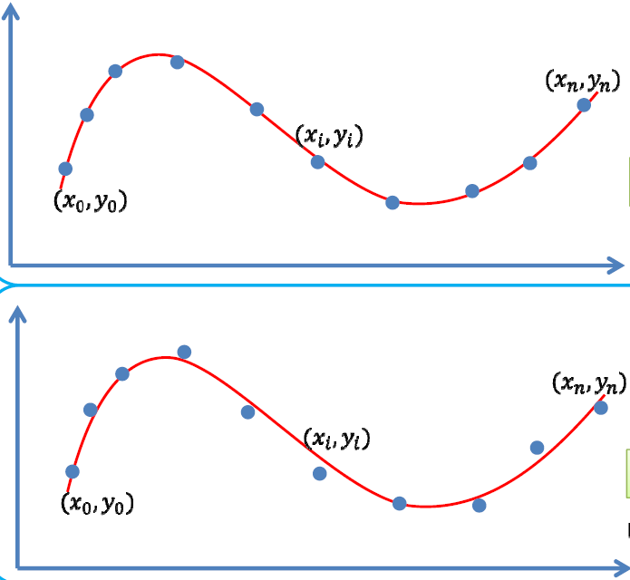
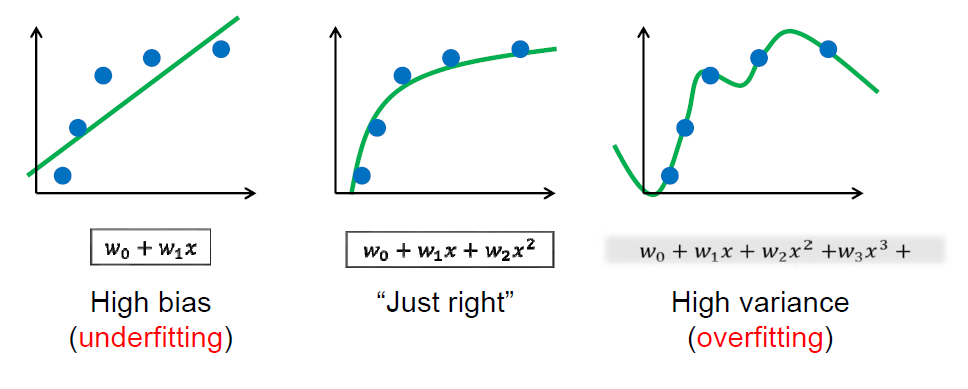

# Overview

:pushpin: **The scope of "Geometry" in Computer Graphic**

According the Liu, there are $3$ sets in CG which are

- Modeling , served for creation
- Animation ,  served for simulation
- Rendering , served for representation


:pushpin: **Modeling is the "input" of animation and rendering**

Modeling can be conceived of as "operand" / "input" for animation and rendering. If there are no models, the latter two would not success.


:pushpin: **Modeling is one of the bottlenecks in CG**

According to Liu.


# Chapter 01: Curve Fitting / Function Fitting

This is an elementary introduction of essential math towards Geometry Modeling and Processing. So called "function fitting" is to choose values for the parameters in a function to best describe a set of data, which, most of the time,  is a continuous curve.


## 1.1. The Root of Math

:pushpin: **Math is a symbol system**

It tries its utmost to better the pattern and sequence of the WORLD.


:pushpin: **Mathematical Thinking and Mathematical Modeling**

If you are equipped with above **2** major abilities, then you are good to go!


:pushpin: **The birth of Math**

Math first comes from our life, our ancestors were inspired by mother nature.

1. Math was originated from practical application, e.g. counting the animals, measuring the lands
2. Filter out the regularity from nature, e.g. how stars orient, the sequence of a year
3. From regularity to logic and reasoning, e.g. Euclid's *Elements of Geometry*
4. New theorem/hypothesis ongoing...


:pushpin: **Application of Math**

```
              Question
              
      →  Mathematical Modeling   --→
      ↑                             ↓
      |        Algorithm          ←--
      |                             ↓
      ↑-----      Code            ←--
```


:pushpin: **Abstraction**

- Kindergarten: 2:apple:+3:apple:=5:apple:
- Elementary school: 2+3=5
- Middle school: 2x+3x=5
- College: $2f'(x)+3f(x)=5$


## 1.2. Function

:pushpin: **Set**

Set can be seen as the constrained target we evaluate.


:pushpin: **Linear Space**

Linear space aims to study the relationship among the elements of a set.


:pushpin: **Mapping**

For **2** non-empty sets $A, B$, the mapping denotes as $f:A\rarr B$. Such that, for every $a_i$ of $A$, there is one **unique** element $b_i$ in $B$ corresponding to $a_i$. 

$f(a)=b$

- $b$称为$a$的象，$a$称为$b$的原象。

- $A$称为定义域，$B$称为值域。



- non-injective surjective function(surjection) 满射
- injective surjective function(bijection) 双射
- injective non-surjective function(injection, not a bijection) 单射
- non-injective non surjective function 非映射


:pushpin: **Function**

> ​	:bulb:Tips: Please take in consideration the methodology of "set"

A function is **a binary relation between two sets** that associates each element of the first set(nonempty real number$\mathbb{R}$ set) to exactly one element of the second set.
$$
y = f(x)
$$

a.k.a. $x$ is in the set $A$ of left side, $y$ is in the set $B$ of the right side.

<figure>
    <center>
  
        <figcaption>This is a function</figcaption>
     </center>
</figure>


<figure>
    <center>
  
        <figcaption>This is not a function</figcaption>
     </center>
</figure>


:pushpin: **Function Space(set of functions)**

:star:Takes several "base" function into linear combination spanning into a function space.
$$
L = \text{span}\{f_1,f_2,\cdots,f_n\}=\sum_{i=1}^{n}a_if_i(x)|a_i\in\mathbb{R}^n  \\
\text{where each function corresponds to }n \text{ real number }\mathbb{R}, \\ 
\text{a.k.a, the coefficient vector }(a_1,a_2,\cdots,a_n)
$$


:pushpin: **Polynomial Function Space**

For a Polynomial base: $\{x^k, k=0,1,\cdots,n\}$, we have polynomial function space:
$$
f(x)=\sum_{k=0}^{n}w_kx^k
$$


:pushpin: **Trigonometric functions space**

$$
f(x) = a_0 + \sum_{k=1}^{n}(a_k\cos kx+b_k \sin kx)
$$


:pushpin: **Completeness of the space**

:star:Can this function space represent (approximate) any function?


## 1.3. Math for fitting

:pushpin: **Normed space赋范空间**

inner product normed
$$
\lang f,g\rang = \int_{a}^{b}f(x)g(x)dx
$$
Normed space,  metrizable space.


- [Hilbert space](https://en.wikipedia.org/wiki/Hilbert_space) – Generalization of Euclidean space allowing infinite dimensions


:pushpin: **Weierstrass theorem(万能逼近定理)**

- 闭区间上的连续函数可用多项式级数一致逼近。
- 闭区间上周期为$2\pi$ 的连续函数可用三角函数级数一致逼近。(周期性质)

Suppose $g$  is an **arbitrary continuous real-valued function** defined on the real interval $[a, b]$. For every $ε > 0$, there exists a $n$-polynomial $f$ 
$$
f(x)=\sum_{k=0}^{n}w_kx^k
$$
such that,
$$
\text{min}_{x\in[a,b]}| f (x) − p(x)| < ε
$$


:pushpin: **Fourier series**

$$
f(t) = A_0+\sum_{n=1}^{\infin}[a_n\cos(nwt)+b_nsin(nwt)]  \\
\text{equivalent to }\\
f(t) = A_0+\sum_{n=1}^{\infin}A_n\sin(nwt+\phi_n)
$$
The second equation is much more readable, where $nwt$ **stretch** the curve, $\phi_n$ **translate** the curve.

<figure>
    <center>
  
        <figcaption>Fourier series</figcaption>
     </center>
</figure>


:pushpin: **function composition**

Function composition is an operation that takes two functions $f$ and $g$ and produces a function h such that $h(x) = g(f(x))$, and so on and so on. In CHN, this is very similar to 套娃。
$$
(f ∘ f ∘ f ∘ f)(x) = f(f(f(f(x)))) = f^4(x)
\\\text{sometimes also denoted as}\\
f=f_k∘f_{k-1}∘\cdots ∘ f_0
$$
e.g. Following functions are composed function
$$
\frac{1}{1+\big(\frac{2x}{1+x^2}\big)^2}\\\\
f(x)=\frac{e^x}{x^2+1}
$$


:pushpin: **How to find the desired function?**:star::star::star:

> ​	For most application problem and single variable

1. mathematical modeling. Find a {mapping | transform} function
2. Observe the inputs, variables, dimensions, etc.


> ​	A. Where to find? **representation**

Select certain function space.

> ​	B. Which one?  **evaluation**

Evaluate which function is the most appropriate.

> ​	C. How to find?  **optimization**

Solver and optimization.


:pushpin: **Example of Approximation/Fitting**

> ​	1.Reverse Engineering



Taking the dots of the silhouette as **input**, try to outline the shape with function.

> ​	2.Pointcloud Reconstruction

Taking the pointcloud as **input**, try to reconstruct the surface of the geometry.




## 1.4. Data Fitting

:pushpin: **Overview of data fitting**

input: a bunch of data points

output: a **function**$f(x)$ reflects the pattern/sequence of such data




:pushpin: **A. Where to find?**

A.1. Select a function space

- Linear Function Space $A=\text{span}\{B_0(x), \cdots, B_n(x)\}$
  - polynomial function $\text{span}\{1,x,x^2,\cdots,x^n\}$
  - RBF(Radial basis function) function
  - Trigonometric  function

A.2. Representation of function
$$
f(x)=\sum_{k=0}^{n}a_kB_k(x)
\\
\text{to find the $n+1$ coefficients }(a_0,\cdots,a_n)
$$


:pushpin: **B.1. Find which one?**

There are **2** main strategies to find the appropriate function. Here is the first. (**1-2**)

This strategy uses **Interpolation**, which ensures the curve passing the data point(**zero errors**)!
$$
y_i=f(x_i), i=0,1,\cdots,n
$$


<figure>
    <center>
  
        <figcaption>Interpolation example polynomial</figcaption>
     </center>
</figure>

:pushpin: **C.1. How to find?**

Since it is desired **0 errors**, solving Simultaneous Linear Equations is an option.

> ​	C.1.1. Use the following equation

$$
\sum_{k=0}^{n}a_kB_k(x_i)=y_i, i=0, 1, \cdots, n
$$

> > ​	C.1.1.1. Solving the $(n+1)\cross(n+1)$ linear equation
> >
> > ​	C.1.1.2. $n$-times Lagrange interpolation polynomial formula


> ​	C.1.2.  :warning: While the coefficient matrix is not quite stable.


:pushpin: **Lagrange Interpolating Polynomial**

:laughing: Fun fact: The formula was first published by Waring in 1779, rediscovered by Euler in 1783, and published by Lagrange in 1795.

The **Lagrange interpolating polynomial** is the polynomial $P(x)$ of degree $\leq(n-1)$ that passes through the $n$ points $(x_1,y_1=f(x_1)),(x_2,y_2=f(x_2)),\cdots, (x_n,y_n=f(x_n))$ and is given by
$$
P(x) = \sum_{j=1}^{n}P_j(x)
$$
where
$$
P_j(x)=y_j\prod_{k=1,\\k\neq j}^{n}\frac{x-x_k}{x_j-x_k}
$$
This polynomial **exists** and is **unique**.(存在且唯一)

The DOF(degree of freedom) of this function = numbers of unknown - numbers of known.

插值函数自由度=未知量个数-已知量个数


:pushpin: **B.2. Find which one?**

There are **2** main strategies to find the appropriate function. Here is the second. (**2-2**)

This strategy uses **Curve Fitting / Approximation**, which allows **errors**!
$$
\min\sum_{i=0}^{n}(y_i-f(x_i))^2
$$

<figure>
    <center>
  
        <figcaption>Polynomial Regression as an example of approximation</figcaption>
     </center>
</figure>

:pushpin: **C.2. How to find?**

Since it allows **errors**, we can take the derivative of coefficients and form linear equations.

> ​	C.2.1. Just like the following equation

$$
Ax=b
$$

> ​	C.2.2. Then use ***least squares*** method.


> ​	C.2.3.  :warning: Then the problem shifts to 
>
> > ​	-less data points, more coefficients?
> >
> > ​	-more data points, less coefficients?


:pushpin: **Recap of above strategies: interpolation and Curve Fitting**

|                         | interpolation | curve fitting                      |
| ----------------------- | ------------- | ---------------------------------- |
| **Evaluation Function** | $y_i=f(x_i)$  | $\min\sum_{i=0}^{n}(y_i-f(x_i))^2$ |
| **Loss Function**       | ZERO error    | least squares errors               |




:pushpin: **Underfitting and Overfitting**



From left to right: Underfitting, OK, Overfitting.


:pushpin: **How to avoid overfitting?**

1. Data Denoise数据去噪
2. Data Augmentation数据增广
3. Model Simplification模型简化
4. Regularization正则约束


:pushpin: **Ridge regression岭回归正则项**

For a function space, 
$$
y=f(x)=\sum_{i=0}^{n}w_iB_i(x)
$$


we have a base function represented as:
$$
W = (w_0,w_1,\cdots,w_n)
$$
Least squares for fitting:
$$
\min\limits_{W}\norm{Y-XW}^2
$$
Ridge regression:
$$
\min\limits_{W}\norm{Y-XW}^2+\mu\norm{W}_2^2
$$


:pushpin: **Regularization for Sparsity**

:bulb:When to use this: there is redundant base function in function space.

Therefore, we can optimize to select an appropriate base function.

- the $L_0$ norm of coefficient vector(nonzero counts) is as smaller as possible.
- pick the RIGHT base function

$$
\min\limits_{a}\norm{Y-XW}^2+\mu\norm{W}_0
\\
\min\limits_{a}\norm{Y-XW}^2,\quad \text{s.t.}\space\norm{W}_0\leq\beta
$$


:pushpin: **Compressed sensing**

If we have $y$ and $\phi$, there might be infinite solution $x$.

For **sparse** signals, we can reconstruct $x$ by optimization under certain condition.
$$
\min\norm{X}_0\\
\text{s.t. }\Phi x=y
$$


:pushpin: ****


:pushpin: ****


:pushpin: ****


:pushpin: ****


:pushpin: ****


:pushpin: ****


:pushpin: ****


:pushpin: ****


:pushpin: ****


:pushpin: ****


:pushpin: ****


:pushpin: ****


:pushpin: ****


:pushpin: ****


:pushpin: ****


:pushpin: ****


:pushpin: ****


:pushpin: ****


:pushpin: ****


:pushpin: ****


:pushpin: ****


:pushpin: ****


:pushpin: ****


:pushpin: ****


:pushpin: ****


:pushpin: ****


:pushpin: ****


:pushpin: ****


:pushpin: ****


:pushpin: ****


:pushpin: ****


:pushpin: ****


:pushpin: ****


:pushpin: ****


:pushpin: ****


:pushpin: ****


:pushpin: ****


:pushpin: ****


:pushpin: ****


:pushpin: ****


:pushpin: ****


:pushpin: ****


:pushpin: ****


:pushpin: ****


:pushpin: ****


:pushpin: ****


:pushpin: ****


:pushpin: ****


:pushpin: ****


:pushpin: ****


:pushpin: ****


:pushpin: ****


:pushpin: ****


:pushpin: ****


:pushpin: ****


:pushpin: ****


:pushpin: ****


:pushpin: ****


:pushpin: ****


:pushpin: ****


:pushpin: ****


:pushpin: ****


:pushpin: ****


:pushpin: ****


:pushpin: ****


:pushpin: ****


:pushpin: ****


:pushpin: ****


:pushpin: ****


:pushpin: ****


:pushpin: ****


:pushpin: ****


:pushpin: ****


:pushpin: ****


:pushpin: ****


:pushpin: ****


:pushpin: ****


:pushpin: ****


:pushpin: ****


:pushpin: ****


:pushpin: ****


:pushpin: ****


:pushpin: ****


:pushpin: ****


:pushpin: ****


:pushpin: ****


:pushpin: ****


:pushpin: ****


:pushpin: ****


:pushpin: ****


:pushpin: ****


:pushpin: ****


:pushpin: ****


:pushpin: ****


:pushpin: ****


:pushpin: ****


:pushpin: ****


:pushpin: ****


:pushpin: ****


:pushpin: ****


:pushpin: ****


:pushpin: ****


:pushpin: ****


:pushpin: ****


:pushpin: ****


:pushpin: ****


:pushpin: ****


:pushpin: ****


:pushpin: ****


:pushpin: ****


:pushpin: ****


:pushpin: ****


:pushpin: ****


:pushpin: ****


:pushpin: ****


:pushpin: ****


:pushpin: ****


:pushpin: ****


:pushpin: ****


:pushpin: ****


:pushpin: ****


:pushpin: ****


