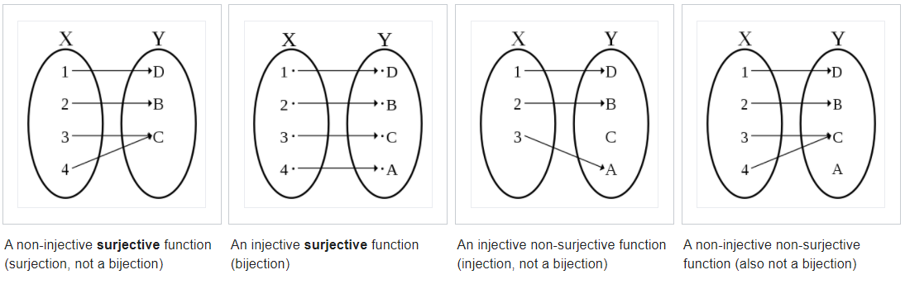
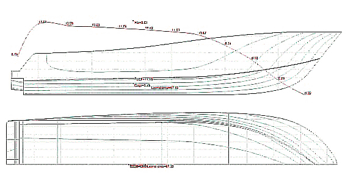
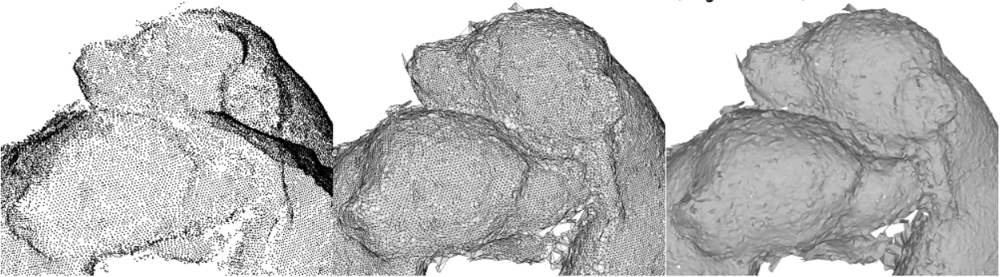
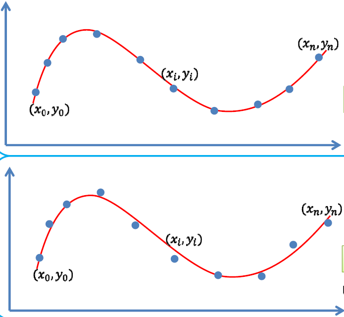

# Overview

:pushpin: **The scope of "Geometry" in Computer Graphic**

According the Liu, there are $3$ sets in CG which are

- Modeling , served for creation
- Animation ,  served for simulation
- Rendering , served for representation


:pushpin: **Modeling is the "input" of animation and rendering**

Modeling can be conceived of as "operand" / "input" for animation and rendering. If there are no models, the latter two would not success.


:pushpin: **Modeling is one of the bottlenecks in CG**

According to Liu.


# Chapter 01: Curve Fitting / Function Fitting

This is an elementary introduction of essential math towards Geometry Modeling and Processing. So called "function fitting" is to choose values for the parameters in a function to best describe a set of data, which, most of the time,  is a continuous curve.


## 1.1. The Root of Math

:pushpin: **Math is a symbol system**

It tries its utmost to better the pattern and sequence of the WORLD.


:pushpin: **Mathematical Thinking and Mathematical Modeling**

If you are equipped with above **2** major abilities, then you are good to go!


:pushpin: **The birth of Math**

Math first comes from our life, our ancestors were inspired by mother nature.

1. Math was originated from practical application, e.g. counting the animals, measuring the lands
2. Filter out the regularity from nature, e.g. how stars orient, the sequence of a year
3. From regularity to logic and reasoning, e.g. Euclid's *Elements of Geometry*
4. New theorem/hypothesis ongoing...


:pushpin: **Application of Math**

```
              Question
              
      →  Mathematical Modeling   --→
      ↑                             ↓
      |        Algorithm          ←--
      |                             ↓
      ↑-----      Code            ←--
```


:pushpin: **Abstraction**

- Kindergarten: 2:apple:+3:apple:=5:apple:
- Elementary school: 2+3=5
- Middle school: 2x+3x=5
- College: $2f'(x)+3f(x)=5$


## 1.2. Function

:pushpin: **Set**

Set can be seen as the constrained target we evaluate.


:pushpin: **Linear Space**

Linear space aims to study the relationship among the elements of a set.


:pushpin: **Mapping**

For **2** non-empty sets $A, B$, the mapping denotes as $f:A\rarr B$. Such that, for every $a_i$ of $A$, there is one **unique** element $b_i$ in $B$ corresponding to $a_i$. 

$f(a)=b$

- $b$称为$a$的象，$a$称为$b$的原象。

- $A$称为定义域，$B$称为值域。



- non-injective surjective function(surjection) 满射
- injective surjective function(bijection) 双射
- injective non-surjective function(injection, not a bijection) 单射
- non-injective non surjective function 非映射


:pushpin: **Function**

> ​	:bulb:Tips: Please take in consideration the methodology of "set"

A function is **a binary relation between two sets** that associates each element of the first set(nonempty real number$\mathbb{R}$ set) to exactly one element of the second set.
$$
y = f(x)
$$

a.k.a. $x$ is in the set $A$ of left side, $y$ is in the set $B$ of the right side.

<figure>
    <center>
  
        <figcaption>This is a function</figcaption>
     </center>
</figure>


<figure>
    <center>
  
        <figcaption>This is not a function</figcaption>
     </center>
</figure>


:pushpin: **Function Space(set of functions)**

:star:Takes several "base" function into linear combination spanning into a function space.
$$
L = \text{span}\{f_1,f_2,\cdots,f_n\}=\sum_{i=1}^{n}a_if_i(x)|a_i\in\mathbb{R}^n  \\
\text{where each function corresponds to }n \text{ real number }\mathbb{R}, \\ 
\text{a.k.a, the coefficient vector }(a_1,a_2,\cdots,a_n)
$$


:pushpin: **Polynomial Function Space**

For a Polynomial base: $\{x^k, k=0,1,\cdots,n\}$, we have polynomial function space:
$$
f(x)=\sum_{k=0}^{n}w_kx^k
$$


:pushpin: **Trigonometric functions space**

$$
f(x) = a_0 + \sum_{k=1}^{n}(a_k\cos kx+b_k \sin kx)
$$


:pushpin: **Completeness of the space**

:star:Can this function space represent (approximate) any function?


## 1.3. Math for fitting

:pushpin: **Normed space赋范空间**

inner product normed
$$
\lang f,g\rang = \int_{a}^{b}f(x)g(x)dx
$$
Normed space,  metrizable space.


- [Hilbert space](https://en.wikipedia.org/wiki/Hilbert_space) – Generalization of Euclidean space allowing infinite dimensions


:pushpin: **Weierstrass theorem(万能逼近定理)**

- 闭区间上的连续函数可用多项式级数一致逼近。
- 闭区间上周期为$2\pi$ 的连续函数可用三角函数级数一致逼近。(周期性质)

Suppose $g$  is an **arbitrary continuous real-valued function** defined on the real interval $[a, b]$. For every $ε > 0$, there exists a $n$-polynomial $f$ 
$$
f(x)=\sum_{k=0}^{n}w_kx^k
$$
such that,
$$
\text{min}_{x\in[a,b]}| f (x) − p(x)| < ε
$$


:pushpin: **Fourier series(periodic)**

$$
f(t) = A_0+\sum_{n=1}^{\infin}[a_n\cos(nwt)+b_nsin(nwt)]  \\
\text{equivalent to }\\
f(t) = A_0+\sum_{n=1}^{\infin}A_n\sin(nwt+\phi_n)
$$
The second equation is much more readable, where $nwt$ **stretch** the curve, $\phi_n$ **translate** the curve.

<figure>
    <center>
  
        <figcaption>Fourier series</figcaption>
     </center>
</figure>


:pushpin: **function composition**

Function composition is an operation that takes two functions $f$ and $g$ and produces a function h such that $h(x) = g(f(x))$, and so on and so on. In CHN, this is very similar to 套娃。
$$
(f ∘ f ∘ f ∘ f)(x) = f(f(f(f(x)))) = f^4(x)
\\\text{sometimes also denoted as}\\
f=f_k∘f_{k-1}∘\cdots ∘ f_0
$$
e.g. Following functions are composed function
$$
\frac{1}{1+\big(\frac{2x}{1+x^2}\big)^2}\\\\
f(x)=\frac{e^x}{x^2+1}
$$


:pushpin: **How to find the desired function?**:star::star::star:

> ​	For most application problem and single variable

1. mathematical modeling. Find a {mapping | transform} function
2. Observe the inputs, variables, dimensions, etc.


> ​	A. Where to find? **representation**

Select certain function space.

> ​	B. Which one?  **evaluation**

Evaluate which function is the most appropriate.

> ​	C. How to find?  **optimization**

Solver and optimization.


:pushpin: **Example of Approximation/Fitting**

> ​	1.Reverse Engineering



Taking the dots of the silhouette as **input**, try to outline the shape with function.

> ​	2.Pointcloud Reconstruction

Taking the pointcloud as **input**, try to reconstruct the surface of the geometry.




## 1.4. Data Fitting

:pushpin: **Overview of data fitting**

input: a bunch of data points

output: a **function**$f(x)$ reflects the pattern/sequence of such data


:pushpin: **A. Where to find?**

A.1. Select a function space

- Linear Function Space $A=\text{span}\{B_0(x), \cdots, B_n(x)\}$
  - polynomial function $\text{span}\{1,x,x^2,\cdots,x^n\}$
  - RBF(Radial basis function) function
  - Trigonometric  function

A.2. Representation of function
$$
f(x)=\sum_{k=0}^{n}a_kB_k(x)
\\
\text{to find the $n+1$ coefficients }(a_0,\cdots,a_n)
$$


:pushpin: **B.1. Find which one?**

There are **2** main strategies to find the appropriate function. Here is the first. (**1-2**)

This strategy uses **Interpolation**, which ensures the curve passing the data point(**zero errors**)!
$$
y_i=f(x_i), i=0,1,\cdots,n
$$


<figure>
    <center>
  
        <figcaption>Interpolation example polynomial</figcaption>
     </center>
</figure>

:pushpin: **C.1. How to find?**

Since it is desired **0 errors**, solving Simultaneous Linear Equations is an option.

> ​	C.1.1. Use the following equation

$$
\sum_{k=0}^{n}a_kB_k(x_i)=y_i, i=0, 1, \cdots, n
$$

> > ​	C.1.1.1. Solving the $(n+1)\cross(n+1)$ linear equation
> >
> > ​	C.1.1.2. $n$-times Lagrange interpolation polynomial formula


> ​	C.1.2.  :warning: While the coefficient matrix is not quite stable.


:pushpin: **Lagrange Interpolating Polynomial**

:laughing: Fun fact: The formula was first published by Waring in 1779, rediscovered by Euler in 1783, and published by Lagrange in 1795.

The **Lagrange interpolating polynomial** is the polynomial $P(x)$ of degree $\leq(n-1)$ that passes through the $n$ points $(x_1,y_1=f(x_1)),(x_2,y_2=f(x_2)),\cdots, (x_n,y_n=f(x_n))$ and is given by
$$
P(x) = \sum_{j=1}^{n}P_j(x)
$$
where
$$
P_j(x)=y_j\prod_{k=1,\\k\neq j}^{n}\frac{x-x_k}{x_j-x_k}
$$
This polynomial **exists** and is **unique**.(存在且唯一)

The DOF(degree of freedom) of this function = numbers of unknown - numbers of known.

插值函数自由度=未知量个数-已知量个数


:pushpin: **B.2. Find which one?**

There are **2** main strategies to find the appropriate function. Here is the second. (**2-2**)

This strategy uses **Curve Fitting / Approximation**, which allows **errors**!
$$
\min\sum_{i=0}^{n}(y_i-f(x_i))^2
$$

<figure>
    <center>
  
        <figcaption>Polynomial Regression as an example of approximation</figcaption>
     </center>
</figure>
:bulb: Why **least squares method最小二乘法** is favored in optimization?  That's because its derivative is $1$-polynomial.(a.k.a. easier to find local or global minima)


:pushpin: **C.2. How to find?**

Since it allows **errors**, we can take the derivative of coefficients and form linear equations.

> ​	C.2.1. Just like the following equation

$$
Ax=b
$$

> ​	C.2.2. Then use ***least squares*** method.


> ​	C.2.3.  :warning: Then the problem shifts to 
>
> > ​	-less data points, more coefficients?
> >
> > ​	-more data points, less coefficients?


:pushpin: **Recap of above strategies: interpolation and Curve Fitting**

|                         | interpolation | curve fitting                      |
| ----------------------- | ------------- | ---------------------------------- |
| **Evaluation Function** | $y_i=f(x_i)$  | $\min\sum_{i=0}^{n}(y_i-f(x_i))^2$ |
| **Loss Function**       | ZERO error    | least squares errors               |




:pushpin: **Underfitting and Overfitting**


From left to right: Underfitting, OK, Overfitting.


:pushpin: **How to avoid overfitting?**

1. Data Denoise数据去噪
2. Data Augmentation数据增广
3. Model Simplification模型简化
4. Regularization正则约束


:pushpin: **Ridge regression岭回归正则项**

For a function space, 
$$
y=f(x)=\sum_{i=0}^{n}w_iB_i(x)
$$


we have a base function represented as:
$$
W = (w_0,w_1,\cdots,w_n)
$$
Least squares for fitting:
$$
\min\limits_{W}\norm{Y-XW}^2
$$
Ridge regression:
$$
\min\limits_{W}\norm{Y-XW}^2+\mu\norm{W}_2^2
$$


:pushpin: **Regularization for Sparsity**

:bulb:When to use this: there is redundant base function in function space.

Therefore, we can optimize to select an appropriate base function.

- the **$L_0$ norm of coefficient vector(≈nonzero counts)** is as smaller as possible.
  - zero elements↑ sparsity↑ choices of $W$↓ easier to compute↑
- pick the RIGHT base function

$$
\min\limits_{a}\norm{Y-XW}^2+\mu\norm{W}_0
\\
\min\limits_{a}\norm{Y-XW}^2,\quad \text{s.t.}\space\norm{W}_0\leq\beta
$$


:pushpin: **Compressed sensing**


$x$ , the sparse vector representing data

$y$ , the compressed vector excluding $0$. 

$\Phi$ , sampling matrix


If we have $y$ and $\Phi$, there might be infinite solution of $x$. 

But according to [Candes and Tao 2005](https://arxiv.org/abs/math/0502327) : for **sparse** signals, we can reconstruct $x$ by optimization under certain condition.
$$
\min\norm{X}_0\\
\text{s.t. }\Phi x=y
$$


:pushpin: ****


:pushpin: ****


:pushpin: ****


:pushpin: ****


:pushpin: ****


:pushpin: ****


:pushpin: ****


:pushpin: ****


:pushpin: ****


:pushpin: ****


:pushpin: ****


:pushpin: ****


:pushpin: ****


:pushpin: ****


:pushpin: ****


:pushpin: ****


:pushpin: ****


:pushpin: ****


:pushpin: ****


:pushpin: ****


:pushpin: ****


:pushpin: ****


:pushpin: ****


:pushpin: ****


:pushpin: ****


:pushpin: ****


:pushpin: ****


:pushpin: ****


:pushpin: ****


:pushpin: ****


:pushpin: ****


:pushpin: ****


:pushpin: ****


:pushpin: ****


:pushpin: ****


:pushpin: ****


:pushpin: ****


:pushpin: ****


:pushpin: ****


:pushpin: ****


:pushpin: ****


:pushpin: ****


:pushpin: ****


:pushpin: ****


:pushpin: ****


:pushpin: ****


:pushpin: ****


:pushpin: ****


:pushpin: ****


:pushpin: ****


:pushpin: ****


:pushpin: ****


:pushpin: ****


:pushpin: ****


:pushpin: ****


:pushpin: ****


:pushpin: ****


:pushpin: ****


:pushpin: ****


:pushpin: ****


:pushpin: ****


:pushpin: ****


:pushpin: ****


:pushpin: ****


:pushpin: ****


:pushpin: ****


:pushpin: ****


:pushpin: ****


:pushpin: ****


:pushpin: ****


:pushpin: ****


:pushpin: ****


:pushpin: ****


:pushpin: ****


:pushpin: ****


:pushpin: ****


:pushpin: ****


:pushpin: ****


:pushpin: ****


:pushpin: ****


:pushpin: ****


:pushpin: ****


:pushpin: ****


:pushpin: ****


:pushpin: ****


:pushpin: ****


:pushpin: ****


:pushpin: ****


:pushpin: ****


:pushpin: ****


:pushpin: ****


:pushpin: ****


:pushpin: ****


:pushpin: ****


:pushpin: ****


:pushpin: ****


:pushpin: ****


:pushpin: ****


:pushpin: ****


:pushpin: ****


:pushpin: ****


:pushpin: ****


:pushpin: ****


:pushpin: ****


:pushpin: ****


:pushpin: ****


:pushpin: ****


:pushpin: ****


:pushpin: ****


:pushpin: ****


:pushpin: ****


:pushpin: ****


:pushpin: ****


:pushpin: ****


:pushpin: ****


:pushpin: ****


:pushpin: ****


:pushpin: ****


:pushpin: ****


:pushpin: ****


:pushpin: ****


:pushpin: ****


# Appendix

## 1. 函数插值

在许多实际问题中，某个函数 $f(x)$ 往往很复杂、没有解析表达或者未知。我们往往只能通过某些手段观测到反映该函数的一些采样数据。我们希望通过这些观测的采样数据来估计该函数的信息，并预测函数在其他观测点的值。这时，我们从观测数据来求得一个函数 $\phi(x)$ 来近似 $f(x)$ 。

**定义**： $f(x)$ 为定义在区间 $[a,b]$ 上的函数， $x_0,x_1,\cdots,x_n$ 为区间上 $n+1$ 个互不相同的点， $\Phi$ 为给定的某一函数类。求 $\Phi$ 上的函数 $\phi(x)$ ，满足：
$$
\phi(x_i)=f(x_i), \ \ i=0,1,\cdots,n
$$
则称 $\phi(x)$ 为 $f(x)$ 关于节点 $x_0,x_1,\cdots,x_n$ 在 $\Phi$ 上的插值函数。称 $x_0,x_1,\cdots,x_n$ 为插值节点，称 $(x_i,f(x_i))$ 为插值点。

### 1.1 多项式插值定理

**定理**：若 $x_i$ 两两不同，则对任意给定的 $y_i$ ，存在唯一的次数至多是 $n$ 次的多项式 $p_n$ ，使得 $p_n(x_i)=y_i，i=0,\cdots,n$ 。

证明：在幂基 $\lbrace 1,x,\cdots,x^n \rbrace $ 下待定多项式 $p$ 的形式为：

$$
p(x)=a_0+a_1x+a_2 x^2+\cdots+a_n x^n
$$

由插值条件 $p(x_i)=y_i,i=0,\cdots,n$ ，得到如下方程组：

$$
\left( \begin{array} {c} 1 &x _ 0 &x _ 0^2 &\dots &x _ o^n \newline 1 &x _ 1 &x _ 1^2 &\dots &x _ 1^n \newline 1 &x _ 2 &x _ 2^2 &\dots &x _ 2^n \newline \vdots &\vdots &\vdots &\ddots &\vdots\newline 1 &x _ n &x _ n^2 &\dots &x _ n^n \newline \end{array} \right) \left( \begin{array} {c} a _ 0 \newline a _ 1 \newline a _ 2 \newline \vdots \newline a _ n \end{array} \right) = \left( \begin{array} {c} y _ 0 \newline y _ 1 \newline y _ 2 \newline \vdots \newline y _ n \end{array} \right)
$$

系数矩阵为 **Vandermonde** 矩阵，其行列式非零，因此方程组有唯一解。

### 1.2 不同形式的插值多项式

对于给定问题，插值多项式存在唯一。但是可以用不同的方法给出插值多项式的不同表示形式。

#### 1.2.1 Lagrange插值

**Lagrange基函数**：由多项式插值定理存在函数 $l_i(x)$ 满足 $l_i(x_j)=\sigma_{ij}$ ：

$$
l_i(x)=\prod_{j=0,j\neq i}\frac{x-x_j}{x_i-x_j}
$$

Lagrange插值多项式：

$$
L_n(x)=\sum_{k=0}^n y_k l_k(x)
$$

#### 1.2.2 Newton插值

**定义**：

一阶差商：

$$
f[x_0,x_1]=\frac{f(x_1)-f(x_0)}{x_1-x_0}
$$

$k $阶差商：

设$ \lbrace x_0,x_1,\cdots,x_k \rbrace  $互不相同，$ f(x) $关于$ \lbrace x_0,x_1,\cdots,x_k \rbrace  $的$ k $阶差商为：

$$
f[x_0,x_1,\cdots,x_k]=\frac{f[x_1,\cdots,x_k]-f[x_0,x_1,\cdots,x_{k-1}]}{x_k-x_0}
$$

所以**Newton插值多项式**表示为：

$$
N _ n(x)=f(x _ 0)+f[x _ 0,x _ 1](x-x _ 0)+\cdots+f[x _ 0,x _ 1,\cdots,x _ n](x-x _ 0)\cdots(x-x _ {n-1})
$$

## 2. 函数拟合

函数拟合是指：给出一组离散的点，需要确定一个函数来逼近原函数。由于离散数据通常是由观察或测试得到的，所以不可避免的会有误差。我们需要的逼近原函数的手段要满足如下两个条件：

- 不要求过所有的点（可以消除误差影响）
- 尽可能表现数据的趋势，靠近这些点

用数学的语言来说即是，需要在给定的函数空间 $\Phi$ 上找到函数 $\phi$ ，使得 $\phi$ 到原函数 $f$ 的距离最小。这里的距离指的是某种度量，不同的度量对应着不同的拟合方法。则函数 $\phi(x)$ 称为 $f(x)$ 在空间 $\Phi$ 上的拟合曲线。

### 2.1 函数拟合的最小二乘法问题

**定义**： $f(x)$ 为定义在去区间 $[a,b]$ 上的函数， $\lbrace x _ i \rbrace  _ {i=0}^m$ 为区间上 $m+1$ 个互不相同的点， $\Phi$ 为给定的某一函数类。求 $\Phi$ 上的函数 $\phi(x)$ 满足 $f(x)$ 和 $\phi(x)$ 在给定的 $m+1$ 个点上的距离最小，如果这种距离取为2-范数的话，则称为最小二乘问题。即：求 $\phi(x) \in \Phi$ ，使得：

$$
R_2=\sqrt{\sum_{i=0}^m (\phi(x_i)-f(x_i))^2}
$$

最小。

#### 2.1.1 最小二乘问题的求解

首先给出如下离散内积与离散范数的定义：

**定义**：函数 $f,g$ 的关于离散点列 $\lbrace x _ i \rbrace  _ {i=0}^m$ 的离散内积为：
$$
(f,g) _ h=\sum _ {i=0}^n f(x _ i)g(x _ i)
$$

**定义**：函数 $f$ 的离散范数为：
$$
||f||_h=\sqrt{(f,f)_h}
$$

该种内积下，范数的定义与向量的2范数一致。

> 上述定义中的下标 $h$ 表示对离散内积与离散范数的指代，类似1-范数的定义 $||x|| _ 1=\sum _ {i=1}^n |x _ i|$ ，无其他特殊含义。

设 $\Phi=span\lbrace \phi_0,\phi_1,\cdots,\phi_n \rbrace $

$$
\phi(x)=a_0\phi_0(x)+a_1\phi_1(x)+\cdots+a_n\phi_n(x)
$$

则最小二乘问题为：

$$
||f(x)-(a_0\phi_0(x)+a_1\phi_1(x)+\cdots+a_n\phi_n(x))||_h
$$

关于系数 $\lbrace a_0,a_1,\cdots,a_n \rbrace $ 最小

$$
\begin{aligned}
&||f(x)-(a _ 0\phi _ 0(x)+a _ 1\phi _ 1(x)+\cdots+a _ n\phi _ n(x))|| _ h^2 \newline
=& ||f|| _ h^2-2(f,a _ 0\phi _ 0(x)+a _ 1\phi _ 1(x)+\cdots+a _ n\phi _ n(x)) _ h+||a _ 0\phi _ 0(x)+a _ 1\phi _ 1(x)+\cdots+a _ n\phi _ n(x)|| _ h^2 \newline
=&||f|| _ h^2-2\sum _ {k=0}^n a _ k(f,\phi _ k) _ h+\sum _ {i,k=0}^n a _ i a _ k(\phi _ i,\phi _ k) _ h \newline
=&Q(a _ 0,a _ 1,\cdots,a _ n)
\end{aligned}
$$

由于它关于系数 ${a_0,a_1,\cdots,a_n}$ 最小，因此有

$$
\begin{align*}
&\frac{\partial Q}{\partial a_i}=0 ,\ \ \ i=0,1,\cdots,n \newline
i.e. \ \ &\sum_{k=0}^n a_k(\phi_i,\phi_k)_h=(f,\phi_i)_h,\ \ \ i=0,1,\cdots,n 
\end{align*}
$$

写成矩阵形式有：

$$
\left( \begin{array} {c} (\phi _ 0,\phi _ 0) _ h & \dots & (\phi _ 0,\phi _ n) _ h \newline \vdots & \ddots & \vdots \newline (\phi _ n,\phi _ 0) _ h & \dots &(\phi _ n,\phi _ n) _ h \end{array} \right) \left( \begin{array} {c} a _ 0 \newline \vdots \newline a _ n \end{array} \right) = \left( \begin{array} {c} (f,\phi _ 0) _ h\newline \vdots \newline (f,\phi _ n) _ h \end{array} \right)
$$

#### 2.1.2 线性拟合

**例1**：取 $\Phi$ 为线性多项式空间，函数空间的基为 $\lbrace 1,x \rbrace $ ,拟合曲线为 $y=a+bx$ ，则法方程为：

$$
\left( \begin{array} {c} (1,1) _ h  & (1，x) _ h \newline (x,1) _ h  &(x,x) _ h \end{array} \right) \left( \begin{array} {c} a \newline b \end{array} \right) = \left( \begin{array} {c} (f,1) _ h\newline (f,x) _ h \end{array} \right)
$$

#### 2.1.3 二次拟合

**例2**：取 $\Phi$ 为线性多项式空间，函数空间的基为 $\lbrace 1,x,x^2 \rbrace $ ,拟合曲线为 $y=a_0+a_1 x+a_2 x^2$ ，则法方程为：

$$
\left( \begin{array} {c} (1,1) _ h  & (1，x) _ h & (1,x^2) _ h\newline (x,1) _ h  &(x,x) _ h &(x,x^2) _ h\newline (x^2,1) _ h  &(x^2,x) _ h &(x^2,x^2) _ h\newline \end{array} \right) \left( \begin{array} {c} a _ 0 \newline a _ 1 \newline a _ 2 \end{array} \right) = \left( \begin{array} {c} (f,1) _ h\newline (f,x) _ h \newline (f,x^2) _ h \end{array} \right)
$$

## 3. Weierstrass 第一逼近定理

**定理**：设 $f(x)$ 是闭区间 $[a,b]$ 上的连续函数，则存在多项式序列 ${P_n(x)}$ 在 $[a,b]$ 上一致收敛于 $f(x)$ 。也就是对任意给定的 $\epsilon > 0 $ ，存在多项式$P(x) $ ，使得：

$$
|P(x)-f(x)| < \epsilon
$$

对一切 $x\in[a,b] $ 成立。

证：不失一般性，设$[a,b] $ 为$[0,1] $，使用构造性的证明。

设$ X $是$ [0,1] $上连续函数$ f(t) $的全体构成的集合，$ Y $是多项式全体构成的集合，定义映射：

$$
\begin{align*}
B_n: &\ \ X \ \rightarrow \ \ Y \newline
 & f(t) \mapsto B_n(f,x)=\sum_{k=0}^n f(\frac{k}{n})C_n^k x^k (1-x)^{n-k}
\end{align*}
$$

得到 ${B_n(f,x)}$ ， $B_n(f,x)$ 表示 $f\in X$ 在映射 $B_n$ 作用下的像，它是以 $x$ 为变量的 $n$ 次多项式，称为 $f$ 的 $n$ 此 $\textbf{Bernstein}$ 多项式。

关于映射 $B_n$ ,有下述基本性质与基本关系式：

1. 线性性: 对于任意 $f,g\in X$ 及 $\alpha,\beta \in R$ ，成立
   $$
   B_n(\alpha f+\beta g,x)=\alpha B_n(f,x)+\beta B_n(g,x)
   $$

2. 单调性: 若 $f(t)\geq g(t) (t\in[a,b])$ ,则
   $$
   B_n(f,x) \geq B_n(g,x) \ \ \ x\in [a,b]
   $$

3. 
   $$
   \begin{align*}
     &B_n(1,x)=\sum_{k=0}^n C_n^k x^k (1-x)^{n-k}=1 \newline
     &B_n(t,x)=\sum_{k=0}^n \frac{k}{n} C_n^k x^k (1-x)^{n-k}=x \newline
     &B_n(t^2,x)=\sum_{k=0}^n \frac{k^2}{n^2} C_n^k x^k (1-x)^{n-k}=x^2+\frac{x-x^2}{n}
   \end{align*}
   $$

函数 $(t-s)^2 $ 在 $ B_n $ 映射下的像(视 $ s $ 为常数)：

$$
\begin{align*}
    B_n((t-s)^2,x)&= B_n(t^2,x)-2sB_n(t,x)+s^2B_n(1,x) \newline
    &=x^2+\frac{x-x^2}{n}-2sx+s^2=(x-s)^2+\frac{x-x^2}{n}
    \end{align*}
$$

根据 $\textbf{Cantor}$ 定理， $f$ 在 $[0,1]$ 上一致连续，于是对于任意给定的 $\epsilon > 0$ ，存在 $\delta > 0$ ，对一切 $t,s\in[0,1]$ :

当 $|t-s| < \delta$ 时，成立：

$$
|f(t)-f(s)| < \frac{\epsilon}{2}
$$

当 $|t-s| \geq \delta$ 时，成立：

$$
|f(t)-f(s)| \leq 2M \leq \frac{2M}{\delta^2}(t-s)^2
$$

于是对一切 $t,s\in[0,1]$ ,成立：

$$
|f(t)-f(s)| \leq \frac{\epsilon}{2}+\frac{2M}{\delta^2}(t-s)^2
$$

即：

$$
-\frac{\epsilon}{2}-\frac{2M}{\delta^2}(t-s)^2 \leq f(t)-f(s) \leq \frac{\epsilon}{2}+\frac{2M}{\delta^2}(t-s)^2
$$

对上式左端，中间，右端三式（视 $t$ 为变量， $s$ 为常数）考虑在映射 $B_n$ 作用下的像，得到对一切 $x,s\in[0,1]$ ，成立：

$$
-\frac{\epsilon}{2}-\frac{2M}{\delta^2}[(x-s)^2+\frac{x-x^2}{n}] \leq B_n(f,x)-f(s) \leq \frac{\epsilon}{2}+\frac{2M}{\delta^2}[(x-s)^2+\frac{x-x^2}{n}]
$$

令 $s=x$ ，注意到 $x(1-x) \leq \frac{1}{4}$ ，即得到对一切 $x\in[0,1]$ ，成立：

$$
|\sum_{k=0}^n f(\frac{k}{n})C_n^k x^k (1-x)^{n-k}-f(x)| \leq \frac{\epsilon}{2}+\frac{M}{2n\delta^2}
$$

取 $N=\lceil \frac{M}{\delta^2 \epsilon} \rceil$ ，当 $n>N$ 时：

$$
|\sum_{k=0}^n f(\frac{k}{n})C_n^k x^k (1-x)^{n-k}-f(x)| < \epsilon
$$

对一切 $x\in[0,1]$ 成立。

## 4. Weierstrass 第二逼近定理

**定理**：设 $f(x)$ 是以 $2\pi$ 为周期的连续函数，则存在三角多项式序列一致收敛于 $f(x)$ 。也就是对于任意给定的 $\epsilon > 0$ ，存在三角多项式 $T(x)$ ，使得:
$$
|T(x)-f(x)| < \epsilon
$$

对一切 $x\in(-\infty,+\infty)$ 成立。

先证明一个引理：

**引理**：设 $g(x)$ 在 $[0,\pi]$ 上连续，则对于任意 $ \epsilon > 0$ ，存在余弦三角多项式 $T(x)$ ，使得：

$$
|T(x)-g(x)| < \epsilon
$$

对一切 $x\in[0,\pi]$ 成立。

证：由 $g(\arccos y)$ 在 $[-1,1]$ 上连续，由 $\textbf{Weierstrass}$ 第一逼近定理，对任意 $\epsilon > 0$ ，存在多项式 $P(y)$ ，使得：

$$
|P(y)-g(\arccos y)| < \epsilon
$$

对一切 $y\in[-1,1]$ 成立，即：

$$
|P(\cos x)-g(x)|< \epsilon
$$

对一切 $x\in [0,\pi]$ 成立。由三角恒等式

$$
\begin{align*}
   &\cos^2x =\frac{1}{2}(1+\cos {2x}), \newline
   &\cos^3x =\frac{1}{4}(3\cos x+\cos{3x}),\newline
   &\cdots,\newline
   &\cos^{2n}x=\frac{1}{2^{2n-1}}(\sum_{k=1}^{n-1} C_{2n}^k \cos{2(n-k)x}+\frac{1}{2}C_{2n}^n),\newline
   &\cos^{2n+1}x=\frac{1}{2^{2n}}\sum_{k=0}^n C_{2n+1}^k \cos{(2n-2k+1)x}\newline
\end{align*}
$$

可知 $P(\cos x)=T(x)$ 是余弦三角多项式。

**推论**：设 $g(x)$ 是以 $2\pi$ 为周期的连续偶函数，则 $\textbf{Weierstrass}$ 第二逼近定理成立，且三角多项式是余弦三角多项式。

$\textbf{Weierstrass}$ 第二逼近定理的证明：

设$ f(x) $是以$ 2\pi $为周期的连续函数，令：

$$
\phi(x)=f(x)+f(-x),\ \psi(x)=[f(x)-f(-x)]\sin x
$$

则 $\phi(x)$ 和 $\psi(x)$ 都是以 $2\pi$ 为周期的连续偶函数，由上面推论，可知对任意给定的 $\epsilon > 0$ ，存在余弦三角多项式 $T_1(x)$ 与 $T_2(x)$ ，使得：

$$
|\phi(x)-T_1(x)| < \frac{\epsilon}{2},\ |\psi(x)-T_2(x)| < \frac{\epsilon}{2}
$$

对一切 $x\in(-\infty,+\infty)$ 成立。

记 $T_3(x)=T_1(x)\sin^2x+T_2(x)\sin x$ ，于是由：

$$
|\phi(x)\sin^2x-T_1(x)\sin^2x|< \frac{\epsilon}{2},|\psi(x)\sin x-T_2(x)\sin x|< \frac{\epsilon}{2}
$$

得到：

$$
\begin{equation}
|2f(x)\sin^2x-T_3(x)| < \epsilon \tag{1} 
\end{equation}
$$

对一切 $x\in(-\infty,+\infty)$ 成立。由于上式对 $f(t-\frac{\pi}{2})$ 也成立，于是也有：

$$
|2f(t-\frac{\pi}{2})\sin^2t-T_4(t)| < \epsilon
$$

令 $x=t-\frac{\pi}{2}$ ，得到：

$$
\begin{equation}
|2f(x)\cos^2x-T_4(x+\frac{\pi}{2})| < \epsilon  \tag{2} 
\end{equation}
$$

对一切 $x\in(-\infty,+\infty)$ 成立。

记 $T_5(x)=\frac{1}{2}[T_3(x)+T_4(x+\frac{\pi}{2})]$ ，结合 (1) 和 (2)，得到：

$$
|f(x)-T_5(x)| < \epsilon
$$

对一切 $x\in(-\infty,+\infty)$ 成立。

## 5. 距离空间的完备性

**定义**：设 $X$ 是距离空间， $\lbrace x_n \rbrace \subset X$ 。 $\lbrace x_n \rbrace $ 是 $X$ 中的基本列，是指对任意 $\epsilon > 0$ ，存在 $N=N(\epsilon)$ ，当 $m,n> N$ 时，有 $\rho(x_m,x_n) < \epsilon$ 。

**定义**：称 $X$ 是完备距离空间，是指 $X$ 中的任何基本列都收敛于 $X$ 中的点。

**例**： $C[a,b]$ 按距离 $\rho(x,y)=\max |x(t)-y(t)|$ 是完备距离空间。

## 6. Fourier级数

首先，周期函数是客观世界中周期运动的数学表述，如物体挂在弹簧上作简谐振动、单摆振动、无线电电子振荡器的电子振荡等，大多可以表述为：

$$
f(t)=A\sin(\omega t +\psi)
$$

这里 $t$ 表示时间， $A$ 表示振幅， $\omega$ 为角频率， $\psi$ 为初相（与考察时设置原点位置有关，可以理解为一个常量）。

然而，世界上许多周期信号并非正弦函数那么简单，如方波、三角波等。于是傅里叶在其著作《热的解析理论》中，推导出用一系列的三角函数 $ A_n\sin(n\omega t+\psi_n)$之和来表示那个较复杂的周期函数 $ f(x)$，即：

$$
\begin{equation}
f(t)=A_0+\sum_{n=1}^{\infty}A_n \sin(n \omega t+\psi_n) \tag{3}
\end{equation}
$$

由 $\psi_n$ 为常数， $A_n$ 也是常数，则对上式进行变形：

$$
A_n \sin(n \omega t+\psi_n)=A_n \sin{\psi_n}\cos(n\omega t)+A_n \cos{\psi_n}\sin(n\omega t)
$$

记 $a_n=A_n\cdot \sin{\psi_n}$ ,\ $b_n=A_n \cos{\psi_n} $ ，则可写 (3) 为如下形式：

$$
\begin{equation}
f(t)=A_0+\sum_{n=1}^{\infty}[a_n\cos(n\omega t)+b_n\sin(n\omega t)]
\end{equation} \tag{4}
$$

即是常见的 **Fourier** 级数形式。

### 6.1 系数求解

对 (4) 式从 $[-\pi,\pi]$ 积分，得：

$$
\begin{align*}
\int_{-\pi}^{\pi} f(t) dt &=\int_{-\pi}^{\pi} A_0dt +\int_{-\pi}^{\pi} \sum_{n=1}^{\infty}[a_n\cos(n\omega t)+b_n\sin(n\omega t)] dt \newline
&=\int_{-\pi}^{\pi} A_0 dt+0\newline
&=2\pi A_0
\end{align*}
$$

解得： $A_0=\frac{1}{2\pi}\int_{-\pi}^{\pi} f(t)$ 。

这样就求得了第一个系数 $A_0$ 的表达式，接下来求 $a_n$ 和 $b_n$ 的表达式。用 $\cos(k\omega t)$ 乘 (4) 式两边得：

$$
f(t)\cdot \cos(k\omega t)=A_0 \cos(k\omega t)+\sum_{n=1}^{\infty}[a_n\cos(n\omega t)\cos(k\omega t)+b_n\sin(n\omega t)\cos(k\omega t)]
$$

对上式从 $[-\pi,\pi]$ 积分，得：

$$
\int_{-\pi}^{\pi}f(t)\cdot \cos(k\omega t) dt=A_0 \int_{-\pi}^{\pi}\cos(k\omega t) dt+\sum_{n=1}^{\infty}[a_n\int_{-\pi}^{\pi}\cos(n\omega t)\cos(k\omega t) dt+b_n\int_{-\pi}^{\pi}\sin(n\omega t)\cos(k\omega t) dt]
$$

由三角函数系的正交性， $A_0$ 和 $b_n$ 后积分均为0， $a_n$ 后积分当且仅当 $k=n$ 时不为0，所以：

$$
\begin{align*}
\int_{-\pi}^{\pi}f(t)\cdot \cos(n\omega t) dt&=a_n\ int_{-\pi}^{\pi} \cos^2(n\omega t) dt \newline
&=\frac{a_n}{2}\int_{-\pi}^{\pi}(1+\cos{2n\omega t}) dt \newline
&=\frac{a_n}{2}(\int_{-\pi}^{\pi} 1 dt+\int_{-\pi}^{\pi} \cos{2n\omega t} dt)\newline
&=\frac{a_n}{2} \dot 2\pi =a_n\pi
\end{align*}
$$

解得：

$$
a_n=\frac{1}{\pi}\int_{-\pi}^{\pi}f(t)\cdot \cos(n\omega t) dt
$$

同理用 $\sin(k\omega t) $ 乘 (4) 式两边得：

$$
b_n=\frac{1}{\pi}\int_{-\pi}^{\pi}f(t)\cdot \sin(n\omega t) dt
$$

令 $a_0=2A_0$ 则有：

$$
f(t)=\frac{a_0}{2}+\sum_{n=1}^{\infty}[a_n\cos(n\omega t)+b_n\sin(n\omega t)]
$$
