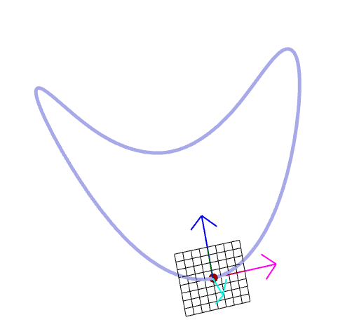
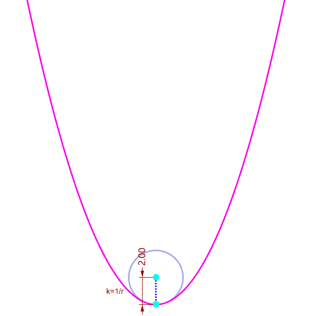

# Computational Geometry

### Welcome:wave:

God ever geometrizes. - PLATO 

Welcome to this repo. As the development of geometric deep learning and geometry processing, geometry is playing an ever-growing important role in the field of architecture, computational design, and robotic fabrication. Although I am able to write geometric algorithm from time to time, I aim to have a big and thorough picture over this topic. Therefore, I felt compelled to study computational geometry across different subject.

### Structure🧩

In light of different sources of materials, this repo is organized as follows:

- Book:books:   the must read books
- Lecture:school:    the popular online lecture
- Library:computer:    the popular geometry processing library
- Paper:page_with_curl:    the must read paper
- Workshop:video_camera:  the short-period of workshop

### Recommended Material:thumbsup:

My recommended study material is followed:

| Name                                                | Type                    | Link                                                         |
| --------------------------------------------------- | ----------------------- | ------------------------------------------------------------ |
| Discrete Differential Geometry, Keenan Crane        | Online Lecture          | http://geometry.cs.cmu.edu/ddg                               |
| Digital Geometry Processing, FU Xiaoming            | Online Lecture(Chinese) | http://staff.ustc.edu.cn/~fuxm/course/2020_Spring_DGP/index.html |
| Computational Conformal Geometry                    | Online Lecture          | https://www3.cs.stonybrook.edu/~gu/lectures/2020/            |
| Computational Geometry: Algorithms and Applications | Book                    | https://www.amazon.com/dp/3540779736/ref=cm_sw_em_r_mt_dp_TN2TN09Q61YS2C2D344T |

### Learning progress

#### Book:books:

#### Lecture:school:

##### Discrete Differential Geometry: :arrow_right:(navigate [here][ddg_md])

- [x] Chapter 01 Overview
- [x] Chapter 02 Combinatorial Surfaces
- [x] Chapter 03 Intro to Differential Geometry
- [ ] Chapter 04 Intro to Exterior Calculus
- [ ] Chapter 05 Curvature of Discrete Surfaces
- [ ] Chapter 06 The Laplacian
- [ ] Chapter 07 Surface Parameterization
- [ ] Chapter 08 Vector Field Decomposition and Design

#### Library:computer:

##### libigl

##### CGAL

#### Paper:page_with_curl:

//TODO

#### Workshop:video_camera:

//TODO

### Outputs

### Disclaimer

1.This repo is merely a collection of notes and I highly recommend YOU to learn by yourself. 

2.The update of this repo may be very very very slow...

3.Please cite the authors for their contribution!

[ddg_md]: Lecture/DiscreteDifferentialGeometry/DDG.md